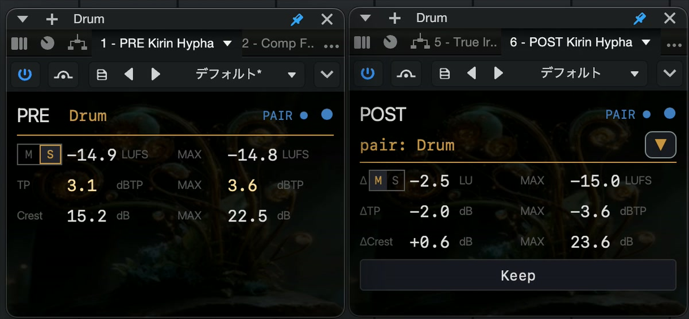

# Kirin Hypha

**A free, open-source audio measurement plugin for macOS (VST3 and Audio Unit).**

The supported release is currently macOS-only. A manual Windows VST3 validation package is also built and published for external testing, but it is not yet a supported Windows release.

Kirin Hypha operates as paired instances — a **PRE** plugin and a **POST** plugin — to measure signal states before and after a processing chain and display the difference.



[Watch PRE/POST with the M/S selector and independent Watch MAX values (32-second silent MP4)](docs/media/kirin-hypha-pre-post-demo.mp4)

[Watch POST move from Watch to Keep/Record and hold the final result after Stop (45-second silent MP4)](docs/media/kirin-hypha-record-keep-demo.mp4)

---

## Design

Kirin Hypha is built to **observe, not to advise**.

It produces measurement data. It does not generate, modify, or attenuate audio. The same input file produces the same output, every time. Numbers are reported as captured — no interpretation, no scoring, no recommendation.

Every metric is backed by a known-signal golden test: the expected values are derived independently from the signal definition and the ITU-R BS.1770 filter coefficients, not asserted by hand. The measurement layer demonstrates its precision rather than claiming it.

---

## Modes

| Feature | Standalone | With Kirin OS |
|---|---|---|
| Watch mode | ✓ | ✓ |
| Record mode | — | ✓ |
| plugin_data output | — | ✓ |

Kirin Hypha is free and fully functional as a standalone plugin. Record mode requires a Kirin OS license.

---

## What it measures

### Watch mode (real-time)

| Metric | Window / Unit | Standard |
|---|---|---|
| LUFS-M / LUFS-S | Selectable Momentary (400 ms) or Short-term (3 s) loudness (LUFS) | ITU-R BS.1770-4 |
| True Peak | Recent peak, last 400 ms (dBTP) | ITU-R BS.1770-4 |
| Crest Factor | Peak − RMS, 400 ms (dB) | — |

PRE displays absolute values. POST displays Δ values relative to the paired PRE. The M/S choice
also selects the independent MAX value for the current Watch playback pass.
In the Watch grid, the live 400 ms True Peak and its playback-pass MAX are shown side by side.
Pressing **Keep** changes the grid labels; **Max TP** then means the maximum for the whole Keep
session, including across transport stops.

### Record mode (Kirin OS required)

| Metric | Window / Unit | Standard |
|---|---|---|
| LUFS-M / LUFS-S | Selectable Momentary (400 ms) or Short-term (3 s) loudness (LUFS) | ITU-R BS.1770-4 |
| Integrated Loudness | Current Keep session (LUFS) | ITU-R BS.1770-4 |
| Max True Peak | Current Keep session maximum (dBTP) | ITU-R BS.1770-4 |
| Crest Factor | Peak − RMS, 400 ms (dB) | — |
| PSR | Peak-to-Short-term Ratio, 3 s (dB) | — |
| Sharpness | acum, mono sum | DIN 45692 |

PRE displays all six values. A paired POST displays Δ for the selected M/S loudness, PSR, Crest,
and Sharpness; Integrated Loudness and Max True Peak remain absolute POST session values. The
Integrated value spans transport stops within one Keep. After Stop, the final Record result remains
visible until the first newly computed Watch result arrives.
PSR always uses the engine's 3 s Short-term loudness, regardless of the M/S selector. The selector
changes the loudness value displayed and compared; it does not redefine PSR.

**On True Peak.** Two distinct True Peak quantities are reported. The *recent peak* is the maximum inter-sample peak within the last 400 ms (the same window as LUFS-M) and is shown live in Watch mode; it is not held, so a transient drops out of the reading once that window has passed. The *session maximum* is the running maximum inter-sample peak over the whole recording and is what the Record data stores. When a single dBTP figure is quoted for a file, it is the session maximum. Peak windows are tracked by sample count, so offline / faster-than-real-time rendering does not shift them.

**On Crest Factor.** Crest Factor is the sample-peak level minus the RMS level (both in dBFS) over the same 400 ms window. Peak and RMS are both computed across the pooled samples of all channels — not a mono sum — and the peak is a sample peak, not the inter-sample True Peak. A silent window produces no value (shown as `---`).

**On the psychoacoustic metrics.** N (Zwicker loudness) remains measured and stored for Kirin OS
even though it is no longer one of the six DAW display cells. N and Sharpness are computed from a
mono sum, (L+R)/2.

---

## Download

Download the latest signed and notarized macOS release from the [Releases page](https://github.com/heyalohaloha/kirin_hypha/releases).

The macOS installer package and the plug-in bundles inside it are signed with Apple Developer ID certificates and notarized by Apple, so Gatekeeper normally opens them without a warning. If a downloaded file is still flagged — for instance when the quarantine attribute persists — you can inspect it and clear the flag yourself:

```bash
# Inspect the installer signature
pkgutil --check-signature "Kirin-Hypha-<version>-macOS-Universal.pkg"

# Verify the download against the SHA-256 shown on the Releases page
shasum -a 256 "Kirin-Hypha-<version>-macOS-Universal.pkg"

# Remove the quarantine attribute if macOS blocks the installer
xattr -d com.apple.quarantine "Kirin-Hypha-<version>-macOS-Universal.pkg"
```

The installer package has companion `.pkg.sha256` and artifact JSON assets on the Releases page. Older zip archives are manual-install fallback artifacts.

The Windows VST3 zip on the Releases page is a **validation candidate**, not a supported installer. It is a manual PRE/POST VST3 package for Windows 10/11 64-bit, has no installer or Authenticode signature, and remains blocked from supported release status until the external DAW and audio-transparency gates in [`docs/windows_external_validation.md`](docs/windows_external_validation.md) are complete.

### Release provenance

Published artifacts are immutable. If repository maintenance changes a public commit ID after a release, the commit recorded in that artifact remains its original build commit. [`docs/release_commit_map.json`](docs/release_commit_map.json) maps an affected artifact commit to the commit currently referenced by its release tag and records the verified source-equivalence scope.

---

## Installation

1. Download the latest `Kirin-Hypha-<version>-macOS-Universal.pkg` from the [Releases page](https://github.com/heyalohaloha/kirin_hypha/releases).
2. Open the installer package and follow macOS Installer.
   - The package installs **VST3** to `/Library/Audio/Plug-Ins/VST3/`.
   - The package installs **Audio Unit** to `/Library/Audio/Plug-Ins/Components/`.
   - The package removes old user-level and system-level Kirin Hypha PRE/POST copies before installing, so DAWs do not load stale bundles first.
3. Rescan plugins in your DAW.
4. Insert **PRE Kirin Hypha** before your processing chain.
5. Insert **POST Kirin Hypha** after your processing chain.

---

## Sandbox & privacy (Audio Unit)

The Audio Unit declares a broad file-access entitlement (`temporary-exception.files.all.read-write`), which the AU sandbox requires for the plug-in to persist its session data (`.kirin` and plug-in data) on disk. The build declares no network entitlement and links no networking or web frameworks — you can confirm this with `codesign -d --entitlements - "Kirin Hypha PRE.component"` and `otool -L "Kirin Hypha PRE.component"`.

---

## Pairing PRE and POST

Pairing is by **name**, not by track position.

1. In the PRE plugin, enter a name in the **Name** field (e.g. `Mix Bus`, `Kick`, `Vocal`). Names accept UTF-8 text, including Japanese.
2. In the POST plugin, enter the same name.
3. POST detects the matching PRE and begins displaying Δ values.

Multiple PRE / POST pairs can run simultaneously (up to 12 active pairs per project).

---

## Watch mode

Real-time display of selectable LUFS-M / LUFS-S, True Peak (recent), and Crest Factor during
playback. The M and S selections retain independent playback-pass maximums. POST displays the
difference between its own measurements and the paired PRE.

Closing the GUI does not stop measurement. The audio thread continues running as long as the plugin is loaded in the DAW.

---

## Record mode (Kirin OS required)

With a Kirin OS license, the POST plugin shows a **Keep** button in Watch mode.

1. Press **Keep** to begin a session recording.
2. Press **Stop** to end the session. The session is written to the `.kirin` record.

Integrated Loudness and session-maximum True Peak accumulate across DAW transport stops while the
same Keep remains active. During an offline bounce/export, POST auto-runs the same cleanup as
**Stop** when the host reports that offline processing has ended. If a host does not emit that
offline-end edge, Keep remains armed until manual **Stop** or the idle auto-stop backstop after
10 minutes without Active signal.

After Stop, the final Record display remains visible until the next playback produces its first
newly computed Watch result; that result returns the grid to Watch without showing stale Watch data
in between. Multiple pairs record independently.

If measurement samples are ever dropped during a recording (for example, on a buffer overflow), the dropped-sample count and an integrity flag are written into the session data. Incomplete measurement is recorded as incomplete, never presented as complete.

---

## Kirin OS ecosystem

Kirin Hypha is one piece of a larger ecosystem. With Kirin OS, session data is written to `plugin_data` in a structured JSON schema and can be bundled with C2PA provenance into a tamper-evident `.kirin` file alongside the audio.

Hypha itself remains **standalone and free** — Kirin OS is not required to use Watch mode.

Kirin OS is available now. More at [kirinmastering.com](https://kirinmastering.com).

---

## Requirements

- macOS 12 or later (Apple Silicon and Intel)
- VST3- or Audio Unit-compatible DAW

Tested on macOS 14 (Sonoma).

**Windows validation candidate:** Windows 10 or 11, 64-bit, VST3 only. External validation is pending; this is not yet a supported release.

**Not currently supported:** Linux · CLAP

---

## Building from source

```bash
git clone https://github.com/heyalohaloha/kirin_hypha.git
cd kirin_hypha
scripts/build_juce_universal.sh
scripts/validate_macos_pluginval.sh juce_shell/build-universal
```

Requires Rust stable toolchain, CMake, Xcode command line tools, and the pinned JUCE submodule.
The macOS release ship set is one JUCE role-parameterised processor/editor compiled as AU and VST3. The VST3 wrapper preserves the original component IDs and migrates legacy nih-plug state so existing DAW sessions keep their identities and pair names.

Run the macOS pluginval gate before opening Studio One for manual validation. It recreates the exact role-first installed layout (`PRE Kirin Hypha.vst3` / `POST Kirin Hypha.vst3`) in an isolated runtime directory, resolves each executable through `CFBundleExecutable`, verifies the preserved component IDs and host names, and then runs pluginval at strictness level 5 against those staged bundles. Logs are written to `target/pluginval/logs/macos`, while plug-in runtime writes stay under `target/pluginval/runtime/macos/`. Override with `PLUGINVAL_STRICTNESS_LEVEL=10` only for the slower stress pass. If Steinberg's VST3 validator is installed, pass it with `VST3_VALIDATOR_BIN=/path/to/validator`.

## Maintainer release packaging

On the release machine, after signing and notarizing the four source plug-in bundles with `cargo run --package xtask -- notarize`, build the Lemon Squeezy installer package with the Kirin OS-style release scripts:

```bash
node scripts/ls_release/build_kirin_hypha_pkg.mjs
mkdir -p release_state
cp docs/ls_release/kirin_hypha_ls_state.example.json \
  release_state/kirin_hypha_X.Y.Z_ls.state.json
node scripts/ls_release/kirin_hypha_ls_dry_run.mjs \
  --state release_state/kirin_hypha_X.Y.Z_ls.state.json \
  --with-apple-verification
```

`release_state/` is deliberately ignored: it contains release-operator targets and upload readiness, not source. Fill the local state from the generated `.pkg.json` sidecar and keep it out of commits. Publish the `.pkg.json` artifact manifest and `.pkg.sha256` with the GitHub Release.

The installer package requires a `Developer ID Installer` certificate in the keychain. A `Developer ID Application` certificate signs the plug-in bundles, but it is not enough to sign the `.pkg`.

Unsigned smoke-test packages are intentionally marked `UNSIGNED-DO-NOT-UPLOAD` and are written under `/tmp/kirin_hypha_pkg_smoke/`:

```bash
KIRIN_SKIP_PKG_SIGN=1 KIRIN_SKIP_PKG_NOTARIZE=1 \
  node scripts/ls_release/build_kirin_hypha_pkg.mjs
```

The legacy manual-install zip can still be built with:

```bash
cargo run --package xtask -- release-package
```

Do not run the signed release checks inside a sandboxed child process; macOS `codesign` can report a false `invalid signature` for valid notarized plugin bundles in that context.
Upload only `Kirin-Hypha-<version>-macOS-Universal.pkg` to the configured Lemon Squeezy products after local verification passes.

---

## License

[GNU General Public License v3.0](LICENSE)

Kirin Hypha is released under GPLv3 to keep the measurement layer auditable. The numbers a tool produces should be inspectable — any user, researcher, or engineer can read the code that generated them. Derivative works inherit the same openness.

---

## Acknowledgements

Built on [nih-plug](https://github.com/robbert-vdh/nih-plug) by Robbert van der Helm.

---

*Kirin Hypha — observation, kept simple.*
