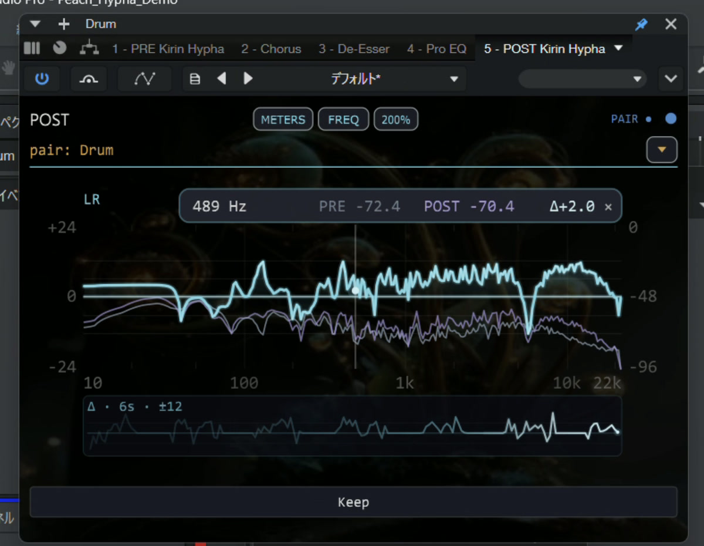
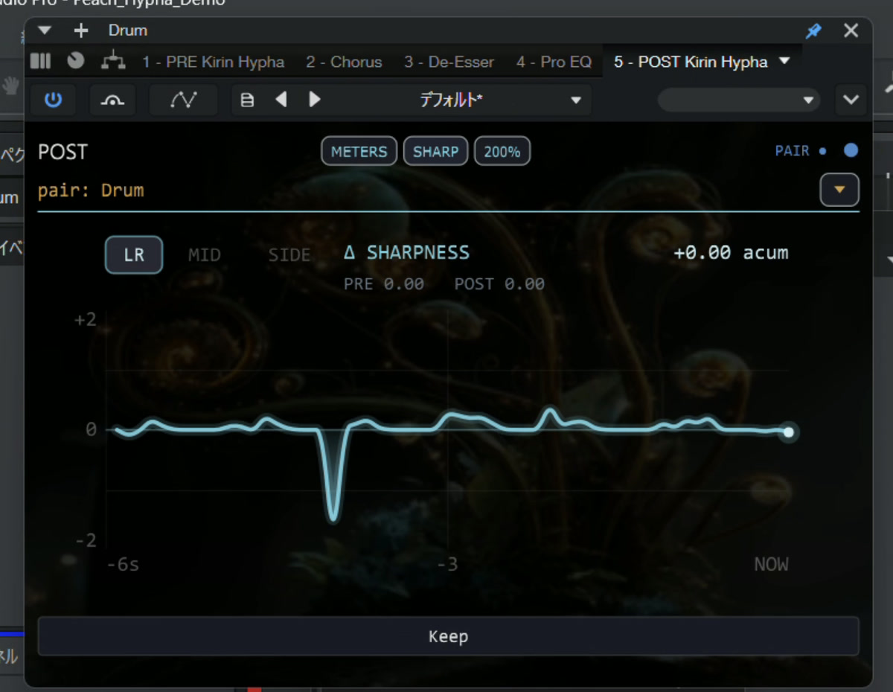
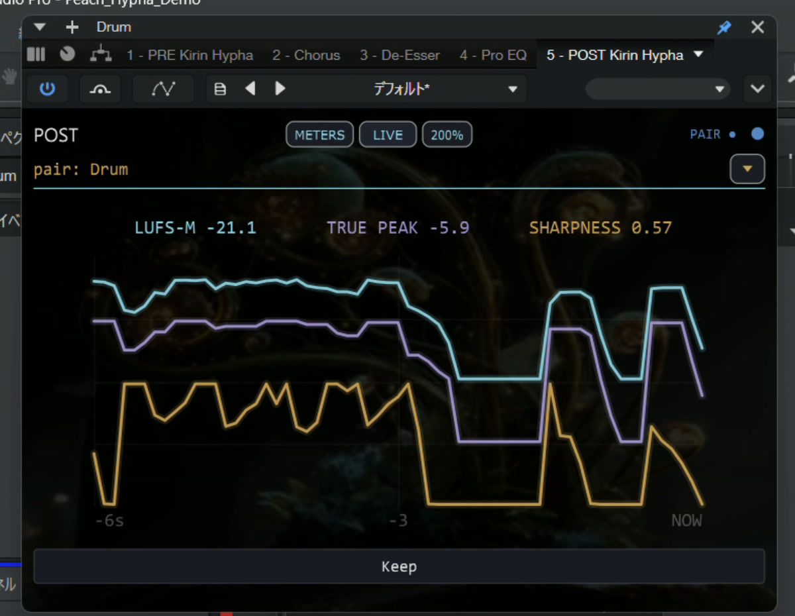

# Kirin Hypha

**See what changed across a processing chain — without changing the audio.**

Kirin Hypha is a free, open-source pass-through measurement plug-in for macOS and Windows. Place
**PRE** before the processors you want to inspect and **POST** after them. POST then shows the measured
difference between those two exact points. Hypha does not generate, modify, attenuate, or delay audio.



[Watch FREQ react to the measured chain in Studio One (10-second silent MP4)](docs/media/kirin-hypha-freq-demo.mp4)

## Start in under a minute

1. Insert **PRE Kirin Hypha** before the processing chain.
2. Insert **POST Kirin Hypha** after the processing chain.
3. Open POST's arrow menu and choose that exact PRE under **Pair choices**.
4. Use the top-level **LEVEL**, **TIME**, **FREQ**, and **SPACE** domains. In **TIME**, choose
   **HISTORY**, **ATTACK**, **SHARP**, or **LIVE**.

Names are optional labels. PRE and POST do not need matching names, and track position is never used
to guess a pair. The two plug-ins are the measurement boundary: PRE captures the input state, while
POST captures the output state and joins only verified matching observations.

## Four observation domains

### LEVEL — loudness, peak, dynamics, and meaningful history

LEVEL keeps immediate loudness and dynamics facts above fixed-scale history. The large view adds M,
S, I, five supporting facts, and L/R meters without changing the compact measurement definitions.

### TIME — what happened and when

TIME directly selects **HISTORY**, validated DRUM **ATTACK**, signed **SHARP**, or three absolute
**LIVE** facts. Only the selected optional analyzer runs.

### FREQ — where the chain changed

The cyan **Δ (POST − PRE)** curve is the primary view. PRE and POST remain visible as references.
Choose LR, MID, or SIDE; click a frequency to keep its exact six-second **Focus Trail**; use **MARK**
to retain one temporary full-spectrum reference. The display scale is ±24 dB.

### SHARP — how perceptual brightness changed over time



SHARP shows six seconds of signed **Δ Sharpness** in acum. It reports observation only: no target,
warning colour, score, or recommendation.

### LIVE — three absolute POST facts on one timeline



LIVE overlays POST **LUFS-M**, **recent True Peak**, and **Sharpness** on one six-second time axis.
Each metric keeps an independent fixed scale, and the current values update at a readable rate.

### SPACE — stereo distribution without a verdict

SPACE shows three-second MID/SIDE density, L/R balance, and correlation. It stays absolute because
Hypha does not invent PRE/POST subtraction for correlation or the stereo field.

Two POST optional analyzers may stay active, supporting a mix bus plus one working track. A third
identifies the owners and waits until one returns to **LEVEL**, **TIME / HISTORY**, or **SPACE**, or closes.

macOS 12 or later is supported as signed and notarized VST3 and Audio Unit plug-ins. Windows 10/11
64-bit is supported as VST3 and distributed as a manual ZIP. The Windows build passes CI and
pluginval and is validated in Studio One Pro on a dedicated Windows machine; a signed Windows
installer is not currently provided.

## Design

Kirin Hypha is built to **observe, not to advise**.

It produces measurement data. It does not generate, modify, or attenuate audio. The same input file produces the same output, every time. Numbers are reported as captured — no interpretation, no scoring, no recommendation.

Every metric is backed by a known-signal golden test: the expected values are derived independently from the signal definition and the ITU-R BS.1770 filter coefficients, not asserted by hand. The measurement layer demonstrates its precision rather than claiming it.

## Modes

| Feature | Standalone | With Kirin OS |
|---|---|---|
| Watch mode | ✓ | ✓ |
| POST on-demand ATTACK / FREQ / SHARP / LIVE | ✓ | ✓ |
| Record mode | — | ✓ |
| plugin_data output | — | ✓ |

Kirin Hypha is free and fully functional as a standalone plugin. Record mode requires a Kirin OS license.

## What it measures

### Watch mode (real-time)

| Metric | Window / Unit | Standard |
|---|---|---|
| LUFS-M / LUFS-S | Selectable Momentary (400 ms) or Short-term (3 s) loudness (LUFS) | ITU-R BS.1770-4 |
| True Peak | Recent peak, last 400 ms (dBTP) | ITU-R BS.1770-4 |
| Crest Factor | Peak − RMS, 400 ms (dB) | — |

PRE displays absolute values. POST displays Δ values relative to the paired PRE. If that exact PRE
is explicitly bypassed, POST returns to its own absolute values without releasing the pair; the
upper-right state changes from blue **PAIR** to lavender **ABS** until PRE is enabled again. A stop,
silence, stale read, or temporary absence never claims that PRE was bypassed. The M/S choice
also selects the independent MAX value for the current Watch playback pass.
In the Watch grid, the live 400 ms True Peak and its playback-pass MAX are shown side by side.
Pressing **Keep** changes the grid labels; **Max TP** then means the maximum for the whole Keep
session, including across transport stops.

### FREQ: Spectrum (on demand)

A paired POST uses top-level **FREQ** to inspect processing between PRE and POST. Spectrum runs only
while FREQ is open. The signed **Δ (POST − PRE)** curve is the primary
display, with absolute PRE and POST spectra retained as reference curves. Δ is shown on a ±24 dB
scale; the underlying difference is not clipped. A difference is produced only when PRE and POST
frames have the same sample rate, aperture length, FFT layout, channel mode, channel count, and
output-presentation sample endpoint.

| Control | Observation behavior |
|---|---|
| LR / MID / SIDE | Selects exactly one channel definition; the three analyzers never run in parallel |
| Hover / click | Reads frequency and Δ; click locks the probe, shows its six-second Focus Trail, and × releases it |
| MARK | Captures or replaces one temporary display-only Δ reference; × clears it |
| Free resize / 100–300% presets | Keeps a fixed 3:2 aspect ratio from 300×200 through the native 900×600 Inspection View and remembers the exact loaded-instance size |

The page analyzes one selected channel view at a time. **LR** transforms L and R independently and
averages their power, so opposite-polarity channels do not cancel. **MID** analyzes the `(L+R)/2`
waveform. **SIDE** analyzes `(L−R)/2` and is available only for stereo input; mono never fabricates a
SIDE result. Switching LR / MID / SIDE clears the old frame and waits for an exact PRE/POST match in
the newly selected mode. Record-mode N and Sharpness use their own independent-channel definition,
described below, so they can differ from MID or SIDE Spectrum on wide or phase-opposed material.

Hovering the plot shows frequency and Δ; larger views also show PRE and POST values.
Below the cycle-derived low-frequency confidence boundary (about 35 Hz), the frequency alone carries
an unobtrusive `~` prefix. The measured band and Δ remain visible and are not dimmed, hidden, or
replaced by a warning. Hover help explains that `~` means an approximate low-frequency position.
All Analysis hover help wraps and repositions inside the plug-in at every size. **Show hover help**
in the POST arrow menu disables or restores explanatory popups for every PRE and POST; the user
preference survives plug-in and DAW restarts. FREQ inspection, click lock, Focus Trail, and MARK stay
available while help is hidden. A click in the plot
locks that readout to the same frequency until its × is pressed. While locked,
**Focus Trail** shows six seconds of Δ: compact at the smallest size and in its own lane when space
permits. Its newest point is the same exact PRE/POST presentation frame as the live Δ, not a
UI-clock estimate. A missed UI poll does not erase valid older observations: retained points keep
their true sample-time positions. The work-surface stroke joins the surrounding exact points across a
missing endpoint so Windows scheduling jitter does not look like a broken curve; the missing time is
still retained as gap metadata and no measurement is inserted. Reversed or incompatible frames, and
a forward discontinuity beyond the six-second view, start a clean trail. After a backwards transport
move, PRE and POST may resume one analysis cadence apart; FREQ waits until both have crossed the old
endpoint, then resumes from their newest exact shared endpoint. The frequency lock and MARK remain
where the user placed them across a loop, silence, temporary warming state, or short I/O gap; only
the factual trail restarts on the new exact time axis. **MARK** freezes one display-only full-band Δ curve as a solid amber reference beneath
the cyan live curve; pressing MARK again replaces it, and its × clears it.
MARK is temporary and is cleared when the pair, sample rate, FFT layout, channel mode, or page changes.
It adds no analyzer and changes no measured value. Exact 3:2 size is remembered for the loaded
instance, while Spectrum itself still opens off.
Focus Trail retains only fixed-capacity display snapshots while Spectrum is open. It adds no analyzer,
does not smooth or delay the live Δ, and is discarded on pair, rate, layout, channel-mode, or page
changes.

Continuity has two bounded layers. POST keeps the newest eight already-computed exact Spectrum
differences in a fixed recovery ring, so a short UI scheduling stall can collect missed frames on the
next poll without another FFT. If a stall exceeds that ring, Focus Trail still keeps the surviving
exact points at their sample-time positions and connects only those surrounding observations for the
work-surface stroke. Both layers are display transport only: no dynamic growth, extra analyzer,
filesystem polling, or Audio Thread work.

The optional PRE/POST exchange is supervised by the existing 10 Hz IO update. On Windows its
short-lived request, readiness, and Analysis snapshots use a small pagefile-backed shared-memory
mapping, avoiding dependence on filesystem create/rename latency at the 30 Hz Spectrum cadence.
macOS retains the atomic-file transport. Watch, Record, and `plugin_data` keep their existing file
contracts on both platforms. Each shared slot is double-buffered and committed as one generation;
a reader keeps the last complete value during a contended update rather than accepting partial data.

The watchdog advances only after a request, readiness fact, or PRE snapshot was actually published.
If publication stops, the stable IO path retries one non-blocking exact exchange before the
1.5-second request lease can expire. During a transient gap, the last exact FREQ or SHARP
presentation is held only within that same lease boundary instead of flashing an empty page. A
publication that completes after its lease has already expired is not counted as live. No second
analyzer is started, no mismatched frames are joined, and no Analysis transport work enters the
Audio Thread.

Where both spectra are extremely quiet, the displayed Δ alone is faded toward zero: it is fully
suppressed at and below −120 dBFS and reaches full strength at −96 dBFS. This display floor does not
alter the captured PRE or POST values. The analyzer follows the host sample rate without resampling.
Its Hann aperture is rounded from the 48 kHz reference time of `4096 / 48000` seconds (about
85.33 ms), and its FFT is the smallest power of two that preserves at least 2× zero-padding. Thus
48 kHz remains exactly 4096 samples / 8192 FFT points, while 44.1, 96, 192, and 384 kHz use
3763/8192, 8192/16384, 16384/32768, and 32768/65536 respectively. Analysis remains at 30 Hz. The live
curve presents the newest frame at 12 Hz and numeric probe values at 2 Hz, without averaging or
changing the measured endpoint. All curve points, hover interpolation, MARK, and Focus Trail use the
same logarithmic band centres `(index + 0.5) / 256`. The first and last edge labels remain plot
boundaries, not invented samples. It compares measured programme energy rather
than reconstructing a plug-in transfer function, so narrow low-frequency EQ shapes can appear broader
than the corresponding EQ control graph.

### TIME / SHARP: Perceptual Δ (on demand)

From **TIME**, **SHARP** opens Perceptual Δ; the top-level **FREQ** domain opens Spectrum. The first
Perceptual Δ observation is **Δ Sharpness History**. It plots the signed Sharpness difference
`POST − PRE` over the latest six seconds, with the newest exact value shown in acum. The measured
difference is not clipped; the stable display scale is ±2 acum. The curve is spatially rounded for
legibility, but no temporal smoothing delays it. The curve keeps the same visual strength across the
full history. Its fill is controlled only by distance from zero: quiet at zero and progressively
denser toward either display edge, never by sample age. Only a small dot identifies the newest exact
observation. All measured
10 Hz points remain in a retained six-second timeline: the curve is repainted at 5 Hz and the exact
PRE / POST / Δ numbers are held for 500 ms. A delayed UI update catches up from that factual
timeline instead of exposing scheduling jitter as broken segments. A true measurement discontinuity
starts one clean new run; no missing value is interpolated.

Each point comes from one non-overlapping 100 ms aperture and is published at 10 Hz. Before the
first point, PRE reports readiness and POST commits one shared, aperture-aligned presentation epoch
at least 200 ms in the future. PRE and POST reset their Phase D and optional sample-rate-converter
state once at that epoch, then preserve that state continuously across later apertures. They must
match in schema, host sample rate, aperture length, state epoch, channel definition, channel count,
and output-presentation sample endpoint. If any of those facts differ, no Δ point is produced.

The psychoacoustic engine runs at its defined 48 kHz analysis rate after following the host-rate
input; at 44.1, 48, 96, or 192 kHz each endpoint still represents exactly 100 ms of host
presentation time. A non-48 kHz converter may buffer an additional chunk before publishing an
already-measured endpoint; it does not shift or interpolate that endpoint. A dropped block,
timeline discontinuity, mode edge, or missed epoch clears the short history and requires a new
shared future epoch instead of continuing state across a gap.

**LR** measures L and R independently and uses their arithmetic mean, so channel polarity cannot
cancel the observation. **MID** measures `(L+R)/2`; **SIDE** measures `(L−R)/2` and remains stereo-
only. Changing channel mode starts new history. Returning to **TIME / HISTORY**, another
non-analysis domain, or closing stops Sharpness and discards display history. Spectrum and
Sharpness stop each other before starting without releasing the owned optional-analysis slot.
Neither changes audio nor rewrites Watch or Record results.

### TIME / LIVE: absolute facts (on demand)

From **TIME**, **LIVE** opens a POST-only absolute timeline; top-level **FREQ** opens Spectrum.
LIVE does not subtract PRE and does not create a PRE analysis request. It overlays three measured
facts on the same latest-six-second time axis:

| Trace | Colour | Fixed display scale |
|---|---|---|
| LUFS-M | Cyan | −42 to 0 LUFS |
| Recent True Peak | Pale violet | −30 to +6 dBTP |
| Sharpness | Amber | 0 to 3 acum |

Each trace has its own fixed scale, so vertical position is comparable over time within that metric,
not numerically between the three metrics. Values outside a display scale remain measured facts and
are only bounded at the plot edge. In a sparse source, an exact aperture whose LUFS-M or recent True
Peak is below the measurement floor remains unavailable internally and in the numeric readout; the
curve alone reaches the lower plot edge so silence does not resemble a dropped UI frame. There are no
targets, score bands, warning colours, or verdicts.

All three values are committed at the same exact 100 ms POST presentation endpoint. Measurement runs
at 10 Hz, Rust retains 64 exact points, the curve repaints at 5 Hz, and current numbers update at 2 Hz.
No missing measurement is interpolated or stored as a value, and no temporal smoothing delays the
display. A short forward observation gap retains the verified points on both sides at their exact
sample times and joins only those points for presentation. A single verified point is shown as a
dot, and a temporary worker re-arm does not erase the last verified field. Backward transport, an
incompatible format, or a gap spanning the six-second field starts a new run.
LUFS-M and recent True Peak reuse Watch's measurement definitions; recent True Peak is the latest
400 ms maximum rather than a session hold. Sharpness keeps the established independent-channel
arithmetic-mean definition. Switching **ATTACK**, **FREQ**, **SHARP**, and **LIVE** replaces only the
analyzer in the owned slot. A non-analysis domain or editor close releases it and discards history.

At most two of ATTACK, FREQ, SHARP, and LIVE run per DAW process. This supports a mix bus plus one
working track without starting 12 costly analyzers. A third view names the two owners and waits.
PRE/POST pairs, Watch, Record, and audio pass-through have no such two-slot limit. Switching optional
views keeps ownership; only a non-analysis domain or editor close releases it.

### Record mode (Kirin OS required)

| Metric | Window / Unit | Standard |
|---|---|---|
| LUFS-M / LUFS-S | Selectable Momentary (400 ms) or Short-term (3 s) loudness (LUFS) | ITU-R BS.1770-4 |
| Integrated Loudness | Current Keep session (LUFS) | ITU-R BS.1770-4 |
| Max True Peak | Current Keep session maximum (dBTP) | ITU-R BS.1770-4 |
| Crest Factor | Peak − RMS, 400 ms (dB) | — |
| PSR | Peak-to-Short-term Ratio, 3 s (dB) | — |
| Sharpness | acum, independent-channel arithmetic mean | DIN 45692 |

PRE displays all six values. A paired POST displays Δ for the selected M/S loudness, PSR, Crest,
and Sharpness; Integrated Loudness and Max True Peak remain absolute POST session values. The
Integrated value spans transport stops within one Keep. After Stop, the final Record result remains
visible until the first newly computed Watch result arrives.
PSR always uses the engine's 3 s Short-term loudness, regardless of the M/S selector. The selector
changes the loudness value displayed and compared; it does not redefine PSR.

**On True Peak.** Two distinct True Peak quantities are reported. The *recent peak* is the maximum inter-sample peak within the last 400 ms (the same window as LUFS-M) and is shown live in Watch mode; it is not held, so a transient drops out of the reading once that window has passed. The *session maximum* is the running maximum inter-sample peak over the whole recording and is what the Record data stores. When a single dBTP figure is quoted for a file, it is the session maximum. Peak windows are tracked by sample count, so offline / faster-than-real-time rendering does not shift them.

**On Crest Factor.** Crest Factor is the sample-peak level minus the RMS level (both in dBFS) over the same 400 ms window. Peak and RMS are both computed across the pooled samples of all channels — not a mono sum — and the peak is a sample peak, not the inter-sample True Peak. A silent window produces no value (shown as `---`).

**On the psychoacoustic metrics.** N (Zwicker loudness) remains measured and stored for Kirin OS
even though it is no longer one of the six DAW display cells. For multichannel Record data, N and
Sharpness are measured independently per input channel and combined by arithmetic mean. They do not
sum the waveform before the nonlinear psychoacoustic pipeline. Perceptual Δ uses that same definition
for LR, while its explicit MID and SIDE selections intentionally measure `(L+R)/2` and `(L−R)/2`.

## Download

Download the latest macOS or Windows release from the [Releases page](https://github.com/heyalohaloha/kirin_hypha/releases).

The macOS installer package and the plug-in bundles inside it are signed with Apple Developer ID certificates and notarized by Apple, so Gatekeeper normally opens them without a warning. If a downloaded file is still flagged — for instance when the quarantine attribute persists — you can inspect it and clear the flag yourself:

```bash
# Inspect the installer signature
pkgutil --check-signature "Kirin-Hypha-<version>-macOS-Universal.pkg"

# Verify the download against the SHA-256 shown on the Releases page
shasum -a 256 "Kirin-Hypha-<version>-macOS-Universal.pkg"

# Remove the quarantine attribute if macOS blocks the installer
xattr -d com.apple.quarantine "Kirin-Hypha-<version>-macOS-Universal.pkg"
```

The installer package has companion `.pkg.sha256` and artifact JSON assets on the Releases page. Older zip archives are manual-install fallback artifacts.

The Windows 10/11 64-bit VST3 release is a supported manual PRE/POST ZIP package. It is built from the
same release commit as macOS, passes the Windows CI and pluginval gates, and has completed Studio One
Pro validation on a dedicated Windows machine. The ZIP does not include an installer or Authenticode
signature. [`docs/windows_external_validation.md`](docs/windows_external_validation.md) remains the
repeatable real-machine regression checklist.

### Release provenance

Published artifacts are immutable. If repository maintenance changes a public commit ID after a release, the commit recorded in that artifact remains its original build commit. [`docs/release_commit_map.json`](docs/release_commit_map.json) maps an affected artifact commit to the commit currently referenced by its release tag and records the verified source-equivalence scope.

## Installation

### macOS

1. Download the latest `Kirin-Hypha-<version>-macOS-Universal.pkg` from the [Releases page](https://github.com/heyalohaloha/kirin_hypha/releases).
2. Open the installer package and follow macOS Installer.
   - The package installs **VST3** to `/Library/Audio/Plug-Ins/VST3/`.
   - The package installs **Audio Unit** to `/Library/Audio/Plug-Ins/Components/`.
   - The package removes old user-level and system-level Kirin Hypha PRE/POST copies before installing, so DAWs do not load stale bundles first.
3. Rescan plugins in your DAW.
4. Insert **PRE Kirin Hypha** before your processing chain.
5. Insert **POST Kirin Hypha** after your processing chain.

### Windows

1. Download the latest `Kirin-Hypha-<version>-Windows-VST3-<build>-<commit>.zip` from the
   [Releases page](https://github.com/heyalohaloha/kirin_hypha/releases).
2. Close the DAW and extract both VST3 folders to:
   `%LOCALAPPDATA%\Programs\Common\VST3\`
3. Start the DAW and rescan VST3 plug-ins if needed.
4. Insert **PRE Kirin Hypha** before your processing chain and **POST Kirin Hypha** after it.

## Sandbox & privacy (Audio Unit)

The Audio Unit declares a broad file-access entitlement (`temporary-exception.files.all.read-write`), which the AU sandbox requires for the plug-in to persist its session data (`.kirin` and plug-in data) on disk. The build declares no network entitlement and links no networking or web frameworks — you can confirm this with `codesign -d --entitlements - "Kirin Hypha PRE.component"` and `otool -L "Kirin Hypha PRE.component"`.

## Pairing PRE and POST

Pairing is an explicit selection of one exact PRE instance. It is not inferred from track position or
matching names.

1. Insert PRE before the processors and POST after them.
2. In POST, open the arrow menu beside the pair field.
3. Under **Pair choices (not Keep targets)**, select the intended PRE.
4. POST keeps that exact PRE identity and begins displaying Δ values.

Giving PRE a name such as `Mix`, `Drum`, or `Vocal` makes the menu easier to scan, but naming is
optional. UTF-8 labels, including Japanese, are supported. An unnamed PRE can still be selected by
its exact instance identity.

Multiple PRE / POST pairs can run simultaneously (up to 12 active pairs per project).

## Watch mode

Real-time display of selectable LUFS-M / LUFS-S, True Peak (recent), and Crest Factor during
playback. The M and S selections retain independent playback-pass maximums. POST displays the
difference between its own measurements and the paired PRE.
Top-level **FREQ** shows signed POST − PRE spectrum. Under **TIME**, ATTACK, SHARP, and LIVE provide
their on-demand time observations. Only the visible optional analyzer runs; two POST instances may
own slots, while a third identifies the owners and waits.

Closing the GUI does not stop measurement. The audio thread continues running as long as the plugin is loaded in the DAW.


[Watch PRE/POST with the M/S selector and independent Watch MAX values (32-second silent MP4)](docs/media/kirin-hypha-pre-post-demo.mp4)

## Record mode (Kirin OS required)

With a Kirin OS license, the POST plugin shows a **Keep** button in Watch mode.

1. Press **Keep** to begin a session recording.
2. Press **Stop** to end the session. The session is written to the `.kirin` record.

Integrated Loudness and session-maximum True Peak accumulate across DAW transport stops while the
same Keep remains active. During an offline bounce/export, POST auto-runs the same cleanup as
**Stop** when the host reports that offline processing has ended. If a host does not emit that
offline-end edge, Keep remains armed until manual **Stop** or the idle auto-stop backstop after
10 minutes without Active signal.

After Stop, the final Record display remains visible until the next playback produces its first
newly computed Watch result; that result returns the grid to Watch without showing stale Watch data
in between. Multiple pairs record independently.

If measurement samples are ever dropped during a recording (for example, on a buffer overflow), the dropped-sample count and an integrity flag are written into the session data. Incomplete measurement is recorded as incomplete, never presented as complete.

[Watch POST move from Watch to Keep/Record and hold the final result after Stop (45-second silent MP4)](docs/media/kirin-hypha-record-keep-demo.mp4)

## Kirin OS ecosystem

Kirin Hypha is one piece of a larger ecosystem. With Kirin OS, session data is written to `plugin_data` in a structured JSON schema and can be bundled with C2PA provenance into a tamper-evident `.kirin` file alongside the audio.

Hypha itself remains **standalone and free** — Kirin OS is not required to use Watch mode.

Kirin OS is available now. More at [kirinmastering.com](https://kirinmastering.com).

## Requirements

- macOS 12 or later (Apple Silicon and Intel)
- Windows 10 or 11, 64-bit
- VST3-compatible DAW, or an Audio Unit-compatible DAW on macOS

Validated on macOS 14 (Sonoma) and Windows with Studio One Pro. Windows is VST3-only and uses a
manual ZIP package; a signed Windows installer is not currently provided.

**Not currently supported:** Linux · CLAP

## Building from source

```bash
git clone https://github.com/heyalohaloha/kirin_hypha.git
cd kirin_hypha
scripts/build_juce_universal.sh
scripts/validate_macos_pluginval.sh juce_shell/build-universal
```

Requires Rust stable toolchain, CMake, Xcode command line tools, and the pinned JUCE submodule.
The macOS release ship set is one JUCE role-parameterised processor/editor compiled as AU and VST3. The VST3 wrapper preserves the original component IDs and migrates legacy nih-plug state so existing DAW sessions keep their identities and pair names.

Run the macOS pluginval gate before opening Studio One for manual validation. It recreates the exact role-first installed layout (`PRE Kirin Hypha.vst3` / `POST Kirin Hypha.vst3`) in an isolated runtime directory, resolves each executable through `CFBundleExecutable`, verifies the preserved component IDs and host names, and then runs pluginval at strictness level 5 against those staged bundles. Logs are written to `target/pluginval/logs/macos`, while plug-in runtime writes stay under `target/pluginval/runtime/macos/`. Override with `PLUGINVAL_STRICTNESS_LEVEL=10` only for the slower stress pass. If Steinberg's VST3 validator is installed, pass it with `VST3_VALIDATOR_BIN=/path/to/validator`.

## Maintainer release packaging

On the release machine, after signing and notarizing the four source plug-in bundles with `cargo run --package xtask -- notarize`, build the Lemon Squeezy installer package with the Kirin OS-style release scripts:

```bash
node scripts/ls_release/build_kirin_hypha_pkg.mjs
mkdir -p release_state
cp docs/ls_release/kirin_hypha_ls_state.example.json \
  release_state/kirin_hypha_X.Y.Z_ls.state.json
node scripts/ls_release/kirin_hypha_ls_dry_run.mjs \
  --state release_state/kirin_hypha_X.Y.Z_ls.state.json \
  --with-apple-verification
```

`release_state/` is deliberately ignored: it contains release-operator targets and upload readiness, not source. Fill the local state from the generated `.pkg.json` sidecar and keep it out of commits. Publish the `.pkg.json` artifact manifest and `.pkg.sha256` with the GitHub Release.

The installer package requires a `Developer ID Installer` certificate in the keychain. A `Developer ID Application` certificate signs the plug-in bundles, but it is not enough to sign the `.pkg`.

Unsigned smoke-test packages are intentionally marked `UNSIGNED-DO-NOT-UPLOAD` and are written under `/tmp/kirin_hypha_pkg_smoke/`:

```bash
KIRIN_SKIP_PKG_SIGN=1 KIRIN_SKIP_PKG_NOTARIZE=1 \
  node scripts/ls_release/build_kirin_hypha_pkg.mjs
```

The legacy manual-install zip can still be built with:

```bash
cargo run --package xtask -- release-package
```

Do not run the signed release checks inside a sandboxed child process; macOS `codesign` can report a false `invalid signature` for valid notarized plugin bundles in that context.
Upload only `Kirin-Hypha-<version>-macOS-Universal.pkg` to the configured Lemon Squeezy products after local verification passes.

## License

[GNU General Public License v3.0](LICENSE)

Kirin Hypha is released under GPLv3 to keep the measurement layer auditable. The numbers a tool produces should be inspectable — any user, researcher, or engineer can read the code that generated them. Derivative works inherit the same openness.

## Acknowledgements

Built on [nih-plug](https://github.com/robbert-vdh/nih-plug) by Robbert van der Helm.

*Kirin Hypha — observation, kept simple.*
