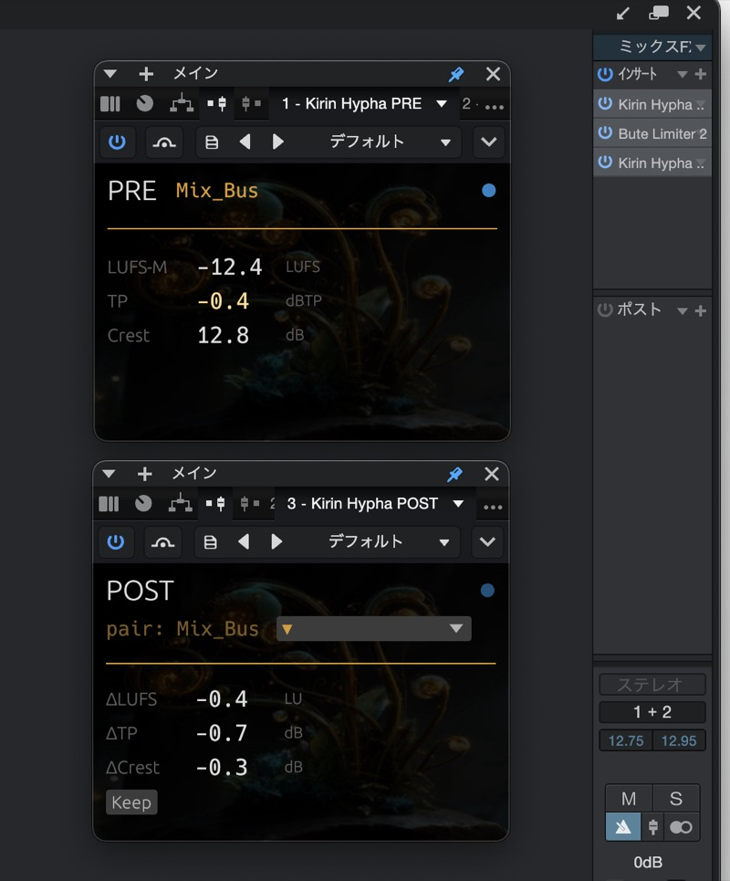
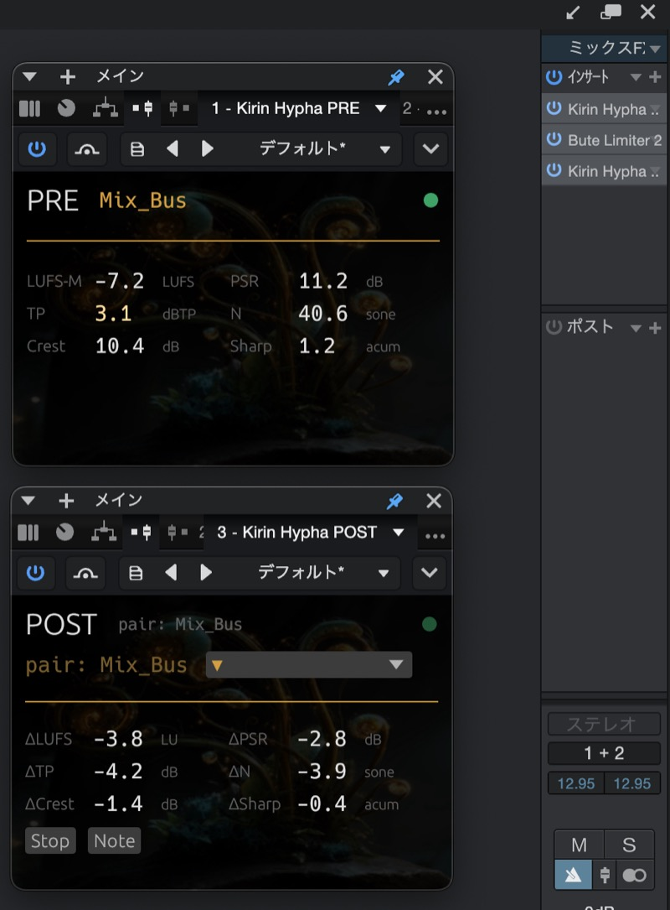

# Kirin Hypha

**A free, open-source audio measurement plugin for macOS (VST3 and Audio Unit).**

Kirin Hypha operates as paired instances — a **PRE** plugin and a **POST** plugin — to measure signal states before and after a processing chain and display the difference.

---

## Design

Kirin Hypha is built to **observe, not to advise**.

It produces measurement data. It does not generate, modify, or attenuate audio. The same input file produces the same output, every time. Numbers are reported as captured — no interpretation, no scoring, no recommendation.

Every metric is backed by a known-signal golden test: the expected values are derived independently from the signal definition and the ITU-R BS.1770 filter coefficients, not asserted by hand. The measurement layer demonstrates its precision rather than claiming it.

---

## Modes

| Feature | Standalone | With Kirin OS |
|---|---|---|
| Watch mode | ✓ | ✓ |
| Record mode | — | ✓ |
| plugin_data output | — | ✓ |

Kirin Hypha is free and fully functional as a standalone plugin. Record mode requires a Kirin OS license.

---

## What it measures

### Watch mode (real-time)

| Metric | Window / Unit | Standard |
|---|---|---|
| LUFS-M | Momentary loudness, 400 ms (LUFS) | ITU-R BS.1770-4 |
| True Peak | Recent peak, last 400 ms (dBTP) | ITU-R BS.1770-4 |
| Crest Factor | Peak − RMS, 400 ms (dB) | — |

PRE displays absolute values. POST displays Δ values relative to the paired PRE.

### Record mode (Kirin OS required)

| Metric | Window / Unit | Standard |
|---|---|---|
| LUFS-M | Momentary loudness, 400 ms (LUFS) | ITU-R BS.1770-4 |
| True Peak | Session maximum (dBTP) | ITU-R BS.1770-4 |
| Crest Factor | Peak − RMS, 400 ms (dB) | — |
| PSR | Peak-to-Short-term Ratio, 3 s (dB) | — |
| N (Zwicker loudness) | sone, mono sum | ISO 532-1 |
| Sharpness | acum, mono sum | DIN 45692 |

PRE displays all six values. POST displays Δ values for all six.

**On True Peak.** Two distinct True Peak quantities are reported. The *recent peak* is the maximum inter-sample peak within the last 400 ms (the same window as LUFS-M) and is shown live in Watch mode; it is not held, so a transient drops out of the reading once that window has passed. The *session maximum* is the running maximum inter-sample peak over the whole recording and is what the Record data stores. When a single dBTP figure is quoted for a file, it is the session maximum. Peak windows are tracked by sample count, so offline / faster-than-real-time rendering does not shift them.

**On Crest Factor.** Crest Factor is the sample-peak level minus the RMS level (both in dBFS) over the same 400 ms window. Peak and RMS are both computed across the pooled samples of all channels — not a mono sum — and the peak is a sample peak, not the inter-sample True Peak. A silent window produces no value (shown as `---`).

**On the psychoacoustic metrics.** N (Zwicker loudness) and Sharpness are computed from a mono sum, (L+R)/2.

---

## Screenshots



*Watch mode — real-time measurement. PRE shows absolute values, POST shows Δ relative to the paired PRE.*



*Record mode — the session is written to the `.kirin` record (Kirin OS required). After Stop, POST returns to the live readout.*

---

## Download

Download the latest signed and notarized release from the [Releases page](https://github.com/heyalohaloha/kirin_hypha/releases).

Binaries are signed with an Apple Developer ID and notarized by Apple, so Gatekeeper normally opens them without a warning. If a downloaded file is still flagged — for instance when the quarantine attribute persists — you can inspect it and clear the flag yourself:

```bash
# Inspect the code signature
codesign -dv --verbose=4 "VST3/Kirin Hypha PRE.vst3"
codesign -dv --verbose=4 "Audio Unit/Kirin Hypha PRE.component"

# Verify the download against the SHA-256 shown on the Releases page
shasum -a 256 "Kirin-Hypha-<version>-macOS-Universal.zip"

# Remove the quarantine attribute if macOS blocks the bundle
xattr -dr com.apple.quarantine "VST3/Kirin Hypha PRE.vst3"
xattr -dr com.apple.quarantine "Audio Unit/Kirin Hypha PRE.component"
```

The release zip has companion `.zip.sha256` and `release-manifest.json` assets on the Releases page.

---

## Installation

1. Download the latest release archive from the [Releases page](https://github.com/heyalohaloha/kirin_hypha/releases).
2. Unzip, then install the format you use:
   - **VST3** — copy `VST3/Kirin Hypha PRE.vst3` and `VST3/Kirin Hypha POST.vst3` to `~/Library/Audio/Plug-Ins/VST3/`, replacing any existing `Kirin Hypha *.vst3` at that path. Remove older system-level copies in `/Library/Audio/Plug-Ins/VST3/` if your DAW still loads stale binaries.
   - **Audio Unit** — copy `Audio Unit/Kirin Hypha PRE.component` and `Audio Unit/Kirin Hypha POST.component` to `~/Library/Audio/Plug-Ins/Components/`, replacing any existing `Kirin Hypha *.component` at that path. Remove older system-level copies in `/Library/Audio/Plug-Ins/Components/` if needed.
3. Rescan plugins in your DAW.
4. Insert **Kirin Hypha PRE** before your processing chain.
5. Insert **Kirin Hypha POST** after your processing chain.

---

## Sandbox & privacy (Audio Unit)

The Audio Unit declares a broad file-access entitlement (`temporary-exception.files.all.read-write`), which the AU sandbox requires for the plug-in to persist its session data (`.kirin` and plug-in data) on disk. The build declares no network entitlement and links no networking or web frameworks — you can confirm this with `codesign -d --entitlements - "Kirin Hypha PRE.component"` and `otool -L "Kirin Hypha PRE.component"`.

---

## Pairing PRE and POST

Pairing is by **name**, not by track position.

1. In the PRE plugin, enter a name in the **Name** field (e.g. `Mix Bus`, `Kick`, `Vocal`). Names accept UTF-8 text, including Japanese.
2. In the POST plugin, enter the same name.
3. POST detects the matching PRE and begins displaying Δ values.

Multiple PRE / POST pairs can run simultaneously (up to 12 active pairs per project).

---

## Watch mode

Real-time display of LUFS-M, True Peak (recent), and Crest Factor during playback.
POST displays the difference between its own measurements and the paired PRE.

Closing the GUI does not stop measurement. The audio thread continues running as long as the plugin is loaded in the DAW.

---

## Record mode (Kirin OS required)

With a Kirin OS license, the POST plugin shows a **Keep** button in Watch mode.

1. Press **Keep** to begin a session recording.
2. Press **Stop** to end the session. The session is written to the `.kirin` record.
3. Optionally press **Note** to attach an annotation ([Good] / [Fix] / [Hold]).

After Stop, the POST display does not hold a frozen value — it returns to the live Watch readout (Δ while audio plays, `---` when the transport is stopped). Multiple pairs record independently.

If measurement samples are ever dropped during a recording (for example, on a buffer overflow), the dropped-sample count and an integrity flag are written into the session data. Incomplete measurement is recorded as incomplete, never presented as complete.

---

## Kirin OS ecosystem

Kirin Hypha is one piece of a larger ecosystem. With Kirin OS, session data is written to `plugin_data` in a structured JSON schema and can be bundled with C2PA provenance into a tamper-evident `.kirin` file alongside the audio.

Hypha itself remains **standalone and free** — Kirin OS is not required to use Watch mode.

Kirin OS is available now. More at [kirinmastering.com](https://kirinmastering.com).

---

## Requirements

- macOS 12 or later (Apple Silicon and Intel)
- VST3- or Audio Unit-compatible DAW

Tested on macOS 14 (Sonoma).

**Not currently supported:** Windows · Linux · CLAP

---

## Building from source

```bash
git clone https://github.com/heyalohaloha/kirin_hypha.git
cd kirin_hypha
cargo run --package xtask -- bundle-universal hypha_pre --release
cargo run --package xtask -- bundle-universal hypha_post --release
cargo run --package xtask -- stamp-egui-version
scripts/build_juce_universal.sh
```

Requires Rust stable toolchain, CMake, Xcode command line tools, and the pinned JUCE submodule.
The release ship set is construction-C: egui VST3 bundles from `target/bundled/` plus JUCE Audio Unit bundles from `juce_shell/build-universal/`. JUCE VST3 bundles are not release artifacts.

## Maintainer release packaging

On the release machine, after signing and notarizing with `cargo run --package xtask -- notarize`, build the upload file from an unsandboxed Terminal session with:

```bash
cargo run --package xtask -- release-package
```

Unsigned smoke-test packages are intentionally marked `UNSIGNED-DO-NOT-UPLOAD` and must be written under `/tmp`.
Do not run the signed release checks inside a sandboxed child process; macOS `codesign` can report a false `invalid signature` for valid notarized plugin bundles in that context.
Upload only `Kirin-Hypha-<version>-macOS-Universal.zip` to Lemon Squeezy after the command passes without `--allow-unsigned`. Publish the companion `.zip.sha256` and `release-manifest.json` with the GitHub Release.

---

## License

[GNU General Public License v3.0](LICENSE)

Kirin Hypha is released under GPLv3 to keep the measurement layer auditable. The numbers a tool produces should be inspectable — any user, researcher, or engineer can read the code that generated them. Derivative works inherit the same openness.

---

## Acknowledgements

Built on [nih-plug](https://github.com/robbert-vdh/nih-plug) by Robbert van der Helm.

---

*Kirin Hypha — observation, kept simple.*
