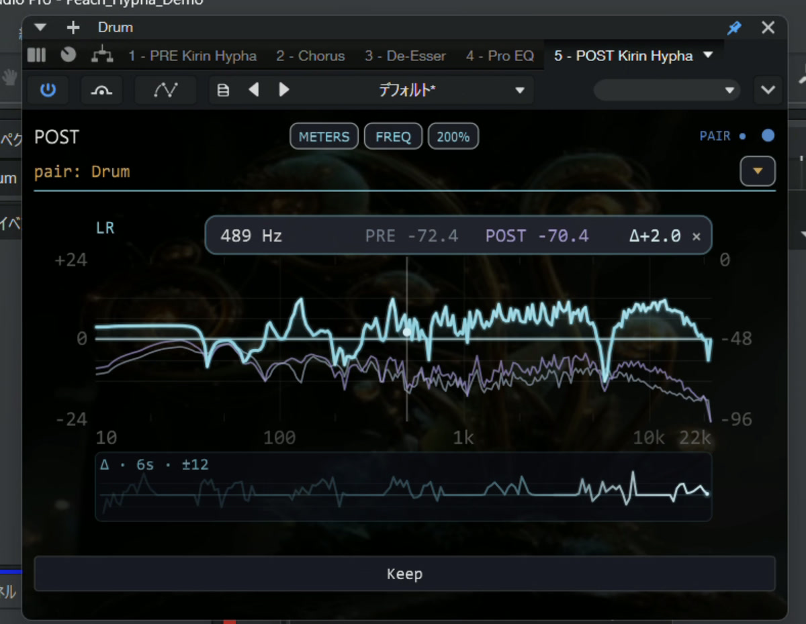
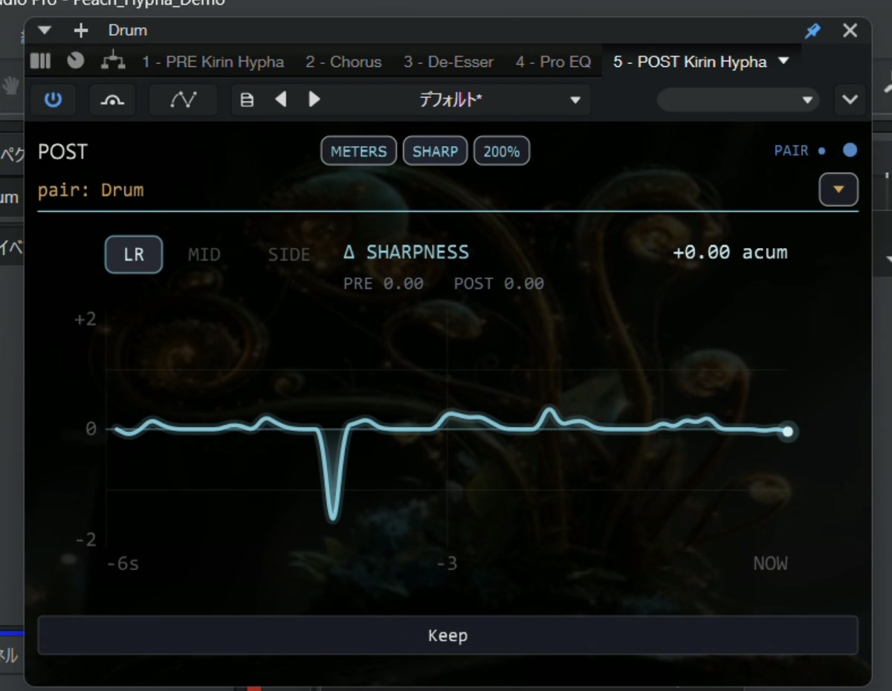
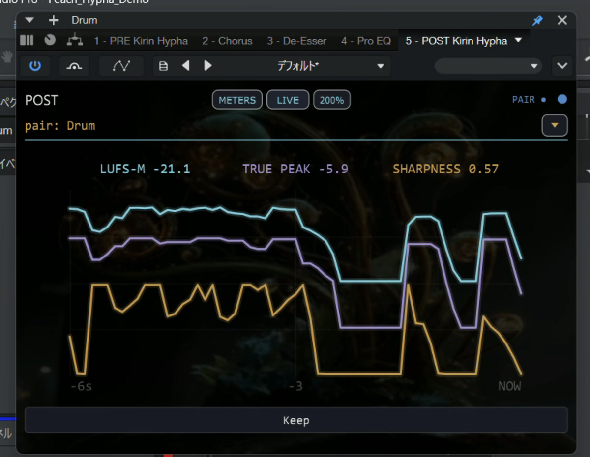
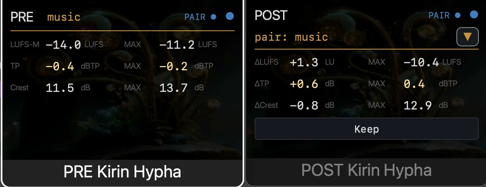

# Kirin Hypha

**See what changed across a processing chain — while the measurement path stays transparent.**

Contributors: read [CONTRIBUTING.md](CONTRIBUTING.md) and [AGENTS.md](AGENTS.md).
The [build guide](docs/hypha_build_entry.md) documents unsigned native builds;
[release qualification](docs/hypha_release_entry.md) covers signing, acceptance and publication.
Both `node scripts/build_hypha.mjs --help` and `--release --help` work without SDKs, credentials or iLok.
For a quick unsigned GUI/DSP test build, run `node scripts/build_hypha.mjs --without-aax`
(Mac: PRE/POST AU+VST3 Universal; Windows: PRE/POST VST3 x64; no AAX SDK or iLok).
The default still builds all formats; this shortcut is not a full-format/release gate.

Kirin Hypha is a free, open-source pass-through measurement plug-in for macOS and Windows. Place
**PRE** before the processors you want to inspect and **POST** after them. POST then shows the measured
difference between those two exact points. Normal measurement does not generate, modify, attenuate,
or delay audio. Only an explicit audition temporarily replaces POST's output: Reference and PRE/POST
Blind play a verified, immutable comparison copy, and the live PRE/POST compare plays PRE's input
where its line-up with POST is proven.



[Watch FREQ react to the measured chain in Studio One (10-second silent MP4)](docs/media/kirin-hypha-freq-demo.mp4)

## Start in under a minute

1. Insert **PRE Kirin Hypha** before the processing chain.
2. Insert **POST Kirin Hypha** after the processing chain.
3. Click POST's pair selector or arrow, then choose that exact PRE under **PRE connection**.
4. Use the top-level **LEVEL**, **TIME**, **FREQ**, and **SPACE** domains. In **TIME**, choose
   **HISTORY**, **ATTACK**, **SHARP**, or **LIVE**.

Names are optional labels. PRE and POST do not need matching names, and track position is never used
to guess a pair. The two plug-ins are the measurement boundary: PRE captures the input state, while
POST captures the output state and joins only verified matching observations.

## Channel scope

- **Mono and stereo:** the complete LEVEL / TIME / FREQ / SPACE, Record / Keep, Reference, local
  PRE/POST Blind and live PRE/POST compare surface is available where its normal role, license and
  platform gates allow it.
- **Exact 5.1 (`L, R, C, LFE, Ls, Rs`):** LEVEL and TIME measurement only, including the six
  role-specific Peak, True Peak, and Clip facts plus shared Loudness, LRA, and PLR. Record / Keep,
  Reference, local PRE/POST Blind, the live PRE/POST compare, Hybrid VU, FREQ, and SPACE are
  deliberately unavailable.
- **Other multichannel layouts:** Hypha refuses the layout instead of guessing channel roles or
  presenting stereo-only facts as surround measurements.

The measurement-only 5.1 path remains a transparent pass-through with zero reported samples of
latency. It does not allocate the Record backlog or run optional FREQ / ATTACK analysis in the
background.

## Four observation domains

### LEVEL — loudness, peak, dynamics, and meaningful history

LEVEL keeps immediate loudness and dynamics facts above fixed-scale history. The large view adds M,
S, I, five supporting facts, and L/R meters without changing the compact measurement definitions.

The footer at 150% and above distinguishes LIVE, HOLD, WAITING and BYPASSED; at 100% and 125% the
folded strip shows only the short states (WAITING, BYPASSED, FORMAT HELD, 5.1 MEASURE). The loaded
version remains in the information menu, not in the narrow status rail.

At 600×400 and above, click a LEVEL history point to hold the display while measurement continues.
`< TP` / `TP >` select adjacent excursions above −1 dBTP; `LIVE` resumes scrolling without resetting
measurements. Only TP strictly above 0 dBTP receives strong local glow, always at its measured height.
`COPY` copies the selected TP and approximate host-clock window endpoint. `HOST ~` does not promise
project-timeline coordinates or an exact peak sample: this history ABI does not distinguish project
and render clocks. An unavailable host position is shown as `ELAPSED`, never invented as a DAW position.

### TIME — what happened and when

TIME directly selects **HISTORY**, validated DRUM **ATTACK**, signed **SHARP**, or three absolute
**LIVE** facts. Only the selected optional analyzer runs.

DRUM draws the six-second PRE/POST envelope above four per-hit lanes on the same time axis:
**TRANSIENT** (the first 30 ms against the body that follows), **STRENGTH**, **CREST**, and
**SHARPNESS** (the first 100 ms), each as POST − PRE. A matched POST hit is measured at the PRE
onset, so both sides read the same content samples. A TRANSIENT whose next hit leaves no 20 ms body,
or whose body is below the −72 dBFS HISTORY floor, shows the reason instead of a value. A hit shows
STRENGTH and CREST as soon as its first 30 ms are measured; TRANSIENT and SHARPNESS follow once its
body is complete, and stay empty for a hit cut off by a transport stop. Without PRE, the lanes show
POST values.

**BAND**, on DRUM's second header row, filters each hit to one ISO octave band (63 Hz to 8 kHz) on
PRE and POST and turns the four lanes into **DELAY** (POST arrival − PRE arrival, where the band
envelope rises through its peak − 20 dB), **ATT** (10 → 90 % of the band peak), **REL** (peak →
−20 dB) and **LEVEL** (the band peak), each as POST − PRE of the same hit. The four lanes become
number lines: each of the last eight hits that rise in the band is a dot at its value, and the bar is
their median. While LIVE, DRUM reads them in one steady summary: each lane's median with its
direction in words and how many hits agree (`+2.7 ms LATER 8/8`), `SAME` when the median is inside
what the band can tell apart, and a card or line such as `POST 2.7 ms LATER / TAIL 28 ms LONGER`.
Hits whose band only rings on, is silent or was not kept are left out and counted. At 200 % and
300 % HISTORY shows those hits' average **HEAD** (−5 to +40 ms) and **TAIL** (0 to 300 ms) in that
band; at 125 % it holds four small number lines. Click a dot (or use ← → HOME) to lock that hit and
read its own values, envelopes and place in the six seconds; the same dot, END or NOW returns to
the summary. The band hits are the same hits as the whole-signal lanes. Each hit is measured once,
after its ring-out, and choosing another band measures the last 7 s again, even while stopped. Every
missing value says why at every size: `RINGING` (the previous hit still rings in the band), `NO SOUND`,
`NEXT HIT` (the tail was cut), `LONG TAIL`, or `NOT MEASURED` (played before the band was chosen).
A value past what was measured reads as a bound, such as `<16 ms` for an ATT shorter than the band's
time resolution (one period of its centre), `>288 ms` for a tail still ringing, or `<-66.0 dB` when
POST has no sound in the band. When nothing in view was measured yet, DRUM says
`PLAY TO MEASURE 63 Hz`. **ALL** returns to the whole-signal DRUM, and while no band is chosen
nothing extra is measured or kept. A PRE older than bands keeps pairing but sends no band: the
lanes then show POST values and DELAY says `UPDATE PRE`.

### FREQ — where the chain changed

The cyan **Δ (POST − PRE)** curve is the primary view. PRE and POST remain visible as references.
Choose LR, MID, or SIDE; click a frequency to keep its exact six-second **Focus Trail**; use **MARK**
to retain one temporary full-spectrum reference. The display scale is ±24 dB.

### SHARP — how perceptual brightness changed over time



SHARP shows six seconds of signed **Δ Sharpness** in acum. It reports observation only: no target,
warning colour, score, or recommendation.

### LIVE — three absolute POST facts on one timeline



LIVE overlays POST **LUFS-M**, **recent True Peak**, and **Sharpness** on one six-second time axis.
Each metric keeps an independent fixed scale, and the current values update at a readable rate.

### SPACE — stereo distribution, and what the mono sum keeps

SPACE shows three-second MID/SIDE density, L/R balance, and correlation. It stays absolute because
Hypha does not invent PRE/POST subtraction for correlation or the stereo field.

At the largest editor it also shows **MONO**, beside the full-height scatter and under BAL and
CORR: how much of each third-octave band survives being summed to mono. One correlation figure is one number for the whole signal, and a stereo problem is
never spread evenly across the spectrum — it is a bass note, or a band an M/S move widened, or a
pair of channels that ended up out of phase somewhere. MONO says which band, and by how much.

Mid and Side are built in the time domain before the transform, so a phase cancellation is already
in the magnitude and the figure is what the band actually loses, not a width estimate.

Identical channels read 0 dB and a hard-panned source exactly -3.01 dB, and those two are the ends
of one range: while a band's channels share polarity, its reading cannot fall below -3.01 dB,
however wide the band is. A reading past -3.01 dB means the channels are partly opposed there, and
a band that cancels outright falls to the floor. The scale is split on that: the top half carries
0..-6 dB, which is every same-polarity reading and the margin around it, and the bottom half
-6..-24 dB, which is cancellation. A band with nothing to measure breaks the line rather than being
drawn at 0 dB, which is the one reading that means the band loses nothing. Below the frequency where one observation holds fewer than three
cycles, a divider and a tilde say so without hiding the values.

Under the curve, six seconds of the same bands run bottom to top: the newest observation along the
bottom edge, rising as it ages. A cancellation that came and went is visible after it has gone.
Those six seconds live in the editor, so closing it loses them; per-band history is not written to
the TIME history or to Record.

MONO is measured on both PRE and POST, so the two can be compared by switching between the
plug-ins. It adds no analyzer, consumes no analysis slot, and runs whether or not SPACE is open.

Two POST optional analyzers may stay active: one can remain on the 2MIX while the other follows the
working track. A third identifies the owners and waits until one returns to **LEVEL**, **TIME /
HISTORY**, or **SPACE**, or closes.

macOS 12 or later is supported as signed and notarized VST3 and Audio Unit plug-ins. Windows 10/11
64-bit is supported as VST3. The current v1.1.49 Windows release uses one Authenticode-signed
installer for PRE and POST. Its payloads, installer, and generated uninstaller passed signature,
pluginval, dedicated-machine DAW, same-version reinstall, v1.1.48 upgrade, and isolated-uninstall
gates.

## Design

Kirin Hypha is built to **observe, not to advise**.

It produces measurement data. During normal measurement, it does not generate, modify, attenuate,
or delay audio: the same input produces the same output, every time. An explicit comparison audition
is a separate output-only path; it never rewrites the input, the captured PRE/POST measurements, or
Record data. Numbers are reported as captured — no interpretation, no scoring, no recommendation.

Two display filters exist in the shipping JUCE surface. They affect what is drawn, never what is
measured, stored, or read back.

- **Live FREQ curves.** The absolute PRE / POST / MID / SIDE spectra rise on the next drawing tick
  and fall at 20 dB per 500 ms. The signed Δ curve follows its target symmetrically over 150 ms, so
  neither sign is favoured.
- **MONO's live curve.** A band with nothing to measure in the current 100 ms observation (the rest
  between two drum hits, for instance) keeps the value it was last measured at for up to one second,
  drawn faintly, so the curve does not blink between hits. After that the band breaks the line.

Watch consumes the producer-owned `KirinWatchDisplay` snapshot directly. SPACE's six-second MONO
field draws observations as measured.

When playback stops, or a rest outlasts the 3-second Watch window, the pages with a six-second history
(FREQ's field or landscape, LIVE, SHARP and SPACE's MONO field) keep what was measured on screen,
dimmed, and withdraw only the present: the live curve and the current values. Rests shorter than
3 seconds, such as the gaps between drum hits, keep every page live.

Everything else is the measurement itself: the playback-pass and Keep maximums, LUFS-S, the FREQ
numeric readout, the six-second field, MARK, Focus Trail, peak hold, Meter Session statistics, TIME
history, the SHARP and LIVE timelines, Record, Keep, and `plugin_data`. A value read back later is therefore the measured
one, and FREQ's live curve can differ from its unsmoothed numeric readout while it is moving.

Every metric is backed by a known-signal golden test: the expected values are derived independently from the signal definition and the ITU-R BS.1770 filter coefficients, not asserted by hand. The measurement layer demonstrates its precision rather than claiming it.

The public [BS.1770-5 / EBU R 128 v5 measurement audit](docs/hypha_bs1770_5_r128_v5_audit_20260831.md)
records the verified scope: BS.1770-5 Annex 1/2 for mono and stereo, all 70 assets in the EBU
Loudness Test Set v05, the source archive SHA-256, and comparison of the Hypha wrapper with the
pinned `ebur128` reference. Decoding the 5.0/5.1 test assets was not used as evidence for the
separately implemented exact 5.1 measurement-only product mode. Hypha does not claim EBU Mode
conformance and does not use the EBU logo.

## Modes

| Feature | Standalone | With Kirin OS |
|---|---|---|
| Watch mode | ✓ | ✓ |
| POST on-demand ATTACK / FREQ / SHARP / LIVE | ✓ | ✓ |
| Local PRE/POST Blind Compare | ✓ | ✓ |
| Live PRE/POST compare (Windows: Pro Tools check pending) | ✓ | ✓ |
| Record mode | — | ✓ |
| plugin_data output | — | ✓ |

Kirin Hypha is free and fully functional as a standalone plugin. Record mode requires a Kirin OS license.

## Screen language

Hypha's screen is in English or Japanese. **MENU → Display → Language** chooses **English** or
**日本語**; until a choice is made, Hypha follows the system's display language. The choice is saved
for every PRE and POST, and open editors switch at once. In Japanese, what explains or reports is
Japanese: status lines, notices, hover help, menus, guidance and dialog text. Labels, abbreviations,
legends, units, values and names (LEVEL, LUFS, TP, POST / Δ, MARK, Kirin OS names) stay as written,
so the layout and the measurement vocabulary are the same in both languages. The language changes
only what is drawn; plug-in names shown by the host, Record, `plugin_data`, the data exchanged with
Kirin OS, and every measurement stay the same.

## What it measures

### Watch mode (real-time)

| Metric | Window / Unit | Standard |
|---|---|---|
| LUFS-M / LUFS-S | Selectable Momentary (400 ms) or Short-term (3 s) loudness (LUFS) | ITU-R BS.1770 |
| True Peak | Recent peak, last 400 ms (dBTP) | ITU-R BS.1770 |
| Crest Factor | Peak − RMS, 400 ms (dB) | — |

PRE displays absolute values. POST displays Δ values relative to the paired PRE. If that exact PRE
is explicitly bypassed, POST returns to its own absolute values without releasing the pair; the
upper-right state changes from blue **PAIR** to lavender **ABS** until PRE is enabled again. A stop,
silence, stale read, or temporary absence never claims that PRE was bypassed. The M/S choice
also selects the independent MAX value for the current Watch playback pass.
In LEVEL, the live 400 ms True Peak and its playback-pass MAX are distinct facts. Pressing **Keep**
changes the presented result context; **Max TP** then means the maximum for the whole Keep session,
including across transport stops. Watch, every MAX, and everything Keep and Record write are raw.

### FREQ: Spectrum (on demand)

A paired POST uses top-level **FREQ** to inspect processing between PRE and POST. Spectrum runs only
while FREQ is open. The signed **Δ (POST − PRE)** curve is the primary
**RAW** display, with absolute PRE and POST spectra retained as reference curves. **SHAPE** is a
one-click alternative: it removes the measured whole-aperture energy difference from each valid
band to make relative spectral reshaping visible. RAW and SHAPE use the same exact PRE/POST
apertures and require no additional FFT. Bands without sufficient energy remain absent, rather
than being joined across a gap or shown as a zero difference. Both modes use a ±24 dB
scale; the underlying difference is not clipped. A difference is produced only when PRE and POST
frames have the same sample rate, aperture length, FFT layout, channel mode, channel count, and
output-presentation sample endpoint.

| Control | Observation behavior |
|---|---|
| LR / MID / SIDE | Selects exactly one channel definition; the three analyzers never run in parallel |
| M/S | Overlays the POST-local `(L+R)/2` Mid and `(L-R)/2` Side spectra from one stereo aperture; unavailable for mono or Δ |
| RAW / SHAPE | Switches the same exact-pair curve between gain-inclusive difference and energy-normalized shape; clears a mode-specific MARK and Focus Trail |
| Hover / click | Reads frequency and the selected RAW/SHAPE value; click locks the probe, shows its six-second Focus Trail, and × releases it |
| MARK | Captures or replaces one temporary display-only reference in the selected mode; × clears it |
| Free resize / 100–300% presets | Keeps a fixed 3:2 aspect ratio from 300×200 through the native 900×600 Inspection View and remembers the exact loaded-instance size. Drag the editor's own bottom-right grip in any host (Studio One on Windows and Pro Tools have no window frame to drag) or choose a size from the size menu. Above 300% the Inspection View is magnified in steps that keep it on whole device pixels for the display (450% and 600% on a Retina display; 600% at 100% Windows scaling; 400% and 600% at 150%; none fits a 1920×1080 display at 125%) |

The page analyzes one selected channel view at a time. **LR** transforms L and R independently and
averages their power, so opposite-polarity channels do not cancel. **MID** analyzes the `(L+R)/2`
waveform. **SIDE** analyzes `(L−R)/2` and is available only for stereo input; mono never fabricates a
SIDE result. Switching LR / MID / SIDE clears the old frame and waits for an exact PRE/POST match in
the newly selected mode. Record-mode N and Sharpness use their own independent-channel definition,
described below, so they can differ from MID or SIDE Spectrum on wide or phase-opposed material.

When POST has no verified PRE, Spectrum shows POST on its own: the current curve, a rolling peak
hold, and the **six-second field** behind them. The field is a second axis inside the same
rectangle — vertical is time, not level. The newest observation is drawn along the bottom edge and
rises as it ages, leaving the top edge six seconds later, so a resonance that appeared, a sweep, or
a level move traces a visible shape. Each of its 180 rows is one thirtieth of a second and shows
the observation nearest that instant, at the full band resolution; density follows the measured
level, so a loud band is far denser than a quiet one. Nothing is averaged, blended, or invented
between observations. A row stays empty when the nearest observation is further away than the
cadence the host is actually publishing at, so the field is continuous at any buffer size while a
break in the measurement stays a break in the field.

At 200% and 300% the same six seconds are drawn as a landscape instead of a flat field. The newest
spectrum stands on the plot itself as the front ridge, on the same frequency and level axes as the
curve, and older spectra recede toward a horizon: higher, narrower, and fainter with age. Each of
the 24 ridges is the one observation nearest its age, keeping the loudest band in each of its 96
columns so a narrow peak is not thinned away. A ridge with no observation within half a ridge
spacing is left out and grid lines join only neighbouring ridges, so a gap stays a gap and two lone
observations never grow a range between them. The landscape adds no value to the reading; the
current curve drawn over it does. The paired Δ view stays flat. At these two sizes the plot also
names what it draws (`Δ(f) = POST(f) - PRE(f)` or `L(f) = POST(f)`) and the analysis behind it —
aperture, FFT size, band count, and presentation rate — read from the frame itself.

In the POST target, **M/S** is a fourth display choice beside LR / MID / SIDE. It overlays solid
cyan Mid and violet Side curves calculated from the same aperture, with a shared
0 to −96 dBFS scale and a two-value probe at every editor size. M/S is an absolute POST observation:
the Δ target is disabled until LR, MID, or SIDE is selected, and M/S is disabled while Δ is active.
M/S creates no PRE request, six-second field, peak hold, MARK, or Focus Trail, and its choice never
leaks into SHARP. The loaded plug-in instance remembers the choice across editor close/reopen, but
new instances and restored DAW sessions start from the existing LR default.

Hovering the plot shows frequency and the selected RAW/SHAPE value; larger views also show PRE and POST values.
Below the cycle-derived low-frequency confidence boundary (about 35 Hz), the frequency alone carries
an unobtrusive `~` prefix. The measured band and Δ remain visible and are not dimmed, hidden, or
replaced by a warning. Hover help explains that `~` means an approximate low-frequency position.
All Analysis hover help wraps and repositions inside the plug-in at every size. At 300 % and above,
pointing at an item on LEVEL, TIME, FREQ, SPACE or REF's B, C and V shows its help in one line over
the footer instead of a popup: across the whole footer row for the graphs, values and tabs (what the
item is and how it is used; PLR, for one, reads as the song's average dynamics, compared between PRE
and POST to see how much limiting reduced it), and in the status at the left for the footer's own
controls, which stay in view. The popup at 200 % and below keeps the full text. **Show hover help**
in the POST arrow menu disables or restores explanatory popups for every PRE and POST; the user
preference survives plug-in and DAW restarts. FREQ inspection, click lock, Focus Trail, and MARK stay
available while help is hidden. A click in the plot
locks that readout to the same frequency until its × is pressed. While locked,
**Focus Trail** shows six seconds of the selected mode: compact at the smallest size and in its own lane when space
permits. Its newest point is the same exact PRE/POST presentation frame as the live Δ, not a
UI-clock estimate. A missed UI poll does not erase valid older observations: retained points keep
their true sample-time positions. The work-surface stroke joins the surrounding exact points across a
missing endpoint so Windows scheduling jitter does not look like a broken curve; the missing time is
still retained as gap metadata and no measurement is inserted. Reversed or incompatible frames, and
a forward discontinuity beyond the six-second view, start a clean trail. After a backwards transport
move, PRE and POST may resume one analysis cadence apart; FREQ waits until both have crossed the old
endpoint, then resumes from their newest exact shared endpoint. The frequency lock and MARK remain
where the user placed them across a loop, silence, temporary warming state, or short I/O gap; only
the factual trail restarts on the new exact time axis. **MARK** freezes one display-only full-band curve as a solid amber reference beneath
the cyan live curve; pressing MARK again replaces it, and its × clears it.
MARK is temporary and is cleared when the pair, sample rate, FFT layout, channel mode, or page changes.
It adds no analyzer and changes no measured value. Exact 3:2 size is remembered for the loaded
instance, while Spectrum itself still opens off.
Focus Trail retains only fixed-capacity display snapshots while Spectrum is open. It adds no analyzer,
does not smooth or delay the live curve, and is discarded on pair, rate, layout, channel-mode, or page
changes.

Continuity has two bounded layers. POST keeps the newest eight already-computed exact Spectrum
differences in a fixed recovery ring, so a short UI scheduling stall can collect missed frames on the
next poll without another FFT. If a stall exceeds that ring, Focus Trail still keeps the surviving
exact points at their sample-time positions and connects only those surrounding observations for the
work-surface stroke. Both layers are display transport only: no dynamic growth, extra analyzer,
filesystem polling, or Audio Thread work.

The optional PRE/POST exchange is supervised by the existing 10 Hz IO update. On Windows its
short-lived request, readiness, and Analysis snapshots use a small pagefile-backed shared-memory
mapping, avoiding dependence on filesystem create/rename latency at the 30 Hz Spectrum cadence.
macOS retains the atomic-file transport. Watch, Record, and `plugin_data` keep their existing file
contracts on both platforms. Each shared slot is double-buffered and committed as one generation;
a reader keeps the last complete value during a contended update rather than accepting partial data.

The watchdog advances only after a request, readiness fact, or PRE snapshot was actually published.
If publication stops, the stable IO path retries one non-blocking exact exchange before the
1.5-second request lease can expire. During a transient gap, the last exact FREQ or SHARP
presentation is held only within that same lease boundary instead of flashing an empty page. A
publication that completes after its lease has already expired is not counted as live. No second
analyzer is started, no mismatched frames are joined, and no Analysis transport work enters the
Audio Thread.

Where both spectra are extremely quiet, the displayed Δ alone is faded toward zero: it is fully
suppressed at and below −120 dBFS and reaches full strength at −96 dBFS. This display floor does not
alter the captured PRE or POST values. The analyzer follows the host sample rate without resampling.
Its Hann aperture is rounded from the 48 kHz reference time of `4096 / 48000` seconds (about
85.33 ms), and its FFT is the smallest power of two that preserves at least 2× zero-padding. Thus
48 kHz remains exactly 4096 samples / 8192 FFT points, while 44.1, 96, 192, and 384 kHz use
3763/8192, 8192/16384, 16384/32768, and 32768/65536 respectively. Analysis remains at 30 Hz. The live
curve presents the newest frame at 12 Hz and numeric probe values at 2 Hz, without averaging or
changing the measured endpoint. All curve points, hover interpolation, MARK, and Focus Trail use the
same logarithmic band centres `(index + 0.5) / 256`. The first and last edge labels remain plot
boundaries, not invented samples. It compares measured programme energy rather
than reconstructing a plug-in transfer function, so narrow low-frequency EQ shapes can appear broader
than the corresponding EQ control graph.

### TIME / SHARP: Perceptual Δ (on demand)

From **TIME**, **SHARP** opens Perceptual Δ; the top-level **FREQ** domain opens Spectrum. The first
Perceptual Δ observation is **Δ Sharpness History**. It plots the signed Sharpness difference
`POST − PRE` over the latest six seconds, with the newest exact value shown in acum. The measured
difference is not clipped; the stable display scale is ±2 acum. The curve is spatially rounded for
legibility, but no temporal smoothing delays it. The curve keeps the same visual strength across the
full history. Its fill is controlled only by distance from zero: quiet at zero and progressively
denser toward either display edge, never by sample age. Only a small dot identifies the newest exact
observation. All measured
10 Hz points remain in a retained six-second timeline: the curve is repainted at 5 Hz and the exact
PRE / POST / Δ numbers are held for 500 ms. A delayed UI update catches up from that factual
timeline instead of exposing scheduling jitter as broken segments. A true measurement discontinuity
starts one clean new run; no missing value is interpolated.

Each point comes from one non-overlapping 100 ms aperture and is published at 10 Hz. Before the
first point, PRE reports readiness and POST commits one shared, aperture-aligned presentation epoch
at least 200 ms in the future. PRE and POST reset their Phase D and optional sample-rate-converter
state once at that epoch, then preserve that state continuously across later apertures. They must
match in schema, host sample rate, aperture length, state epoch, channel definition, channel count,
and output-presentation sample endpoint. If any of those facts differ, no Δ point is produced.

The psychoacoustic engine runs at its defined 48 kHz analysis rate after following the host-rate
input; at 44.1, 48, 96, or 192 kHz each endpoint still represents exactly 100 ms of host
presentation time. A non-48 kHz converter may buffer an additional chunk before publishing an
already-measured endpoint; it does not shift or interpolate that endpoint. A dropped block,
timeline discontinuity, mode edge, or missed epoch clears the short history and requires a new
shared future epoch instead of continuing state across a gap.

**LR** measures L and R independently and uses their arithmetic mean, so channel polarity cannot
cancel the observation. **MID** measures `(L+R)/2`; **SIDE** measures `(L−R)/2` and remains stereo-
only. Changing channel mode starts new history. Returning to **TIME / HISTORY**, another
non-analysis domain, or closing stops Sharpness and discards display history. Spectrum and
Sharpness stop each other before starting without releasing the owned optional-analysis slot.
Neither changes audio nor rewrites Watch or Record results.

### TIME / LIVE: absolute facts (on demand)

From **TIME**, **LIVE** opens a POST-only absolute timeline; top-level **FREQ** opens Spectrum.
LIVE does not subtract PRE and does not create a PRE analysis request. It overlays three measured
facts on the same latest-six-second time axis:

| Trace | Colour | Fixed display scale |
|---|---|---|
| LUFS-M | Cyan | −42 to 0 LUFS |
| Recent True Peak | Pale violet | −30 to +6 dBTP |
| Sharpness | Amber | 0 to 3 acum |

Each trace has its own fixed scale, so vertical position is comparable over time within that metric,
not numerically between the three metrics. Values outside a display scale remain measured facts and
are only bounded at the plot edge. In a sparse source, an exact aperture whose LUFS-M or recent True
Peak is below the measurement floor remains unavailable internally and in the numeric readout; the
curve alone reaches the lower plot edge so silence does not resemble a dropped UI frame. There are no
targets, score bands, warning colours, or verdicts.

All three values are committed at the same exact 100 ms POST presentation endpoint. Measurement runs
at 10 Hz, Rust retains 64 exact points, the curve repaints at 5 Hz, and current numbers update at 2 Hz.
No missing measurement is interpolated or stored as a value, and no temporal smoothing delays the
display. A short forward observation gap retains the verified points on both sides at their exact
sample times and joins only those points for presentation. A single verified point is shown as a
dot, and a temporary worker re-arm does not erase the last verified field. Backward transport, an
incompatible format, or a gap spanning the six-second field starts a new run.
LUFS-M and recent True Peak reuse Watch's measurement definitions; recent True Peak is the latest
400 ms maximum rather than a session hold. Sharpness keeps the established independent-channel
arithmetic-mean definition. Switching **ATTACK**, **FREQ**, **SHARP**, and **LIVE** replaces only the
analyzer in the owned slot. A non-analysis domain or editor close releases it and discards history.

At most two of ATTACK, FREQ, SHARP, and LIVE run per DAW process. This supports a mix bus plus one
working track without starting 12 costly analyzers. A third view names the two owners and waits.
PRE/POST pairs, Watch, Record, and audio pass-through have no such two-slot limit. Switching optional
views keeps ownership; only a non-analysis domain or editor close releases it.

### Record mode (Kirin OS required)

| Metric | Window / Unit | Standard |
|---|---|---|
| LUFS-M / LUFS-S | Selectable Momentary (400 ms) or Short-term (3 s) loudness (LUFS) | ITU-R BS.1770 |
| Integrated Loudness | Current Keep session (LUFS) | ITU-R BS.1770 |
| Max True Peak | Current Keep session maximum (dBTP) | ITU-R BS.1770 |
| Crest Factor | Peak − RMS, 400 ms (dB) | — |
| PSR | Peak-to-Short-term Ratio, 3 s (dB) | — |
| Sharpness | acum, independent-channel arithmetic mean | DIN 45692 |

PRE displays all six values. A paired POST displays Δ for the selected M/S loudness, PSR, Crest,
and Sharpness; Integrated Loudness and Max True Peak remain absolute POST session values. The
Integrated value spans transport stops within one Keep. After Stop, the final Record result remains
visible until the first newly computed Watch result arrives.
PSR always uses the engine's 3 s Short-term loudness, regardless of the M/S selector. The selector
changes the loudness value displayed and compared; it does not redefine PSR.

**On True Peak.** Two distinct True Peak quantities are reported. The *recent peak* is the maximum inter-sample peak within the last 400 ms (the same window as LUFS-M) and is shown live in Watch mode; it is not held, so a transient drops out of the reading once that window has passed. The *session maximum* is the running maximum inter-sample peak over the whole recording and is what the Record data stores. When a single dBTP figure is quoted for a file, it is the session maximum. Peak windows are tracked by sample count, so offline / faster-than-real-time rendering does not shift them.

**On Crest Factor.** Crest Factor is the sample-peak level minus the RMS level (both in dBFS) over the same 400 ms window. Peak and RMS are both computed across the pooled samples of all channels — not a mono sum — and the peak is a sample peak, not the inter-sample True Peak. A silent window produces no value (shown as `---`).

**On the psychoacoustic metrics.** N (Zwicker loudness) remains measured and stored for Kirin OS
even though it is no longer one of the six DAW display cells. For multichannel Record data, N and
Sharpness are measured independently per input channel and combined by arithmetic mean. They do not
sum the waveform before the nonlinear psychoacoustic pipeline. Perceptual Δ uses that same definition
for LR, while its explicit MID and SIDE selections intentionally measure `(L+R)/2` and `(L−R)/2`.

## Download

Download the latest macOS or Windows release from the [Releases page](https://github.com/heyalohaloha/kirin_hypha/releases).

The macOS installer package and the plug-in bundles inside it are signed with Apple Developer ID certificates and notarized by Apple, so Gatekeeper normally opens them without a warning. If a downloaded file is still flagged — for instance when the quarantine attribute persists — you can inspect it and clear the flag yourself:

```bash
# Inspect the installer signature
pkgutil --check-signature "Kirin-Hypha-<version>-macOS-Universal.pkg"

# Verify the download against the SHA-256 shown on the Releases page
shasum -a 256 "Kirin-Hypha-<version>-macOS-Universal.pkg"

# Remove the quarantine attribute if macOS blocks the installer
xattr -d com.apple.quarantine "Kirin-Hypha-<version>-macOS-Universal.pkg"
```

The installer package has companion `.pkg.sha256` and artifact JSON assets on the Releases page. Older zip archives are manual-install fallback artifacts.

The current v1.1.49 Windows 10/11 64-bit VST3 release is distributed as one signed installer EXE for
PRE and POST. It was built from the same release commit as macOS and passed Windows CI, pluginval,
Studio One Pro validation, same-version reinstall, upgrade from v1.1.48, and isolated uninstall on
the dedicated Windows machine. Its plug-in binaries, installer, and generated uninstaller all have
valid Authenticode signatures. [`docs/windows_external_validation.md`](docs/windows_external_validation.md)
is the repeatable real-machine regression checklist.

### Release provenance

Published artifacts are immutable. If repository maintenance changes a public commit ID after a release, the commit recorded in that artifact remains its original build commit. [`docs/release_commit_map.json`](docs/release_commit_map.json) maps an affected artifact commit to the commit currently referenced by its release tag and records the verified source-equivalence scope.

Maintainers use the [public history identity contract](docs/public_history_identity.md): full commit
SHAs, SemVer tags, and PR numbers are authoritative; historical B numbers are supplemental labels.

## Installation

### macOS

1. Download the latest `Kirin-Hypha-<version>-macOS-Universal.pkg` from the [Releases page](https://github.com/heyalohaloha/kirin_hypha/releases).
2. Open the installer package and follow macOS Installer.
   - The package installs **VST3** to `/Library/Audio/Plug-Ins/VST3/`.
   - The package installs **Audio Unit** to `/Library/Audio/Plug-Ins/Components/`.
   - The package removes old user-level and system-level Kirin Hypha PRE/POST copies before installing, so DAWs do not load stale bundles first.
3. Rescan plugins in your DAW.
4. Insert **PRE Kirin Hypha** before your processing chain.
5. Insert **POST Kirin Hypha** after your processing chain.

### Windows

1. Download the latest `Kirin-Hypha-<version>-Windows-x64-Setup.exe` and its `.sha256` companion
   from the [Releases page](https://github.com/heyalohaloha/kirin_hypha/releases).
2. Close the DAW and run the installer. Select **Current user** unless you specifically need the
   elevated all-users installation.
3. Start the DAW and rescan VST3 plug-ins if needed.
4. Insert **PRE Kirin Hypha** before your processing chain and **POST Kirin Hypha** after it.

The manual VST3 ZIP is a diagnostic and recovery fallback, not the normal installation path.

## Sandbox & privacy (Audio Unit)

The Audio Unit declares a broad file-access entitlement (`temporary-exception.files.all.read-write`), which the AU sandbox requires for the plug-in to persist its session data (`.kirin` and plug-in data) on disk. The build declares no network entitlement and links no networking or web frameworks — you can confirm this with `codesign -d --entitlements - "Kirin Hypha PRE.component"` and `otool -L "Kirin Hypha PRE.component"`.

## Pairing PRE and POST

Pairing is an explicit selection of one exact PRE instance. It is not inferred from track position or
matching names.

1. Insert PRE before the processors and POST after them.
2. In POST, click the read-only pair selector or its arrow.
3. Under **PRE connection**, select the intended PRE.
4. POST keeps that exact PRE identity and begins displaying Δ values.

Giving PRE a name such as `Mix`, `Drum`, or `Vocal` makes the menu easier to scan, but naming is
optional. UTF-8 labels, including Japanese, are supported. An unnamed PRE can still be selected by
its exact instance identity. POST never accepts a typed pair name or retargets another PRE by name.

Multiple PRE / POST pairs can run simultaneously (up to 12 active pairs per project).

## Reference from Kirin OS

Kirin OS automatically publishes its saved Reference library to POST. No Work connection,
INSPECT screen, receiver choice, or connect button is required. A small OS indicator reports the
connection; received settings remain visible when media is unavailable. Hypha does not substitute
its own Factory library.

Reference has four roles, each with its own button in the same place at every size: **A B C V**.

- **A — LIVE**: the DAW input. A is never processed; every other role is an audition copy.
- **B — REF**: the songs of a B set. In Kirin OS you rank up to three B sets for Hypha; choose the
  set and the song on the B page. A song plays its Cue as Kirin OS set it, starting from the Cue's
  head; when you press B, or B returns after a stop or seek, at a point outside that Cue (you moved
  back before where you chose the song, or the song has run past its end), B starts the Cue again
  from the current position instead of refusing. If a chosen song leaves
  the B set, Hypha says so instead of switching to another song. If Hypha cannot read a B set (for
  example from a newer Kirin OS), the B page asks to update Kirin OS and Hypha; the sets it can read
  stay usable, and while Kirin OS is publishing new sets the current ones stay.
- **C — CHECK**: a Check from a CHECK set (also ranked in Kirin OS, up to three). A Check names what
  to listen for; its song defaults to the first-ranked B set. The Cue is the section C plays.
- **V — VERSION**: another Version of the same song, aligned to A's position by its content.

Only one role sounds at a time. The A/B/C/V buttons change the sound; the pages change only the
display. Choosing a different song, Check, Cue or Version changes only that role: if it was playing,
it fades to A and plays the new choice with a new MATCH as soon as it is ready; the other roles keep
playing. Receiving or restoring settings never starts a role.

**Level matching.** B and V follow A: every second Hypha measures A's gated loudness over the last
10 seconds (BS.1770 gating of the 100 ms momentary history) and moves the audition copy toward
"A − the source's level" with a 50 ms ramp, ignoring changes within 0.5 dB. B uses its Cue's
Integrated loudness from Kirin OS (the whole song when the Cue has no value); V pairs A with the
aligned V content over the same window. Following never raises the copy above
max(−1 dBTP, A's maximum true peak, the source's maximum true peak) and never moves more than 6 dB
from the gain of the MATCH you started (as AUTO in the live PRE/POST compare); at either limit it
stops, keeps the current gain and says so. After stopping at the ceiling, following resumes as soon
as A gets quieter and the copy needs to come down, because lowering never crosses the ceiling; it
stops again if A gets louder, and the notice is shown once while you listen to the same role. C matches once and stays fixed: it compares A's gated
loudness over the Cue's length (at least 10 s, at most 10 minutes) with the Cue's Integrated
loudness, and waits until A has played for the Cue's length (at most 30 s) so that a fixed gain is
not set from a few seconds; pressing C earlier queues it and C starts once A is measured, and until
then the C page shows how much of A it has (for example A 12 / 30 S) instead of a gain. **MATCH** on
the C page matches again from the current A window. A match without enough A keeps the current gain
and says why. A Check set to original level in Kirin OS plays as is.

**Lowering A to match.** A loud master and a quieter reference cannot be matched by raising the
reference past the ceiling. When the reference falls short by 0.5 dB or less, which the ear cannot
tell, Hypha plays it at the ceiling without asking, and the status line says how far it is under A
(0.1 DB UNDER A (PEAK LIMIT)); following and MATCH again do the same. Beyond that Hypha offers, on the
page of that role, to lower A by the difference: the line says the amount (B NEEDS A 8.0 DB LOWER) and
its button the fix (LOWER A 8.0 DB & PLAY B), sized to what it says. The reference then plays at
its own level and A is lowered to it. Nothing is lowered without that approval. A stays lowered after the audition, through the other
roles, until RETURN in the footer; RETURN stops the role and raises A over half a second. The roles'
readouts then name the gain against the lowered A, and RETURN in the footer says how far A is lowered
(the status line says it below 150 %, where the footer has no RETURN).
Offline renders and host bypass are never lowered, and the measurements and Record are taken before
it. While A is lowered, the live PRE/POST compare and Blind wait for RETURN, so POST is never lowered
twice.

A stop or seek keeps the selection: the same source returns at the same gain once it is ready again,
as in the live PRE/POST compare. An offline render, a local Blind or starting the live PRE/POST
compare clears that held selection, so nothing returns on its own afterwards. Sample-rate conversion
of the audition copy is automatic (the source file is never changed). Lowering A for a Blind whose
match exceeds the ceiling still requires explicit approval. Offline render, a missing or changed
source, or a failed check leaves A playing.

**Status.** The status line says one of three things, with a dot: ready (cyan: what plays
and how its level is held — following A, matched and fixed, stopped at the ceiling, or original
level), waiting (gold: what it waits for and how it proceeds, such as playing the DAW), or
unavailable (grey: the reason and its one fix, such as ranking a B set in Kirin OS). Its parts are in
order of importance — how the role plays, how far it is under A, then the rest — and where the line is
narrower than all of them it shows the parts that fit whole instead of cutting one; pointing at a
shortened line shows it whole across the footer row. At 150% and
above it sits at the bottom left of the footer on every Reference page, where the other pages show
LIVE or HOLD, so the charts keep that row; at 100% and 125% it is the bottom row of the page. A
notice in the footer takes its place while it shows; when the line carries an approval or VERSION
BLIND, the line moves back to the bottom of the page instead, so neither is hidden. A role that
cannot be heard yet is drawn dimmed but stays clickable and explains itself. A wait never runs on
silently: past its limit (Kirin OS answering, 5 s; checking, loading or preparing a source, 10 s;
alignment, 30 s of play; A's level for MATCH, 10 s of play, or 35 s for C) it turns unavailable with
its reason and fix, shown even under the start guide, and returns to ready once the source is. While
Kirin OS prepares the song of a B set or CHECK set, the line says what Kirin OS is doing in its own
terms — how many songs it prepares first, checking the file, waiting for another measurement — and a
file Kirin OS cannot find turns the line unavailable with the retry as its fix (Kirin OS publishes
this beside its heartbeat; nothing is shown once Kirin OS closes). Blind keeps its own line and never
says which source plays or how it is matched. Pressing a role while it is still preparing
(publishing a new choice, verifying, loading or aligning its source, or measuring A) waits for it
and plays it as soon as it is ready, as when you press it while the DAW is stopped; a step only you
can change (outside the Cue, no match in this passage) or a match that cannot be made is explained
instead.

**Pages.** Each role has its page at 300% (900×600). Below 300%, C and V are drawn dimmed; pressing
them opens 300% without changing the sound (press again to listen), as Blind does. At 100% the B page
shows the song and the status; songs are switched from 125%.

- **B**: the songs of the chosen B set on the left (number, title, Cue LUFS-I from Kirin OS, the
  current MATCH gain of the playing song, and PLAYING / READY, or for a song being prepared what Kirin
  OS is doing: 2 AHEAD, CHECKING, WAITING or NOT FOUND) and **Balance** on the
  right: A over the last 10 seconds (gold), the chosen song (cyan) and the set's p10–p90 range, each
  song shifted to the level B plays it at. No genre curves are supplied. B plays and is measured over
  its default Cue: for a song left on the whole track in Kirin OS, that is the chorus candidate, or the
  loudest 30 seconds when no chorus is found; the legend names the part and its times
  (B CHORUS 1:02-1:24), and the C page legend names C's part the same way. The list starts with A's row
  (its last 10 seconds, gold) and shows, for every prepared song, the gain MATCH would play it at; the
  playing song shows the gain applied. The legend's B SET RANGE is the band between the set's songs
  (p10 to p90 per band, each at the level B plays it at).
- **C**: CHECK SET with its rank ("1 / 3"), the song, the Checks as tabs in the set's order (a tab
  keeps the song; a set holds at most six Checks in Kirin OS, so the tabs fit one row at 300%; an older
  set with more Checks takes two rows rather than cut the names), the Cue, and MATCH. The comparison is the Cue against the same length of recent
  A; below it, the four-band Balance difference (20–250 Hz, 250 Hz–2 kHz, 2–8 kHz, 8–20 kHz) under
  the heading A VS C (dB) (CよりA（dB） in Japanese), read as 3.7 LESS or 0.5 MORE (3.7少ない, 0.5多い),
  and the Cue's place in the song with its loop and the playing position. A Check
  that looks at dynamics, loudness, stereo, waveform or transient compares range strips: for each
  fact, A (gold) and C (cyan) bars from p10 to p90 of the window with a mark at the median, and the
  medians on the right, with the difference on A's line — crest (TP/RMS) and loudness movement (LUFS-S around each median,
  read as p90 − p10) for dynamics, LUFS-M for loudness, width (S/M) and correlation for stereo, peak
  and RMS for waveform, and attack (each hop's peak minus its LUFS-M: how far the peaks stand out,
  made smaller by limiting) and onset for transient. The facts are Kirin OS's per-hop definitions
  (crest 20·log10(TP/RMS); width √(mean S²)/√(mean M²) × 100, up to 150 %; correlation
  ΣLR/√(ΣL²·ΣR²); LUFS at the end of the hop), so A's 100 ms bins are regrouped into C's hop
  (200 ms for a song longer than 204.8 s). Loudness facts (LUFS-M, peak, RMS) are shown at the level
  C plays at. Until A has 3 seconds only C is drawn (A WAITING).
  Every difference on B, C and V is said with A as the subject and a word instead of a sign (chosen
  by the owner on 2026-10-04 after "is A more or less than C?" was hard to read): A 0.12 LOWER,
  A 10 pt NARROWER, A 1.2 LU QUIETER (Aが0.12低い, Aが10 pt狭い, Aが1.2 LU小さい), and A SAME AS C
  (AはCと同じ) when it rounds to zero. The metric cards read A, C and A VS C (CよりA) with the size of
  the difference and its unit and word under it (1.2 / LU QUIETER); at 200 % and below each card is one
  line, LUFS-I A 1.2 LU QUIETER.
- **V**: the Version (across the whole row), then the tabs WHOLE, TONE, DYNAMICS, STEREO and LOW END
  (全体・音色・ダイナミクス・ステレオ・低域). V's items are fixed and separate from C's CHECK SET, whose
  Checks each come with their own reference songs (owner, 2026-10-04: comparing Versions of the same
  song needs no CHECK SET; section and album Checks do not compare one section). WHOLE is the song timeline: A above V,
  peak outside and RMS inside, only observed A regions drawn and older passes dimmed. Select a region
  for the shared LOUDNESS (3-second endpoint) or CREST comparison, or use FOLLOW to return to the play
  position; these controls never seek the DAW or switch audio. The other tabs compare A and V over
  the same aligned section: TONE the full-range spectrum, LOW END 20–250 Hz, DYNAMICS the crest and
  loudness movement beside the attack and onset, and STEREO the width and correlation, as range strips
  for A and V over the last 30 seconds of that section (both measured by Hypha on the same frames),
  with the first fact over time above them (A gold, V cyan, scaled to the lines).
  VERSION BLIND opens from this page and runs on the same screen as the PRE/POST **BLIND**, over the
  whole window: switch **SOURCE 1 / SOURCE 2** while the DAW plays, **REVEAL SOURCES** once both
  have sounded, and BLIND RESULT names them (1: A / 2: V) while you keep switching. **END** returns
  to A, and says by how much A rises when Blind started with A lowered. The graphs and their
  accessibility content stay hidden until END; they are on the V page afterwards.
  **AUTO** finds the Version you are working on: while Reference is open, Hypha measures A's Kirin
  fingerprint (the definition Kirin OS uses) and compares the last 30 seconds with each Version's
  fingerprint, first within ±30 s of the DAW position, then anywhere in the song, so a song that
  starts later on the timeline (an album session) is found too. The best Version that Kirin OS would
  call the same song is marked AUTO with its agreement — another mix of your song counts. Because 30
  seconds can resemble another song by chance, a match also needs A's loudness contour to follow the
  Version (correlation 0.3 or more), and away from the DAW position only a strong match (agreement 0.70
  or more) counts. On the owner's own mixdowns (16 songs, 47 versions) this chose the right song in
  122 of 134 tries with no wrong choice when the song starts the timeline, and 113 with one wrong
  choice when it sits later in an album session. When no Version is chosen,
  the AUTO one is chosen once it is the best twice in a row; AUTO changes only V's choice and never
  stops B or C, and never changes V while V plays or waits to play. A Version chosen by hand is never
  replaced; a Version AUTO chose is replaced only when another stays clearly better (by 0.02).

At 300 % on B, C and V, pointing at an item shows one line over the footer on what the item
measures and what it is for (CREST, the four bands, Blauert's bands, WHOLE and so on), as a loudness
meter's help bar does, across the whole footer row as on the other pages; it returns to the status
when the pointer leaves. The controls' own help goes to the same line instead of a popup there.
**Show hover help** turns both off; below 300 % the popups stay as they were.

A is gold and the compared role is cyan on every page; colour never scores a result. A is drawn as
the thicker line underneath, so both lines stay visible where they agree. Spectrum charts carry
frequency ticks (50 Hz to 10 kHz, or 30 to 200 Hz for a low-band Check). Full-range spectrum charts
(B's Balance, C, and V's TONE) also shade Blauert's directional bands — 300–400 Hz, around 1 kHz
(891–1122 Hz) and 3–4 kHz — and read at the top right how A's 1 kHz sits against the mean of the
other two compared with the other role (1k vs 300-400·3-4k / A 1.2 dB LOWER;
300-400·3-4kに対する1k / Aが1.2 dB低い). In loudspeaker
stereo, more at 300–400 Hz and 3–4 kHz tends to sound present and near, more around 1 kHz diffuse and
far, mostly on familiar sounds; Hypha shows the decibels only, never near or far. It is a difference
within each song, so it needs no level matching; it reads the 64-band medians of both sides, and is not
shown when a band is near silence (−100 dBFS or below). The four-band Balance cannot show it: its
250 Hz–2 kHz band holds both 300–400 Hz and 1 kHz. A Check that Kirin OS
compares by listening (no measured view, such as Vocal balance) says so on C instead of showing
a chart. V's tabs are matched with the alignment's level even while V is not playing. Until
Kirin OS has measured a Cue, C is compared over its whole song, as MATCH is. Standard names from
Kirin OS (Check sets, Checks, automatic Cues, a new B set's default name) read as Kirin OS's English
names, whatever language they were saved in. On the Japanese screen a name reads in Japanese where
Hypha has its Japanese (the Check sets, for example, also when ranked "1 / 3"); simple English names
(Dynamics, Stereo, Set 1) stay in English rather than turning into katakana (owner, 2026-10-05).
Names you give stay as written. A role
waiting for the DAW is marked on its button and named in the status line.

**Same definition, same section, same level.** For each Cue Kirin OS publishes values computed
every 100 ms: the 64-band spectrum (the largest bin of each band of a periodic-Hann FFT, p10, median
and p90 over the Cue) and the four-band Balance (band power sums). Hypha measures A with the same
definition — not the FREQ page's spectrum, whose definition reads several dB differently on noise —
over the same length, and compares at the level the role plays at. V is measured by Hypha the same
way over the section aligned with A.

A is compared live: while REF is open and the song plays, Hypha measures A for the role you
are looking at (B, C or V) and fills V's WHOLE timeline as you play. There is no separate step
to capture A and no VIEW switch; the page of the role you open decides what is compared, and the
space goes to the charts. The former **CAPTURE A** was removed on 2026-10-04: it added a second
analysis of A only to keep the overview in the DAW session. A capture saved in a session by an
older version is skipped on reopen (it neither changes the display nor uses analysis) and is
dropped at the next save.

## Live PRE/POST compare

Switch between PRE and POST of the same chain while the song keeps playing. When you select PRE,
POST plays the input that PRE received, lined up with what POST is processing by the DAW's timing
and delay compensation. Where Hypha cannot confirm that line-up, you hear POST, and PRE comes back
by itself as soon as it can confirm it again. Whenever you hear POST with PRE selected, even
briefly, the PRE control reads **PRE WAIT**. Measurement and Records are never changed.

It runs on macOS in VST3, AU and AAX, and on Windows in VST3 and AAX. In Pro Tools it is offered
on stereo instances and on mono tracks. Insert PRE and POST as stereo (multichannel) plug-ins: a
multi-mono PRE or POST does not offer it, because Pro Tools processes the channels of a
multi-mono plug-in in parallel. On Windows it passes the same automated end-to-end tests as macOS
and was checked in Studio Pro (VST3); Pro Tools on Windows is still to be checked.

1. In POST, select the exact PRE pair. At 200% or 300%, press **LISTEN** (**PRE/POST LISTEN** at
   300%) in the footer.
2. Play the DAW and choose **PRE** or **POST**. Each switch crossfades over 5 ms.
3. Press **MATCH** to level PRE to POST. Hypha measures the latest four seconds of playback (at
   least three, BS.1770 loudness, up to ±24 dB) and applies that gain to PRE only; the PRE control
   shows it, for example **PRE +3.2 dB**. If PRE would have to rise above the larger of −1 dBTP and
   the measured true peaks, which is common with a loud, limited master, MATCH asks first:
   - **Lower POST** by the whole difference and keep PRE at its own level. POST then reads, for
     example, **POST -7.0 dB**.
   - Or raise PRE only up to that ceiling. MATCH reads **TP LIMIT**, PRE stays quieter than POST,
     and Hypha reports the gain a full match would need.

   Closing the menu changes nothing. MATCH is fixed: it does not follow later level changes, so
   press it again after changing the chain. Each session starts PRE at unity gain. If a raised PRE
   would still peak above the ceiling later in the song, Hypha stops PRE at that block and asks you
   to select it again. A new gain while PRE plays glides over 50 ms instead of jumping.
4. Once matched, pressing MATCH offers **MATCH again** or **AUTO**. With AUTO, PRE follows POST:
   every second of playback Hypha measures again and moves PRE once it is 0.5 dB or more away. The
   control reads **AUTO**. AUTO never moves POST, never raises PRE above the ceiling approved at
   MATCH and never moves PRE more than 6 dB from that MATCH; it stops and says why instead. Silence
   changes nothing. AUTO is not available after a TP LIMIT match, and it stops at END or PIN. These
   values are experimental until listening tests settle them.
5. Press **END** once to end the comparison and clear MATCH. If POST was lowered, the button
   names the rise in advance, for example **END +7.0 dB**. Hypha first returns from PRE to POST,
   then restores normal POST level with the existing slow ramp (500 ms for the full gain range).
   Completion waits for actual audio output at unity; without callbacks it stays pending.
6. Closing the window or a fault is different: it stops PRE but holds approved POST attenuation.
   **RETURN +7.0 dB**, for example, explicitly restores normal level. Offline render, a bypass
   the DAW reports, and another audition are never attenuated. Measurements remain before this path.

For a DAW loop, start **LISTEN → MATCH** during ordinary playback, then enable the DAW's loop.
No Hypha LOOP button or per-lap approval is needed. With a confirmed, constant-tempo loop and
continuous PRE/POST timing, the fixed gain and selection stay unchanged at each wrap. Short loops
can accumulate real playback time for **MATCH again**; Hypha does not duplicate recorded samples.
If timing becomes uncertain, POST plays at the approved level and PRE WAIT explains the next step.
**HELD** means the previous gain remains, but MATCH needs reconfirmation—not that the current
levels are verified equal. A failed or cancelled rematch never discards the previous gain.

Starting LISTEN or BLIND for the first time while already looping cannot establish a unique PRE
occurrence from repeated timeline positions. The screen asks you to turn LOOP off and play to
confirm PRE, then turn LOOP back on. Missing loop timing, a tempo/range change or a callback gap
also requires reconfirmation. Some hosts hold POST's reported position at the loop start while
delayed audio is still arriving: that interval stays on POST, not unverified PRE. Long-delay
clamped loops may not support continuous comparison. These conditions have local fixture coverage;
this implementation has not yet been qualified in a real DAW on macOS or Windows.

In **MENU**, **PIN 4 S** fixes the last four seconds of PRE and POST and opens them in
PRE / POST Blind, prepared and ready to start, without Blind's own capture step. It needs four
seconds of confirmed playback with no loop wrap, seek or stop inside; otherwise Hypha says why.
PIN ends the live session, and Blind's own RETURN brings back POST.

While a session runs, **END** and **MENU** stay at every size; MENU includes any controls that
do not fit the footer. Keep POST's window
open while comparing: in Studio One / Studio Pro, pin it before opening another plug-in on the
same channel; in Pro Tools, turn off its **Target** button.

- The line-up relies on every plug-in between PRE and POST reporting its latency correctly. Every
  two seconds of playback Hypha also compares the audio itself. When PRE is off, the status line
  says so, for example **PRE 2.31 ms early** (a plug-in between that under-reports its latency) or
  **late**. An intentional delay, reverb or heavy processing can cause the same message, and
  silence or a held tone cannot be judged; Hypha never changes the comparison because of it.
- If that offset jumps during playback, as when a plug-in changes its latency and the DAW does not
  compensate until playback restarts, Hypha plays POST (the PRE control reads **PRE WAIT**) until
  you stop and restart playback.
- While delay compensation is turned off in Pro Tools, you hear POST, the PRE control reads
  **PRE WAIT** and the status line says why. PRE comes back by itself once delay compensation is
  on again.
- If the chosen PRE is one channel of a multi-mono plug-in in Pro Tools, LISTEN does not start
  and the status line says so.
- Right after a seek or a new start, you hear POST for about the latency of the chain plus a few
  blocks while Hypha confirms the line-up.
- If the input stays silent for several seconds, the DAW may stop calling Hypha. PRE comes back
  shortly after the sound returns.
- If you change a plug-in setting that changes its latency (look-ahead, oversampling, linear
  phase) while comparing, PRE can be misaligned for a moment right after the change. In our
  measurements this lasted up to four blocks in Studio Pro 8.1.2 (171 ms at 2048 samples); the
  clocks recorded in Pro Tools 2026.4 bound it to two blocks (43 ms at 1024 samples).
- With a loop shorter than the chain's latency, PRE can come from the previous pass of the loop.
- As in Reference, a stop or a seek does not deselect PRE: it waits and returns by itself.

## Local PRE/POST Blind Compare

**BLIND** is a one-pass live blind comparison, without Capture or rewinding. Press BLIND, keep
the DAW playing, and Hypha prepares a fixed level match. Switch **SOURCE 1 / SOURCE 2** as often
as needed during that same playback. Once both have actually sounded, **REVEAL** shows the
PRE/POST assignment in one click, without a preference question or another playback. You can keep
switching after reveal, or press **END**. Live Blind does not collect preference answers, save a
vote, learn from it, or change audio from it. No Kirin OS is required.

Alternatively use **LISTEN → MATCH → BLIND**. A valid, fully applied MATCH is reused without
another measurement; AUTO stops and the gain is frozen. TP LIMIT is not a full match. If matching
requires lowering POST, approval names both the reduction and the rise on END before applying it.
END ends the entire comparison, not a return to matched LISTEN. Any rise is shown before pressing
END, ramped, and confirmed by the Audio Thread. Closing the window alone never raises the level.
If closing or restoring state leaves POST attenuated, use the displayed **RETURN +x dB** before
starting a new LISTEN or BLIND session. Only a still-active session can carry its own approved
attenuation into BLIND. A match outside the final ±24 dB range reports why it cannot start;
it does not remain in preparation without an explanation.

Live Blind compares different moments within one continuous playback; it does not claim identical
sample ranges, an ABX identification test, or proof of better sound. A confirmed loop may continue
the same trial only while every block remains verified. Even one POST fallback invalidates the
trial; it is never counted as the other Source. Stop, seek, unconfirmed loop timing, clock failure,
bypass, offline render or a safety failure ends that trial without automatically restarting.
Restoring plug-in state also cancels the old trial and MATCH, even if the same PRE pair is restored.
Existing attenuation stays held; an END already requested continues to actual normal level.
The first detected interruption reason survives teardown and remains on the stopped screen with
POST's output status and recovery instructions. A later callback cannot overwrite that reason or
attribute an old failure to a new attempt. It describes the detected condition, not an inferred
fault in another plug-in. END clears it only after the normal-level output receipt.
In named LISTEN, PRE WAIT has persistent guidance: ordinary timing checks resume automatically;
a changed content offset requires stopping and restarting DAW playback; disabled delay compensation
requires enabling it. Selecting POST leaves the comparison's approved attenuation intact.
The retained fault and the current recovery condition are separate: END alone does not clear a
content-timing hold. The stop/play instruction remains until a stopped audio callback clears it.
After an automatically ended session at normal level, the route is **MENU → LISTEN**, not a
nonexistent END button. Held attenuation instead keeps the visible **RETURN +x dB** control.
Blind interruption and its first reason are committed together for the sampled trial; named PRE
selection uses the same command-bound rule, so a late callback cannot clear a newer selection.
Reference and its access panel follow the parent editor's current body bounds when a recovery
line appears or disappears. Unchanged geometry does not relayout those panes.
Meters, names, gain details and their accessibility are isolated until the comparison ends.
The new one-pass/END flow still requires real-host acceptance on each supported format.

### Optional Exact 4 S

For the identical four-second range on both sides, use **LISTEN → MENU → PIN 4 S**. This retains
the immutable-PCM trial below, with replay of the same range for each source. It is a preference
listening trial, not a score or proof that either side is better.

The AAX entry is enabled by user direction for current-candidate validation. Its
Pro Tools clock/PDC acceptance remains pending; exact capture and runtime checks
are enforced on every format.

1. In POST, select the PRE pair and start LISTEN.
2. Keep the DAW playing for at least four seconds, then choose **MENU → PIN 4 S**. It uses the
   current meter context without changing the normal meter context or WIDE / FOCUS.
   Wait for the pinned range to finish preparation. If Gain Match is unavailable,
   follow the section guidance and use **CAPTURE AGAIN** in the same screen.
3. Optionally, press **NAMED A/B** first (from 200%, or wherever the screen fits it beside
   **START BLIND**). It plays the same frozen range by name: **PRE** with its fixed gain and
   **POST**. Choose either at any time; play the DAW from before the range to hear it again. A stop
   or a seek only waits for the range start again, and nothing is counted or answered. Press
   **START BLIND** when ready: which is which is hidden again, and Blind begins from empty.
4. Start the prepared comparison, then play the DAW from before the displayed range. Hypha auditions
   only the captured samples, even when a processing block crosses either end of the range.
   After the first pass completes, select the other **Source** and play from before the same range
   again. A sample-exact DAW loop is optional. Both sources must complete a full pass before answering.
5. Answer, reveal the hidden assignment, end the comparison, and explicitly return to the live
   signal.

POST is the normal Gain Match reference: the frozen PRE audition copy receives one fixed gain so it
matches the captured POST level. If raising PRE would exceed the comparison ceiling, Hypha does not
clip or silently normalize both sides. It asks for explicit approval to leave PRE unchanged and lower
POST by the inverse fixed amount instead. Gain does not follow the signal during the trial. Source changes and the two range edges use
symmetric five-millisecond transitions in the audition output only; the captured PCM, normal input
measurement and Record remain unchanged. Closing the editor ends the audition. Reopening recovers
the explicit return screen without automatically resuming playback.

The normal header's Meter Context control opens a descriptive choice rather than switching on one
click. Blind inherits it when opened and keeps any override within that comparison.
**2MIX** identifies a mix or master bus and uses continuous active sections for Gain Match.
**TRACK/STEM** identifies an individual track or group bus and uses short or sparse event energy.
Hypha never infers or changes this choice from channel count, names, routing, or signal level.

Hypha does not change DAW Solo, Mute, faders, plug-in bypass, or routing. On a TRACK or STEM, only that
POST output is replaced, so the rest of the project continues at the same DAW timeline and the user
hears the change in mix context. On a 2MIX bus, the captured whole-bus PRE/POST copy is auditioned.
Downstream processors still receive the selected copy and may react to it. Sends or parallel paths
that branch before POST are not switched, so this is specifically a comparison between the chosen
PRE and POST insertion points—not a claim about every route in the project.

The local PRE/POST trial length is four seconds. Reference Version Blind is a separate whole-song
comparison between live DAW A and a measured, acoustically matched Version V from Kirin OS, shown on
the same screen as BLIND.
Its four-second A observation proves calibration only; it neither replaces live A nor claims
whole-song loudness or an immutable whole-song identity for the current DAW input.

## Watch mode

Real-time display of selectable LUFS-M / LUFS-S, True Peak (recent), and Crest Factor during
playback. The M and S selections retain independent playback-pass maximums. POST displays the
difference between its own measurements and the paired PRE.
Top-level **FREQ** shows signed POST − PRE spectrum. Under **TIME**, ATTACK, SHARP, and LIVE provide
their on-demand time observations. Only the visible optional analyzer runs; two POST instances may
own slots, while a third identifies the owners and waits.

Closing the GUI does not stop measurement. The audio thread continues running as long as the plugin is loaded in the DAW.

At 100% and 125% the footer folds into the header's second row: the domain cycle, VU, MENU, the size
and POST / Δ share one row, and the measurement reaches the bottom edge. Status lines (a toast, a
persistent status, a running capture, or WAITING and BYPASSED when nothing else is shown) appear
whole in a one-line strip over the bottom edge of the measurement while they last; clicking feedback
opens the details.

100% is for reading, not operating. The buttons that take room (CURRENT / MAX, the history range
and FOCUS, LR / MID / SIDE, M/S, PSB, MARK, RAW / SHAPE, and DRUM's VIEW and BAND) are chosen at
125% and above; a choice made there stays in force at 100%, where only a non-default one (MID, SIDE,
SHAPE, MARK, HOLD, LOCK, a DRUM band) is named. Clicking the plot itself (FREQ's frequency lock, DRUM's hit selection) works at every
size. The room goes to the measurement: LEVEL reads S, I (Crest for a track or stem) and the
Session's MAX TP; TIME HISTORY draws S and TP; DRUM shows one row of history over its four values,
large; FREQ's plot takes the control rows and the right-hand absolute axis; SPACE's scatter takes
the full height with BAL and CORR beside it.

The **VU** button in the footer (in the header's second row at 100% and 125%) opens the same Hybrid VU during ordinary playback; it is not a separate
measurement mode and does not alter the selected domain. The selection survives closing and reopening
the editor while that plug-in instance remains loaded. In the Hybrid VU, **CLEAR** releases only the
per-channel held True Peak markers and Clip indicators. Live TP, the 300 ms VU needles, Meter Session
statistics and history, and Record/Keep data remain intact. A signal that is still clipping lights the
indicator again on the next 100 ms observation.



[Watch PRE/POST with the M/S selector and independent Watch MAX values (32-second silent MP4)](docs/media/kirin-hypha-pre-post-demo.mp4)

## Record mode (Kirin OS required)

With a Kirin OS license, the POST plugin shows a **Keep** button in Watch mode.

1. Press **Keep** to begin a session recording.
2. Press **Stop** to end the session. The session is written to the `.kirin` record.

Integrated Loudness and session-maximum True Peak accumulate across DAW transport stops while the
same Keep remains active. During an offline bounce/export, POST auto-runs the same cleanup as
**Stop** when the host reports that offline processing has ended. If a host does not emit that
offline-end edge, Keep remains armed until manual **Stop** or the idle auto-stop backstop after
10 minutes without Active signal.

After Stop, the final Record display remains visible until the next playback produces its first
newly computed Watch result; that result returns the grid to Watch without showing stale Watch data
in between. Multiple pairs record independently.

If measurement samples are ever dropped during a recording (for example, on a buffer overflow), the dropped-sample count and an integrity flag are written into the session data. Incomplete measurement is recorded as incomplete, never presented as complete.

[Watch POST move from Watch to Keep/Record and hold the final result after Stop (45-second silent MP4)](docs/media/kirin-hypha-record-keep-demo.mp4)

## Kirin OS ecosystem

Kirin Hypha is one piece of a larger ecosystem. With Kirin OS, session data is written to `plugin_data` in a structured JSON schema and can be bundled with C2PA provenance into a tamper-evident `.kirin` file alongside the audio.

Hypha itself remains **standalone and free** — Kirin OS is not required to use Watch mode or local
PRE/POST Blind Compare.

Kirin OS is available now. More at [kirinmastering.com](https://kirinmastering.com).

## Requirements

- macOS 12 or later (Apple Silicon and Intel)
- Windows 10 or 11, 64-bit
- VST3-compatible DAW, or an Audio Unit-compatible DAW on macOS

Validated on macOS 14 (Sonoma) and Windows with Studio One Pro. Windows is VST3-only. The current
v1.1.49 release uses an Authenticode-signed installer containing both PRE and POST.

**Not currently supported:** Linux · CLAP

## Building from source

For all supported formats in one local build, use
[`node scripts/build_hypha.mjs`](docs/hypha_build_entry.md): macOS produces PRE/POST × AAX/AU/VST3
as Intel + Apple Silicon Universal bundles; Windows produces PRE/POST × AAX/VST3 for x64.
An external licensed AAX SDK is required. The same command runs natively on each OS:

```bash
node scripts/build_hypha.mjs --sdk /absolute/external/aax-sdk-root --license-confirmed
```

This is an unsigned diagnostic build, with no iLok, CI, installation or publication step.
Use `--dry-run` to inspect the plan and `--verify-only` to recheck saved binaries without rebuilding.
Signing and release qualification retain their independent mandatory gates.

For the complete workflow **through HP upload**, use the same entry's
[`--release` mode](docs/hypha_release_entry.md). It coordinates the approved signing/notarization
producers, same-commit Windows installer, A3/A4/A5, LS verification, immutable GitHub Release,
EN/JA homepage links, standard staged production deployment and public download hash checks.
Human host/LS checkpoints and explicit candidate publication authorization remain mandatory.

```bash
node scripts/build_hypha.mjs --release --help
```

The AAX-free route:

```bash
git clone https://github.com/heyalohaloha/kirin_hypha.git
cd kirin_hypha
scripts/build_juce_universal.sh
scripts/validate_macos_pluginval.sh juce_shell/build-universal
```

Requires Rust stable toolchain, CMake, Xcode command line tools, and the pinned JUCE submodule.
The macOS release ship set is one JUCE role-parameterised processor/editor compiled as AU and VST3. The VST3 wrapper preserves the original component IDs and migrates legacy nih-plug state so existing DAW sessions keep their identities and pair names.

Run the macOS pluginval gate before opening Studio One for manual validation. It recreates the exact role-first installed layout (`PRE Kirin Hypha.vst3` / `POST Kirin Hypha.vst3`) in an isolated runtime directory, resolves each executable through `CFBundleExecutable`, verifies the preserved component IDs and host names, and then runs pluginval at strictness level 5 against those staged bundles. Logs are written to `target/pluginval/logs/macos`, while plug-in runtime writes stay under `target/pluginval/runtime/macos/`. Override with `PLUGINVAL_STRICTNESS_LEVEL=10` only for the slower stress pass. If Steinberg's VST3 validator is installed, pass it with `VST3_VALIDATOR_BIN=/path/to/validator`.

## Maintainer release packaging

For opt-in AAX builds, start with the [AAX build and signing entry guide](docs/aax_build_signing_entry.md).
It separates diagnostic builds, local host validation and distribution candidates, and identifies
the macOS and Windows signing inputs without storing customer information or credentials here.

On the release machine, after signing and notarizing the four source plug-in bundles with `cargo run --package xtask -- notarize`, build the Lemon Squeezy installer package with the Kirin OS-style release scripts:

```bash
node scripts/ls_release/build_kirin_hypha_pkg.mjs
mkdir -p release_state
cp docs/ls_release/kirin_hypha_ls_state.example.json \
  release_state/kirin_hypha_X.Y.Z_ls.state.json
node scripts/ls_release/kirin_hypha_ls_dry_run.mjs \
  --state release_state/kirin_hypha_X.Y.Z_ls.state.json \
  --with-apple-verification
```

`release_state/` is deliberately ignored: it contains release-operator targets and upload readiness, not source. Fill the local state from the generated `.pkg.json` sidecar and keep it out of commits. Publish the `.pkg.json` artifact manifest and `.pkg.sha256` with the GitHub Release.

The installer package requires a `Developer ID Installer` certificate in the keychain. A `Developer ID Application` certificate signs the plug-in bundles, but it is not enough to sign the `.pkg`.

Unsigned smoke-test packages are intentionally marked `UNSIGNED-DO-NOT-UPLOAD` and are written under `/tmp/kirin_hypha_pkg_smoke/`:

```bash
KIRIN_SKIP_PKG_SIGN=1 KIRIN_SKIP_PKG_NOTARIZE=1 \
  node scripts/ls_release/build_kirin_hypha_pkg.mjs
```

Signed Windows installers require an independently controlled signing environment and reviewed
exact source. The full source commit and a successful CI run for that commit bind the signed PRE/POST
payload, installer and uninstaller. Same-version reinstall, prior-release upgrade, isolated uninstall,
pluginval and dedicated-host acceptance remain mandatory release gates. Signing credentials and
operator configuration must remain outside this public GPL repository. The legacy public CI
`windows_signing=signed` route is subject to the security audit in
[the exposure report](docs/security/public_repo_exposure_audit_20261005.md).

The legacy manual-install zip can still be built as a fallback with:

```bash
cargo run --package xtask -- release-package
```

Do not run the signed release checks inside a sandboxed child process; macOS `codesign` can report a false `invalid signature` for valid notarized plugin bundles in that context.
Upload only `Kirin-Hypha-<version>-macOS-Universal.pkg` to the configured Lemon Squeezy products after local verification passes.

## License

[GNU General Public License v3.0](LICENSE)

Kirin Hypha is released under GPLv3 to keep the measurement layer auditable. The numbers a tool produces should be inspectable — any user, researcher, or engineer can read the code that generated them. Derivative works inherit the same openness.

## Acknowledgements

Built on [nih-plug](https://github.com/robbert-vdh/nih-plug) by Robbert van der Helm.

*Kirin Hypha — observation, kept simple.*
