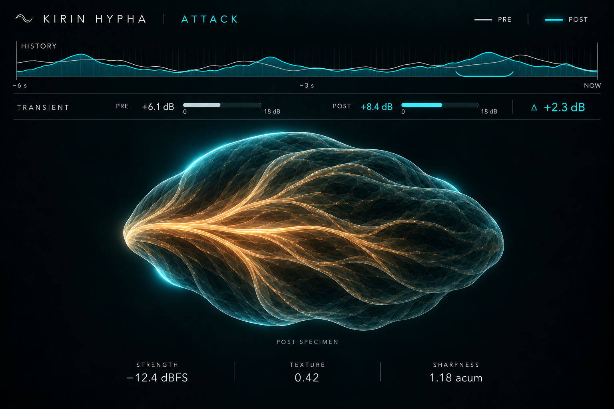
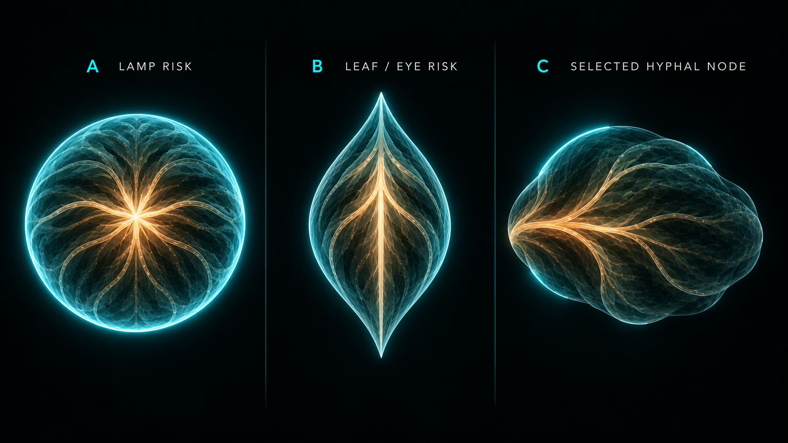
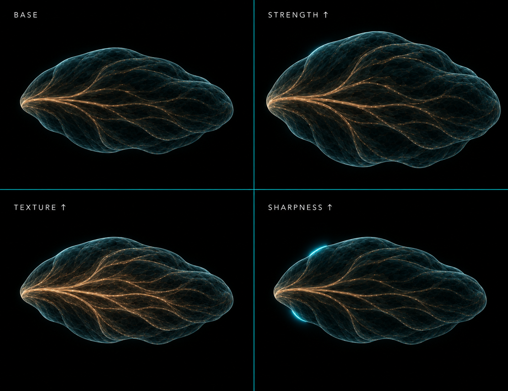

# ATTACK表示の完成提案

- **作成日**：2026-09-09
- **更新日**：2026-09-09
- **状態**：TRACK / STEM表示へ採用。native実装と専用render契約を完了し、DAW／Windows表示確認待ち。
- **変更範囲**：表示契約、JUCE native描画、比較画像。測定coreとAudio Threadは変更しない。
- **対象**：TRACK / STEMのDRUM ATTACK。
- **対象外**：公開判断、2MIX用ATTACK、BODY / TAIL測定値の製品実装。

## 1. 目的

ATTACKをHyphaの中心機能として成立させる。

利用者が一目で、次の三つを順に理解できる画面を目指す。

1. どの打音が変化したか。
2. Transientがどれだけ変化したか。
3. 選択した打音がどのような強さ、組織、鋭さを持つか。

表示には、イカやクラゲのような水中生物が持つ透過、浮遊感、厚みによる遮光、連続する組織を取り入れる。

具体的な生物の形は描かない。

観測量の判別を世界観より優先する。

## 2. 結論

300%表示では、画面を上30%、下70%へ分ける。

上部は6秒のPRE / POST履歴と、選択イベントのTransient比較へ限定する。

下部はPOST絶対値の中央標本と、Strength、Texture、Sharpnessの数値へ使う。

中央標本には、円、長い紡錘、左右対称の葉形を使わない。

採用形は、幅と高さの比がおよそ1.30対1の、丸みに近い非対称な菌糸組織とする。

Strengthは大きさ、Textureは繊維と表面の折れ、Sharpnessは背後から輪郭の一部へ漏れる冷色光で示す。

Transientは中央標本から外し、PRE / POSTの二本メーターと符号付き差分へ固定する。

Decayの単一ms表示は現時点で採用しない。

45本の実キックで当初の閾値方式が十分に成立しなかったため、有限窓のBODY / TAILエネルギーとエネルギー集中時刻を比較検証する。

### 2.1 今回の決定一覧

| 項目 | 決定 |
| --- | --- |
| 中央の形 | 円と長い紡錘を棄却し、丸みに近い非対称nodeを採用 |
| 中央の質感 | 半透明の密度塊を基礎材質、連続繊維と表面の折れをTextureへ固定 |
| 電灯対策 | 全周rim、中心光、円形haloを禁止し、外周光の範囲を数値化 |
| 上部 | 6秒PRE / POST履歴90 px、Transient一行52 pxへ固定 |
| fixture | 実キック8本、既存実スネア58本、再配布可能な合成6種を選定 |
| Decay | 単一閾値msを棄却し、BODY / TAIL比を第一検証候補へ変更 |
| 文書 | 比較画像、測定計画、契約差、完成条件まで本書へ統合 |

## 3. Hyphaが取る位置

ATTACKの強みは、派手な生物表現そのものではない。

同じcontent sampleのPRE / POSTをexactに対応させ、時間、差分量、打音の状態を一画面で分けて読めることに置く。

画面の読み方は次の順序へ固定する。

1. HISTORYで変化した時刻を見る。
2. TRANSIENTで差分の量と符号を見る。
3. SPECIMENでPOSTの打音そのものを見る。
4. 必要な場合だけBODY / TAILの後続文脈を見る。

競合製品の公式資料では、Attack / Sustainの処理、Transient / Tonalの分離、周波数別Transient処理が主に扱われている。

Hyphaは処理器にならず、通常経路を変えず、PRE / POSTの観測事実を表示する。

この境界が製品上の差になる。

主機能としての呼び名は`ATTACK SPECIMEN`を推奨する。

新しい指標を増やすことより、選択eventをLOCKし、前後のeventへ移動して同じ尺度の標本を比較できることを優先する。

将来の拡張候補は、複数eventの小さな標本を同じ尺度で並べる`SPECIMEN ATLAS`である。

楽器名を推定せず、打音間のばらつきとPRE / POSTの変化を観察できる。

これは現在案の完成後に別途検証し、初回画面へは入れない。

## 4. 現行実装で確認した事実

現行の上部表示は、6秒間の10 ms RMS包絡である。

現行の選択イベントは、直前100 msのcontextと発音後30 msのattack apertureから値を得る。

`contrast_db`は、`attack_rms_dbfs - context_rms_dbfs`として実装されている。

現行のTexture量は、sample-edge比、Crest、peak plateau幅を正規化し、その最小値を取った複合量である。

TextureはSaturation量でも高調波歪み量でもない。

現行の中央標本は、Strength、Brightness、Transient、Textureの四量を四枚の膜へ写す。

PAIR時は、PREの低輝度な基準膜とPOSTの膜を重ねる。

Transientは中央標本の前端へ描かれる。

中央のgeometryは固定生成式と6秒waveformから得る表示用bendで作られ、`shape[96]`は描画開始条件には使われるが、輪郭そのものには使われていない。

今回の提案は、この現行表示契約をそのまま記述したものではない。

中央をPOST絶対値へ限定し、Transientを独立メーターへ移す変更候補である。

## 5. 観測量の割り当て

| 表示 | 測定上の意味 | 表現 | 比較方法 |
| --- | --- | --- | --- |
| HISTORY | 6秒間の10 ms RMS包絡 | 上部の連続輪郭 | PRE線とPOST面を同じ固定尺度へ重ねる |
| STRENGTH | 30 ms attack RMS | 標本の大きさ、主に高さ | 中央はPOST絶対値 |
| TRANSIENT | 30 ms attack RMSと直前100 ms RMSの局所contrast | 二本の短いメーター | PRE、POST、`POST−PRE` |
| TEXTURE | sample-edge比、Crest、peak plateau幅の既存複合量 | 内部束、表層繊維、膜の折れ | 中央はPOST絶対値 |
| SHARPNESS | 既存100 ms Sharpness | 背面光と部分的な輪郭光 | 中央はPOST絶対値 |

中央標本の長軸へ時間を割り当てない。

中央標本の横幅へDecayを割り当てない。

色だけで量を識別させない。

## 6. 300%の配置

300%では900×600相当を主な設計面とする。

| 領域 | y座標の目安 | 高さ | 内容 |
| --- | ---: | ---: | --- |
| 見出し | 0–38 | 38 px | ATTACK、PRE / POST凡例 |
| 6秒履歴 | 38–128 | 90 px | PRE / POST RMS包絡、選択arc |
| Transient | 128–180 | 52 px | PRE / POSTメーター、符号付き差分 |
| 中央標本 | 180–526 | 346 px | POSTのStrength、Texture、Sharpness |
| 数値 | 526–600 | 74 px | 三量の名称、値、unit |

上部は180 px、下部は420 pxとする。

Transientは独立したカードへせず、履歴の直下へ一行で置く。

中央標本の最大外接矩形は、上部と数値へ接触させない。

100%から200%では、観測値と欠測表示を残したまま線密度と補助文言を減らす。

300%で見えている繊維を縮小画像へそのまま詰め込まない。



この画像は方向確認用であり、画素単位の実装正本ではない。

下記の数値条件とnative render fixtureを表示正本にする。

## 7. PRE / POST履歴

PREとPOSTは同じ時間軸、同じ固定縦尺度へ描く。

曲内最大値やpercentileによる正規化は行わない。

PREは低輝度の無彩色連続線とする。

POSTはtealの連続輪郭と低alphaの面とする。

第三の差分波形は追加しない。

増減の符号は選択イベントの数値欄を正本とする。

選択位置は点ではなく、履歴下端に沿う短い連続arcで示す。

exact identityでは二本が同じ位置へ重なる。

POST onlyではPOSTだけを描き、`POST ABSOLUTE`を表示する。

PREの代替波形を生成しない。

## 8. Transientメーター

Transientは中央標本から完全に外す。

PREとPOSTの短い横メーターを、同じ0–18 dBの固定表示尺度へ置く。

数値は実測値をclipしない。

バーだけを表示端で止める。

表示例は次のとおりである。

```text
TRANSIENT   PRE +6.1 dB  ━━━━━   POST +8.4 dB  ━━━━━━━   Δ +2.3 dB
```

差分は`POST contrast - PRE contrast`へ固定する。

ODFまたはOnset Fluxはイベント検出に残し、利用者向けメーターへ混ぜないことを推奨する。

PRE不在時はPOST絶対値だけを表示し、差分を`--`とする。

正値、負値、ゼロを長さと符号付き数値で示す。

良い、悪い、適正、過剰といった区分は置かない。

## 9. 中央標本の形

### 9.1 比較結果

| 案 | 判定 | 理由 |
| --- | --- | --- |
| 円、均一な楕円 | 棄却 | orb、細胞アイコン、円形メーター、電灯へ見えやすい |
| 長く尖った紡錘 | 棄却 | 葉、目、羽へ見え、横幅を時間と誤読しやすい |
| 丸みに近い非対称node | 採用 | 厚み、付着部、成長方向を持ち、量の変化を体積として読める |



### 9.2 採用形の固定条件

中間Strengthで、外接矩形の幅と高さの比を1.22–1.38へ収める。

左側を付着部としてやや重くする。

右側は細くするが、鋭い先端へ収束させない。

上下の輪郭を鏡像にしない。

外形には二つか三つの大きな組織塊を持たせる。

小さな凹凸を全周へ均等に散らさない。

Strengthが増えると、付着部を固定したまま各組織塊が異なる率で厚くなる。

高さの変化を主とし、横幅の変化は高さの三分の一以下へ抑える。

## 10. 透過と水中の生物感

標本は、表面へ光を当てた固体ではなく、厚さの異なる半透明組織として描く。

薄い部分では背面光が透過し、厚い部分では遮られる。

二つか三つの低contrastな入れ子の密度塊を、Textureとは独立した基礎材質として置く。

中心へ明るい発光核を置かない。

生命感は、付着部からの非対称な成長、連続する繊維、透過の不均一、実測値間の独立した変化から作る。

独立した呼吸、点滅、粒子、巡回光は使わない。

LOCKした標本は静止する。

## 11. Strength

Strengthはgeometryだけを主に変える。

最小値でも標本の存在と方向が分かる大きさを残す。

最大値でも上部履歴と数値へ接触させない。

Strengthの増加で、Textureの繊維本数、Sharpnessの光量、amberの平均輝度を変えない。

最小から最大への高さ差は、DPI 1、標本高124 px換算で8物理px以上とする。

## 12. Texture

Textureは次の三層へ写す。

1. 付着部から連続する太い内部束。
2. 束の間をつなぐ細い表層繊維。
3. 膜の折れと狭い表面反射。

繊維は左から右へ進み、途中で分岐し、右端へ到達する前に組織へ溶ける。

ランダムな毛、粒子、火花、等間隔stripeは使わない。

Textureが増えると繊維本数と折れを増やす。

同時に一本あたりの輝度を下げ、標本全体の平均輝度差を5%以内へ収める。

基礎材質の入れ子構造へTexture用の繊維を重複させない。

Textureの色は補助手掛かりとし、繊維密度と曲率を主な手掛かりにする。

## 13. Sharpness

Sharpnessは標本の背後に置いた冷色光で示す。

光源の中心は標本の中心から外す。

光は上左または下左の背後から回り込み、二つか三つの短い輪郭区間だけへ現れる。

厚い組織では光を遮る。

Sharpnessの増加で、標本geometry、繊維本数、copperの明るさ、本体alphaを変えない。

Sharpnessは外部光の到達範囲と部分輝度だけを変える。

## 14. 電灯に見せない固定条件

次の条件を一つでも外した案は採用しない。

- 全周を同じ太さと輝度のrimで囲まない。
- 背景へ真円または均一な楕円のhaloを描かない。
- 標本中心へ放射グラデーションの中心を置かない。
- 発光核、瞳、一点光、電球のフィラメントに見える中心線を置かない。
- Sharpness最大時も、冷色光が見える輪郭を二つか三つの連続区間へ限定する。
- Sharpness最大時の明るい区間の合計を、外周長の18–42%へ収める。
- Sharpness最大時も、一つの明るい区間を外周長の18%以下にする。
- 外部光の到達距離を、標本高の8%以下にする。
- Sharpness最小と最大で、標本中央40%の平均輝度差を3%以下にする。
- Sharpness最小と最大で、alpha 0.05以上の見かけ面積差を7%以下にする。
- Strength、Texture、Sharpnessを同じalpha変化で一斉に明滅させない。

rim判定では、cyan成分かつalpha 0.18以上の外周画素を数える。

実装方式に依存しないrender検査として固定する。

## 15. 三量の独立性



画像は独立性の意図を示す。

採否は次のrender fixtureで判定する。

| fixture | Strength | Texture | Sharpness | 変わってよいもの |
| --- | ---: | ---: | ---: | --- |
| BASE | −24 dBFS | 0.30 | 1.10 acum | 基準 |
| STRENGTH LOW | −42 dBFS | 0.30 | 1.10 acum | geometry |
| STRENGTH HIGH | −6 dBFS | 0.30 | 1.10 acum | geometry |
| TEXTURE LOW | −24 dBFS | 0.10 | 1.10 acum | 繊維と折れ |
| TEXTURE HIGH | −24 dBFS | 0.65 | 1.10 acum | 繊維と折れ |
| SHARPNESS LOW | −24 dBFS | 0.30 | 0.60 acum | 輪郭外の冷色光 |
| SHARPNESS HIGH | −24 dBFS | 0.30 | 2.50 acum | 輪郭外の冷色光 |
| LAMP STRESS | −6 dBFS | 0.65 | 2.50 acum | 三担当だけ。電灯条件は維持 |

## 16. 状態別表示

| 状態 | 上部履歴 | Transient | 中央標本 | 後続文脈 |
| --- | --- | --- | --- | --- |
| exact pair | PRE線とPOST面 | PRE、POST、符号付き差分 | POST絶対値 | 両側が有効な場合だけ比較 |
| POST only | POST面 | POST絶対値、差分`--` | POST絶対値 | POSTだけ成立可 |
| identity | 二本が一致 | 差分`0.0 dB` | POST絶対値 | 成立値も一致 |
| detail pending | 履歴を保持 | 未確定項目`--` | 成立済み層だけ | `--` |
| 次イベント重複 | 実測履歴を維持 | 成立済み値 | 成立済み値 | `OVERLAP`または`--` |
| LIVE無音または停止 | 事実状態を維持 | `--` | 黒 | `--` |
| LOCK | 選択位置を保持 | 選択値を保持 | 静止 | 確定値だけ保持 |

## 17. キック／スネア表示fixture

### 17.1 見た目のfixture

次の状態をnative render fixtureへ固定する。

- PRE / POST identity。
- POSTがPREよりTransientで大きい例。
- POSTがPREよりTransientで小さい例。
- PRE不在。
- Strengthだけが最小から最大へ変わる例。
- Textureだけが最小から最大へ変わる例。
- Sharpnessだけが最小から最大へ変わる例。
- 三量最大のLAMP STRESS。
- 無音、pending、次イベント重複、LOCK。

### 17.2 実キックの開発fixture

既に開封済みのB-558キック45本から、次の8本を固定した代表fixtureとする。

音源bytesと絶対pathはrepositoryへ入れない。

| ID | 役割 | 診断値 | SHA-256 |
| --- | --- | --- | --- |
| K030 | 初期部と残留energyの対照 | −12 dB保持59.4 ms、40%実効35 ms、energy 95%は183.9 ms | `f1e3bd28a9852962dc8814c9c839ae4c0617c5c1612fa234ffce0f425f00be43` |
| K017 | 中間の減衰 | −12 dB保持134.3 ms、−24 dB保持254.0 ms | `292cb4790a3427dcf532609a7c3160465c8877139b3f09f5b19bc435b55f789a` |
| K025 | 遅い−12 dB到達 | −12 dB保持264.0 ms | `f5595cff36c8e9f0c89379268c6481df713c4bccfe7e1942378acaebf9965bd7` |
| K002 | 閾値未到達 | 500 ms内で−6 dB保持にも到達しない | `4f967e270463abee2f365886220986337cad8f4b72135a39116ea4fbbd9f8c41` |
| K016 | 高域尾の対照 | 発音後30–300 msのlow / high比 −14.52 dB | `48f826778a9704ba19e7a8838f7af288ece6bb68bb7519d09642f4e5ad2ec946` |
| K037 | 低域尾の対照 | 発音後30–300 msのlow / high比 +27.01 dB | `6b856cbaebd3bad1599c5cd16a5ba19f7176f60a4f592b833510518926639b7a` |
| K043 | energy集中が早い例 | energy 95%は82.0 ms、40%実効70 ms | `2a9b7bc1181d4af6cbfadcaeb5b7d1f8ca41ff7fd837b0cbd449754a1630de46` |
| K038 | window端まで続く例 | 40%実効295 ms、−12 dB保持未到達 | `65ea2f30ce309504953e58b4be7afd147fadb3d498415e7245aba080d99cdbff` |

この8本は、短長だけでなく、低域尾、高域尾、非単調、閾値未到達を含む。

### 17.3 実スネアの回帰fixture

実スネアは、B-573で確認済みの58本、三つの独立source groupを全件使う。

短い代表だけへ絞らない。

B-573では58本すべてが先頭250 ms内で検出されている。

一つのsampleから複数eventが出る例は、聴取判断なしに誤検出と決めない。

音源bytesと絶対pathはrepositoryへ入れず、alias、SHA-256、format、eventだけを決定的artifactへ残す。

### 17.4 再配布可能な合成fixture

実データだけでは再現性と公開性を満たせないため、次の合成fixtureを別に固定する。

| ID | 内容 |
| --- | --- |
| FK-SHORT | 120→55 Hzの指数chirp、振幅時定数55 ms、先頭2 msのclick |
| FK-LONG | 95→42 Hzの指数chirp、振幅時定数280 ms、先頭3 msのclick |
| FS-DRY | 190 Hzの減衰正弦、時定数70 ms、高域noise、時定数45 ms |
| FS-RING | 230 Hzのring、時定数380 ms、高域noise、時定数70 ms |
| FS-ROOM | FS-DRYに25 ms後から時定数600 msのdecorrelated stereo tailを加える |
| F-PAIR | 第二打を29、30、31、35、40、50、65 ms後へ置く |

基本sample rateは48 kHzとし、44.1、96、192 kHzへ同じ時間定義で展開する。

mono、stereo同相、dual-mono、片ch入力を用意する。

## 18. Decay候補の実測結果

当初案は、発音後30 msまでの10 ms RMS peakを基準とし、−12 dB未満が30 ms続く最初の時刻をDecayとするものだった。

この案をB-558の45本へ診断適用した。

対象は44.1 kHz、mono、500 msで、onsetは各clipの200 ms位置へ固定した。

したがって、観測できる発音後区間は300 msである。

診断は10 ms RMS、5 ms hopを用いた。

| 閾値 | 30 ms保持まで到達 | coverage | 到達例の範囲 |
| --- | ---: | ---: | ---: |
| −6 dB | 35 / 45 | 0.778 | 34.5–259.0 ms |
| −12 dB | 19 / 45 | 0.422 | 54.4–264.0 ms |
| −18 dB | 7 / 45 | 0.156 | 109.3–229.0 ms |
| −24 dB | 4 / 45 | 0.089 | 149.2–254.0 ms |
| −30 dB | 0 / 45 | 0.000 | 成立なし |

−12 dB方式は過半数で値を出せない。

閾値を−6 dBへ上げると、初期bodyの小さな谷をDecay終端として拾いやすい。

閾値を下げると、500 msより長い尾やnoise floorの影響で成立率が急落する。

単一の閾値時刻をATTACKの製品値へ採用しない。

## 19. Decay検証計画

### 19.1 比較する候補

| 候補 | 定義 | 長所 | 主な弱点 | 優先度 |
| --- | --- | --- | --- | ---: |
| D1 閾値保持時刻 | peak比の閾値を30 ms保持 | msで直感的 | 非単調なring、noise floor、窓端に弱い | 4 |
| D2 Effective Duration | envelopeがpeak比以上にある時間の総和 | 短音と持続音を分けやすい | 途切れた区間を足し、入力長へ依存 | 3 |
| D3 Energy Time | onset後の累積energyが50 / 80 / 95%へ達する時刻 | 非単調な尾でも必ず順序を持つ | 集計終端と次打に依存 | 2 |
| D4 BODY / TAIL比 | 各窓のmean powerを用い、`10 log10(P[30,120) / P[0,30))`と`10 log10(P[120,500) / P[0,30))` | 有限窓で安定し、PRE / POST比較が明確 | 単一の長さmsではない | 1 |

D4を第一候補とする。

表示名は`DECAY`ではなく、測定内容に合わせて`BODY`と`TAIL`を使う。

D3が実データと聴取基準の両方で安定した場合だけ、補助的なms表示を再検討する。

### 19.2 帯域の扱い

キックの低域bodyとスネアの高域noise tailは同じ減衰を持たない。

全帯域に加え、30–200 Hzと2–12 kHzを診断帯域として比較する。

帯域別値を初回製品表示へ追加しない。

全帯域のBODY / TAILが同程度でも帯域別結果が逆転する例の有無を確認する。

十分な再現性がある場合だけ、後続の質感説明へ使う。

楽器分類には使わない。

### 19.3 valid条件

次の条件をすべて満たす場合だけ、イベント固有の後続値として扱う。

- event、sample rate、generation、definitionが一致する。
- 必要な後続windowが実測済みである。
- window内に次の確定eventがない。
- floor-limitedではない。
- PRE / POST比較では両側が同じwindowを持つ。

次イベントが入った場合、履歴はそのまま描く。

BODY / TAILのイベント値は`OVERLAP`または`--`とする。

次打のenergyを選択イベントの尾として足さない。

### 19.4 検証母集団

次の順で検証する。

1. §17.4の合成fixtureで定義と境界を固定する。
2. §17.2の実キック8本で候補間の違いを見る。
3. B-558のキック45本全件へ広げる。
4. B-573のスネア58本全件へ広げる。
5. kick / snareのidentity、固定gain、compressor、soft clip、room追加のPRE / POST対を作る。
6. DRUM busのclose pairとrollで欠測条件を確認する。
7. 別source groupをcandidate決定後のholdoutとして一度だけ評価する。

### 19.5 合格条件

- identityでPREとPOSTの各値が一致する。
- 固定gainで比率値が変わらない。
- 同じaudioを44.1、48、96、192 kHzへ変換し、比率は0.15 dB以内、時刻は5 ms以内で一致する。
- 次打29 / 30 / 31 ms境界のvalid / invalidが定義どおりになる。
- kickとsnareの各50音以上、二群以上でmissing率を記録する。
- 候補値と聴取による短、中、長の順位一致をblindで評価し、kickとsnareのSpearman順位相関を各0.80以上とする。
- source group別の順位相関を0.70以上とする。
- source groupごとの順位相関とworst groupを記録する。
- 値が成立しない素材を別の値で補間しない。
- Audio Threadへ計算、alloc、lock、I/Oを追加しない成立性を確認する。

閾値、帯域、窓長はdevelopmentで一度だけ決め、holdoutを見て調整しない。

## 20. ATTACKという名称

ATTACKは維持する。

主要表示は、発音前contextと発音後30 msのattack観測だからである。

BODY / TAILは選択attackの後続文脈として、上部へ補助的に置く。

中央標本の主要四量へ昇格させない。

将来、pitch drop、ring、room、複数帯域の尾を独立解析して常設する場合は、DRUMまたはHITへの画面名変更を別途判断する。

## 21. 契約差への推奨

### 21.1 Transient

利用者向けTransientは、現行実装の局所contrastへ統一することを推奨する。

Onset Fluxはイベント検出器の内部量へ残す。

`INV-S14`の表示記述を実装へ合わせて更新する方が、表示値をOnset Fluxへ戻すより変更範囲が小さい。

### 21.2 Sharpness

表示名は`SHARPNESS`へ統一することを推奨する。

FFIとRustの`sharpness_acum`が測定側の名称であり、`BRIGHTNESS`は表示上の旧名だからである。

### 21.3 中央のPAIR

中央標本はPOST絶対値へ限定することを推奨する。

PRE / POSTの比較はHISTORYとTRANSIENTへ集約する。

Strength、Texture、Sharpnessの差分数値が必要なら、中央の形へ重ねず、下部数値へ小さく追加する。

この変更には、現行のPAIR基準膜契約の更新が必要である。

## 22. 表示検証

- 100%、125%、150%、200%、300%の全サイズを確認する。
- macOS RetinaとWindows対応DPIを確認する。
- 文字を既存契約の最小11 logical px未満にしない。
- PRE / POST identityの履歴をpixel一致で確認する。
- Transientの正、負、ゼロ、PRE不在をrender fixtureへ固定する。
- Textureだけを増やした平均輝度差を5%以内にする。
- Sharpnessだけを増やした中央40%の平均輝度差を3%以内にする。
- Sharpnessだけを増やした見かけ面積差を7%以内にする。
- Strengthだけを増やしたときに繊維密度と外部光が変わらないことを確認する。
- LAMP STRESSで§14の全条件を通す。
- 停止、無音、pending、再開、LOCKで自律的な動きを出さない。
- 6秒履歴、event選択、音の時刻をDAW上で照合する。
- 最大表示、二枠、最大event数で既存の描画予算を再測定する。

描画予算は、更新中央値1枠12 ms、二枠16 ms、最大24 ms、初回80 ms以内を維持する。

## 23. 採用実装の順序

Daisukeの2026-09-09の指示によりTRACK / STEM表示へ採用した。
1–7はnative実装とrender契約まで完了し、8のDAW／Windows表示確認と9の実素材確認を残す。
10のBODY / TAILは測定検証を終えるまで製品値へ接続しない。

1. Transient、Sharpness、中央PAIRの契約差を決める。
2. 静止native fixtureへ900×600のlayoutを固定する。
3. HISTORYとTRANSIENTだけを組み、identity、正、負、欠測を確認する。
4. 中央へ成長の非対称と透過だけを入れる。
5. Strengthのgeometryを固定する。
6. Textureの繊維と輝度補正を入れる。
7. Sharpnessの背面光を入れ、LAMP STRESSを通す。
8. 全サイズ、全状態、両OSのnative renderを確認する。
9. 実キックとスネアをDAWで確認する。
10. BODY / TAILは別の測定検証を完了してから採用可否を決める。

透過、Texture、Sharpnessを同時に入れて効果を判定しない。

一条件ずつ追加し、一条件だけを外した比較を残す。

## 24. 今回扱わない項目

- 歪み全体の量。
- 偶数次と奇数次の比率。
- 低次と高次の高調波分布。
- レベルによる歪み方の変化。
- transformerまたはprocessorの種類の推定。
- kickとsnareの自動分類。
- 2MIX用ATTACKへの一般化。
- 良否、改善、推奨操作の表示。

高調波歪みの可視化は、既知のテスト信号を用いるMaterial Scan候補として別に扱う。

## 25. 完成条件

利用者が説明を読まず、Strength、Transient、Texture、Sharpnessをこの順で識別できる。

PRE / POSTが変わった時刻をHISTORYで読める。

選択イベントのTransient差分量と符号を一行で読める。

中央標本からPOSTの大きさ、繊維感、鋭さを独立して読める。

三量最大でも電灯に見えない。

円、目、葉、電球、キャラクターへ固定して見えない。

水中の半透明な組織として感じられるが、特定のイカやクラゲの図柄には見えない。

欠測を値で埋めず、停止中に生きているふりをしない。

## 26. 外部資料から採用した考え方

EssentiaのEffectiveDurationは、envelopeがpeak比以上にある時間を測り、短い音と持続音の区別に使える一方、入力長へ依存すると明記している。

このため、HyphaではEffective Durationを唯一のDecay正本にしない。

EssentiaのStrongDecayは、energyとtemporal centroidの組み合わせであり、長さmsではない。

Decayの補助診断には使えても、durationとして表示しない。

iZotope Neutronの公式資料は、Attackを初期打撃、SustainをAttack以外として分けている。

Hyphaでも30 ms attackと後続文脈を分ける。

Eventide SplitEQはTransientとTonalを分離し、両streamをspectrum上で示す。

oeksound spiffはTransient処理のDecayを回復時間として扱い、low / high frequencyで別のDecay調整を持つ。

Hyphaではこれらの操作UIを模倣せず、低域bodyと高域tailが異なり得るという検証課題だけを採る。

## 参照資料

### Repository

- [DRUMの上下分離と半透明膜の実装](hypha_drum_membrane_implementation_20260907.md)
- [ATTACK perceptual visual contract](attack_perceptual_visual_contract_20260831.md)
- [Transient Delta Phase 2 DRUM pilot report](transient_delta_phase2_drum_pilot_report_20260830.md)
- [Transient Delta Phase 2 recovery plan](transient_delta_phase2_recovery_plan_20260830.md)
- [Hypha meter product contract](hypha_meter_product_contract_20260831.md)
- [Hypha invariants](hypha_invariants.md)
- [CE 2226 visual system](hypha_ce2226_jungle_visual_system_20260901.md)

### External official sources

- [Essentia EffectiveDuration](https://essentia.upf.edu/reference/std_EffectiveDuration.html)
- [Essentia StrongDecay](https://essentia.upf.edu/reference/std_StrongDecay.html)
- [iZotope Neutron user guide](https://www.izotope.com/en/content/download/77683/file/izoptope-neutron-help-documentation.pdf?inLanguage=eng-GB&version=1)
- [Eventide SplitEQ](https://www.eventideaudio.com/plug-ins/spliteq/)
- [oeksound spiff manual](https://oeksound.com/manuals/spiff/)
