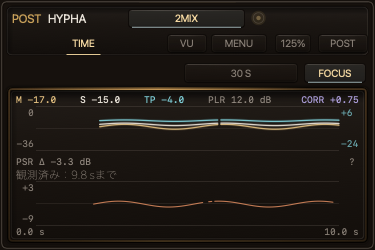

# G2 — DRUM／PSR実装とローカル受入receipt

2026年10月8日。起点は統合済みG1、B-1325。G2はtyped snapshotを出荷JUCE shellへ接続し、表示・Capture・Session coverageと正本を同期する工程である。Rust・static ABI・source契約、TIME／Session／Capture／DRUM focused native、正式native 90件＋Update 7件の確認済みreceiptを以下へ記録する。先行strict legacyと独立V2 denseのFAILを原因調査に使い、固定stage材質の重複描画を既存の容量制限付きcacheへ移した。修正後の正式ATTACK gateはlegacy changing 120条件、resize 6条件、BAND 4条件、V2 dense 120条件を全て完走してPASS。未測定だった11条件も閉じ、G2の実装・ローカル受入・正本同期は完了した。閾値、入力条件、測定回数、表示内容は維持する。exact final commitのCI結果は待機中で、途中確認・CI・merge・releaseはClaude担当、G3の候補freeze・技術／実DAW受入と公開前の利用者本人確認は未実施である。ローカルfixtureを実DAW、使いやすさ、品位、公開完了の認定へ繰り上げない。

正本は[改善計画](../hypha_drum_psr_usability_improvement_plan_20261007.md)、[製品表示契約](../../hypha_meter_product_contract_20260831.md)、[不変条件](../../hypha_invariants.md)。G1の証拠は[G1記録](../hypha_drum_psr_g1_20261007/README.md)に留め、現候補の結果へ流用しない。

## 接続した契約

| 面 | G2の動作 | 保持する境界 |
| --- | --- | --- |
| BAND LIVE | cutoff時点の6秒内の直近最大8検出打音を固定。exact／interval／N/A／unknown／pendingを数え、全体中央値・区間と確定部分中央値・件数・ageを区別 | 欠測の代わりに古い打音を補充しない。値、scope、理由、平均包絡、mask、参加集合、断線を同stampから採用 |
| ALL／LOCK | 同じproducer event鍵の単打値・形を取得。窓外LOCK保持、近接候補の固定集合、LIVE復帰 | 終端済みSingleを書き換えない。BANDの8打集計をALLへ流用しない |
| TIME／PSR | main POST／ΔとPSR自動Δのtarget・cutoff・proof・履歴を分離。PLR／CORRはmain。同source・proofのmainボタン切替はmainだけを空にし、PSRを保持 | currentをhistory mean／最後のfinite点から作らない。比較不能をPOSTへ黙って替えない。RUNは既存履歴経路を維持 |
| 時計・周期 | DRUM取得30 Hz、BANDまとめ250 ms、ALL／LOCK取得中はnative周期、TIME10 Hz | source退役・選択はまとめ周期を待たない。viewportとfacts cutoffを分離し、publicationごとにanchorを変えない |
| TTL | TIME currentは原slot完了から400 ms未満。GUIでもpoll開始時の残り期限を減らす | 再poll、再join、BUSY、IO到着で延長しない。stop／bypass／source・run失効を優先 |
| Capture | 新しいsnapshotを取得せず、採用済みTIME／DRUMの時計と失効だけを進めて同じimmutable presentationからPNGを描く。Work v1がtyped意味を保持できない場合はunsupportedを通知し同じ凍結PNGをローカル保存へ渡す | metadataを捨てたattached成功なし。保存は完全な一時siblingを書いて置換し、appendや古い尾を残さない。失敗時は既存PNGを保持 |

DRUM clockのlook-behind 150 ms／鮮度250 ms、Singleの有限1000 ms応答案、正常jitterと提示遅延はdevelopment値・校正対象である。製品の実再生保証とは呼ばず、G3 freeze前に根拠を固定する。

2026年10月8日の利用者判断を反映し、PSRは補助情報とする。数値行はM／S／TPと同じlegend固定font、通常weight、通常の補助灰色で表示し、main headlineへ昇格させない。値・target・履歴は保持し、数値行の高さを減らした分はplotへ渡す。変更後の全5サイズ・日英のnative画像とfont階層fixtureをfocused runで再確認した。

## 保存したnative development画像

最新TIME／Session focused fixtureの20枚（TIME 10枚、長期prefix／pending LEVEL Session 10枚）から、統合担当が画素を確認したTIME二枚を保存した。main POSTと独立PSR Δ、対象付き数値、補助灰色・通常weightのlegend、gapと異なるcutoffを実native painterで描いたdevelopment fixtureである。実DAW、実音源、G3受入、利用者の日常操作・品位の証拠とは呼ばない。

[300%の英語TIME native development fixture](time-900-en.png)。mainボタン切替後もPSRのscope・履歴・元の完了期限を保持する回帰fixtureを含む最新native runで、20枚の再生成hashが一致した。

[300%の英語BAND typed fixture](drum-v2-900-en.png)は、同じ8打cohortのexact件数、欠測・区間、下限と平均包絡のgapを表示する。[300%の英語ALL fixture](drum-v2-all-900-en.png)はfull-band historyと単打のPRE／POST形を表示する。二枚とも共有stage修正後の正式ATTACK gateで再生成した描画fixtureである。DRUM 50枚は全5サイズ・日英のALL／BAND、有限区間±999.9、共有指数3／308を画素確認し、bytes／SHA-256と寸法・CRC／IENDを照合した。全50枚のhashは先行最終catalog画像と一致した。TIME／Sessionの先行20枚と合わせ、全70枚の描画内容を維持している。実音源の検出品質や性能budgetの証拠へ読み替えない。

| 保存PNG | bytes | SHA-256 |
| --- | --- | --- |
| `time-375-ja.png` | 44,150 | `5bd342ba5a32f3794fb7887281899379ef4fbdff46158dc189ed9cdc544cf19a` |
| `time-900-en.png` | 356,790 | `f90acffd2d668624fcb40d2f229f9805a4ded9a0ab48887c3817d343d5ff8a27` |
| `drum-v2-900-en.png` | 117,541 | `7178cb4f6da6d3646dfe2aa8a7895192efd26fafb667109112b89a9d2e8a7873` |
| `drum-v2-all-900-en.png` | 112,605 | `8df7450ac20c24d081db6a31e74c0df425fcd7d92f1b0e9243b2206ebc646246` |

## 利用者承認のVU基準選択（2026年10月8日）

既存の`0 VU = −18 dBFS`をクリックし、−12／−14／−16／−18／−20（既定−18）を選ぶ。左右は共通値、exact project＋PRE instanceのPRE／POSTはこのcomputerで同じ設定fileを読む。unpaired POSTは自身のscopeを使う。値はuser設定領域へ完全なtemporary siblingを検証してatomic置換し、DAW restoreは共有fileを上書きしない。scope取得の一時競合では採用済み基準を保持して選択を無効にし、新しいscopeの取得成功後にその設定を採用する。file不在・破損・未知値は−18。保存失敗とメニュー中のchain失効は通知し、旧値を保持する。

VU用の独立additive locator getterは合法64-byte identityを完全に返す。旧identity DTO／pollの形と意味は維持し、切詰めた63-byte prefixを共有scopeに使わない。getterは非RTのtry_lockで、BUSY／未解決／short buffer／null／出力重複では両出力を変更しない。校正は測定済みdBFSから針位置への表示換算だけで、音声・LUFS・TP・clip／Session・Record／plugin_data／work.json、300 msの測定窓と針の時間応答を変えない。Captureは採用済みの基準をコピーし、保存fileを取得し直さない。

最終native buildはUiRender／EditorSurface／SnapshotABI／PRE／POSTでPASS。VU focused fixtureは8.06 sでPASS、日英×5サイズ×PRE／POST×stereo −18／stereo −20／mono −20の60 PNGを生成した。5基準の数値換算、左右共通、exact scopeの共有・合法64-byte末尾の非衝突、250 msと時計wrap、scope一時取得不能・切替、再open、破損、partial write／flush／サイズ・内容不一致の4失敗モードで旧file／cache／相手側／再openの値を保全する境界を確認した。全60枚の寸法・CRC・EOF・SHAと画素を確認し、基準legendの収まり、針0→+2 VU、mono Rの下端、TPの不変を確認した。

| 修正後native gate | 結果 |
| --- | --- |
| `kirin_editor_surface_product` | PASS、76.10 s |
| `kirin_ui_render_contract`（性能判定を含む） | PASS、65.07 s |
| `kirin_snapshot_abi_contract` | PASS、5.71 s |
| `kirin_time_history_contract` | PASS、1.99 s |

4件は直列、CTestのwall timeは148.94 s、再試行0。初回buildのPopup namespace compile errorは完全修飾へ直し、最終文面を含むbuildで確認した。先行FAILは保全し、最終PASSへ加算しない。新しいCTest名は増やさず、release-sourceのnative inventoryは90件を維持する。

[125%日本語POST・−20のnative fixture](vu-375-ja-20.png)、[300%英語PRE・−18のnative fixture](vu-900-en-18.png)を保存した。bytes／SHAは下表の通り。実DAW・本人の日常操作／品位の証跡とは呼ばない。300／375のPOSTヘッダは末字が切れて`POS`と見える既存描画が残る。`paintHeader`はB-1325と同一で、今回のVU基準変更では触っていない。この既存の品位項目はG3の確認資料に明示する。

| 保存PNG | bytes | SHA-256 |
| --- | --- | --- |
| `vu-375-ja-20.png` | 116,440 | `ff9234404fe29fa1ea8a29c6b27abf9da7e3d667d317887b638cb042e307e547` |
| `vu-900-en-18.png` | 641,063 | `5301e3ffcae12511f244e58d04f2b19128fdd0f13ee33ee125d99030d8544823` |

## G2の性能・入力coverageの判断

| 指摘 | 実装した対処 | costと範囲 |
| --- | --- | --- |
| 別request ATTACKの繰返しfull read／decode | 28-byte headerでrequest identityを読む。foreign bodyを読取・decodeしない | full payloadは自分のrequestを検証・消去するときだけ。atomic交換とWindows共有slotの既存境界を維持 |
| V2 Δの約7.86 MB確保がmutex内 | generation ticket取得後、Δ mutex外で保持領域を確保。採用時にticketを照合 | reset競合は古いBoxを採用しない。容量7,863,480 bytesはentry領域だけで、全RSS上限ではない |
| exact cacheの線形成長 | I／LRA共有65,536 distinct nodesまで。超過で補助木を解放しcanonical exactへfallback | 量子化・間引きなし。56-byte nodeの64-bit payloadは最大3,670,016 bytes、allocator／canonical履歴／RSSを除く。全accepted energyがuniqueなら最大11 nodes/sで約99分。実際は重複・絶対gate棄却に依存 |
| Stop直前の10 ms未満の未処理尾 | sized Session V2で統計とprocessed／pending framesを同時取得。MAX TPは確認済み下限`≥`、PLRは`---`、I／LRAは処理済みprefix | raw sample peakをtrue peakへ偽装しない。zero padding、Record、Audio Threadの変更なし。pause／bypassはpending保持、再開で同Sessionを処理、RESETで破棄 |

ATTACK retirementの28-byte確認・full検証・削除は別のIO操作である。同じIO所有者が公開と退役を直列化する前提を引き継ぎ、検証直後に別ownerが同pathを置換する競合をconditional removalで解決したとは主張しない。G3でowner遷移・再起動時の実transportを監査する。

通常cache queryは木の深さに比例する。LRA gateの集計順による参加集合の曖昧さと、cache上限後はcanonical結果を使う。同じ履歴の結果は再利用するが、accepted energy追加後の最初のfallbackはIの走査、LRAの走査・sortを要する。上限後の頻回query costが履歴長から独立しているとは主張しない。canonical履歴とRecordの保存契約は従来のままである。

Max M、current、TIME pointは100 ms境界を維持し、Session I／LRA／MaxTPだけが全EBU処理済み10 ms尾を含む。framesはchannelあたりのsamples。Active入力はprocessed＋pending、pendingは現在の未完了解析chunkである。新しいSession getterはtry_lockし、BUSYと不正ABIは出力不変。旧ABI／publicationを置き換えない。LEVELは最新の確認済み処理prefixを使う。同generation・epochのV2でも、active_framesが新しい100 ms公開frameより古ければ、そのMAX TP／I等を上書きしない。BUSYで残った古いgetterによって集計を後退させず、最新入力coverageが未確認ならMAX TPの下限とPLR未成立を保つ。TIME PLRは完全100 ms pointの処理済みprefix累積値で、後続pendingを含む値とは呼ばない。Active中は同pointの原期限内だけ保持し、Stopではcurrentを退役する。Sessionの別poll値をTIME atomic packetへ混ぜない。

## 現候補の確認済みreceipt

2026年10月8日のG2作業sourceに対するローカル結果を集計した。統合担当が実行したログを読み取り、件数とSHA-256を照合した。G1のログ、失敗した先行試行、別architectureの診断を合格根拠へ足さない。最終commitと試験sourceの照合、G3 freezeは後続工程である。

先行`workspace-final.log`は2,346 passed／2 failed／43 ignoredであり、greenとして数えない。失敗したshipping shellのsource契約とxtask assertionを修正し、`workspace-accepted.log`をaggregateで再実行して38 suites／2,352 passed／0 failed／43 ignored、exit 0を確認した。その実行中に追加したmainボタンcallbackのsource guardは、後続`delta-wiring-accepted.log`のfocused 1件とFFI Clippyを別に再実行して合格した。計測Rust product coreはこの追加guardで変わっていない。

先行formal nativeの非timing集合50件は49 passed／1 failed、exit 8だった。`kirin_editor_surface_product`でTIME PLRのfooter helpが856 pxを超え、EN 1,006.89 px／JA 1,291.74 pxとなった。文面を短縮し、font・width thresholdを保持して、修正後のeditor focused 1件（75.19 s）とaffected 4件（9.44 s）を再実行し、各exit 0を確認した。Update 7件も40.58 s、exit 0。最終の非timing集合50件は、先行の影響外45件＋修正後affected 4件＋editor 1件で確認し、再実行の重複を件数へ加算しない。その後のprotected timing集合2件はTIME historyがPASS、UiRenderがJapanese catalog契約でFAILだった。locale不変のHEAD／TAIL時間labelをENとJA同じ文面で二重登録した2 entriesだけを除き、既存fallbackを保持した。修正後のfull UiRender 1件は74.63 s、DRUM layout 1件は7.52 s、各exit 0で確認した。先行TIME history 1件と修正後full UiRender 1件でprotected集合2件を確認する。retry-live 38件も全PASS、retry 0、455.29 s。先行の二つの失敗logは残し、修正・影響再実行の成功集合を実測inventoryへ対応させた。

| gate／範囲 | 確認した結果 | 根拠ログ |
| --- | --- | --- |
| Rust workspace | PASS：最新aggregateのexit 0、38 result suites、2,352 passed、0 failed、43 ignored。ignoredを実行済みへ数えない | `workspace-accepted.log` |
| Clippy | PASS：workspace候補、修正後xtaskと最後の追加source guard後FFIで各exit 0。既存vendor警告は本体の品質判定と区別 | `clippy-candidate.log`、`clippy-xtask-final.log`、`clippy-ffi-accepted.log` |
| opt-in summary cache | PASS：8 passed、0 failed、1 ignored。65,536-node上限、canonical parity、gate二反例、unchanged-history memo、RESETを確認 | `summary-cache.log` |
| 必須ignored Record parity | inventory 20件と実行20 passed／0 failedが一致、123.38 s | `parity-inventory.log`、`parity-ignored.log` |
| 必須ignored pairing candidates | inventory 6件と実行6 passed／0 failedが一致、4.71 s | `pairing_candidates-inventory.log`、`pairing_candidates-ignored.log` |
| 最新xtask | PASS：176 passed、0 failed | `xtask-final.log` |
| source／lightweight | 先行source-only runはexit 0、JUCE patch stateもPASS。最終sourceのtypography／screen text／line budget（origin/main）、Cargo fmt／diff checkは全exit 0。public text checkerの先行base...HEAD検査は準備commitまでの範囲であり、未commitの製品変更・新規文書の最終PASSではない。同規則working-diff preflightとcommit後の公式実行は統合担当が完了する | `lightweight-final.log`、`typography-source-final.log`、`screen-text-source-final.log`、`source-budget-final.log`、`fmt-final.log`、`diff-final.log` |
| shipping Capture／Δ wiring | PASS：Capture境界は取得を増やさず時計・失効だけを進めるsource契約1件、最後のmain callbackもPSRを退役しないshipping Δ wiring 1件。画面のruntime受入とは区別 | `capture-wiring-final.log`、`delta-wiring-accepted.log` |
| CMake dependency／provenance | static review PASS：Viewをcompileする5 target全てのTIME／Session source登録とshipping PRE／POSTのFFI linkを照合。asset／font declarationと3 PNGはB-1325と同一。native compile／実行の代用ではない | `cmake-snapshot-dependencies-final.log`、[限定レビュー](../../provenance/distribution_gate.md) |
| release JavaScript契約 | PASS：13回のNode test呼出しを合計し154 passed／0 failed／0 skipped。standalone checkerの成功は別に確認。公開・署名を実行した証拠ではない | `release-js-contracts.log` |
| Rust optimized build | PASS：FFI候補のrelease profile build。plugin format／Universal／署名／公証の受入ではない | `rust-release-candidate.log` |
| static C ABI symbols | PASS：`cargo build -p kirin_hypha_ffi --locked -j2`はexit 0。debug archiveはrelease source scriptの必要16 symbols全て、native buildに使ったrelease archiveはNavigation V2／Session V2の2 symbolsを定義済み`T`として確認。両archiveはx86_64 | `ffi-symbols-final.log` |
| pure C++契約 | PASS：`ui_contract_test.cpp`と`observatory_contract_test.cpp`をC++17、`-Wall -Wextra -Wpedantic -Werror`でcompileし、それぞれcompile／実行ともexit 0 | `pure-cpp-contracts.log` |
| native source／object checkpoint | PASS：Viewをcompileする5 target、最後のTIME／DRUM catalog修正、shipping callback／clock-only Captureを含む39 source objectsが全てfresh。18 targetの影響native buildもexit 0 | `g2-native-source-object-checkpoint.json`、`g2-catalog-final-native-build.log`、native runner receipt |
| formal native全体 | PASS：inventory 90件を成功集合で照合。非timing 50件は影響外45件＋affected 4件＋help修正後editor 1件、protected 2件はTIME history 1件＋catalog修正後full UiRender 1件、正式retry-live 38件は全PASS・retry 0。affected 4件／再生成layoutは重複として加算しない | `g2-native-inventory-final.log`、先行失敗・修正後log、`g2-native-live.log`、`g2-native-accepted97.json` |
| native Update | PASS：実測inventory 7件と実行7 passed／0 failedが一致、40.58 s、exit 0 | `g2-update-inventory-final.log`、`g2-update-accepted.log` |
| native DRUM functional | PASS：共有stage修正後のRelease／x86_64。adopted-C pointer／current keyboard、cluster／drag固定、empty LOCK保持、typed Facts、丸め・mask・参加集合・断線、全size／日英、clock-only Captureを確認。固定材質のcold／warm同画素、寸法／DPI／材質variantとcache容量も確認 | `g2-attack-frame-budget-shared-stage.log`、`g2-drum-stage-cache-receipt.json` |
| 正式DRUM frame budget | PASS：legacy changing 120、resize 6、BAND 4、V2 dense 120条件を全て完走、exit 0。閾値・条件・回数不変。V2の全条件最大median 10.6228 ms／max 12.1634 ms | `g2-attack-frame-budget-shared-stage.log`、`shared-stage-exit.json` |
| native TIME／Session coverage | focused PASS：Release／x86_64、`--time-snapshot-only` exit 0。独立PSR、main切替とBUSY、原期限、gap、時計だけを進める凍結Capture、pending下限、held coverage、最新処理prefix、PSR legend階層を現sourceで確認。5サイズ×日英でTIME 10枚＋長期prefix／pending LEVEL Session 10枚を出力。native全体受入とは区別 | `g2-time-functional.log`、native runner receipt、`g2-time-images-manifest.json` |
| native Capture Work v1／local PNG | focused PASS：Release／x86_64の最新silent binary exit 0をnative担当が確認。typed-v1不対応時のWork request 0、同じ凍結PNG保持、短い／長い画像へのatomic置換、準備／保存失敗時の既存content保持、一時sibling残存なしを確認 | native runner receipt、`g2-capture-functional.log`（0 bytes）。空logをPASS文字列として扱わない |
| 最終Rust性能5件 | PASS：foreign header／32-sample worker／Sharpness／two POST／raw cache treeを各1件、一回serialで全exit 0。raw-treeとSession cap後fallbackの範囲を分ける | `performance-results.json`、下記5 log |
| native ABI／原完了期限probe | PASS：Release／x86_64。192,000 framesを処理、初回remaining 398.969 ms→32 ms後367.937 ms、cutoff不変。実consumerのABI検査 | `g2-abi-functional.log` |

`g2-native-accepted97.json`は90＋7のunique 97件と対応logを持つ。全97件のPASS行、log hash、重複0を独立に照合した。影響範囲の再実行を組み合わせたローカル成功集合であり、先行失敗を消さず各修正の範囲を追跡する。

nativeのarchitectureはCMakeのRelease／x86_64設定と照合した。別のarm64診断で生じた`bad CPU type in executable`は、この実行環境で起動できなかった診断であり、arm64機能PASSにもx86_64受入のFAILにも合算しない。Universal、Apple silicon実行、実DAW受入はこのreceiptの対象外である。

static symbol照合では`nm`のdependency member診断によるexit 1を既存scriptと同じ規則で扱い、必要な各symbolの完全名に対する定義済み`T`行を個別に確認した。`lipo -archs`は両archiveでexit 0／x86_64。native ABI executableのlink先とrelease archiveを照合し、読取前後のSHA-256一致を確認した。以下はローカルstatic archiveの証跡であり、署名済み配布物ではない。

| archive | architecture | bytes | SHA-256 |
| --- | --- | --- | --- |
| debug `libkirin_hypha_ffi.a` | x86_64 | 172,511,376 | `4a0aba9c3064d9398f41a6c2912ef39f965fe899e76b6f5ffc4adb8644fc61b2` |
| native linkのrelease `libkirin_hypha_ffi.a` | x86_64 | 28,025,680 | `624edfaeedabb889bb81204d85ee639cb4dc03d56448b3d3316b072529e3ea63` |

### fixtureへの対応

| 範囲 | fixture／検証方法 | 結果と残工程 |
| --- | --- | --- |
| navigation authority／waveform | producer ledger鍵、numeric利用不可、band切替、common support／PCM gap、proof mode・source競合 | Rust workspaceでPASS |
| typed DRUM表示、丸め、選択、clock、平均包絡断線 | `AttackV2PresentationContractTest.cpp`、描画・操作fixture、全size／日英、UTF-8 Facts canary | 共有stage修正後のnative functionalとstrict性能budget PASS。G3実host受入は未実施 |
| TIME target／TTL／mapping／Session／Capture | `TimeSnapshotContractTest.cpp`、`TimeSnapshotInputContractTest.h`、`SessionCoverageContractTest.cpp`、`CaptureWorkAttachmentTest.cpp` | 最新main切替・Capture保存修正後のx86_64 focused／formal実行PASS。strict DRUM性能とは分ける |
| foreign header read | `fixed_prefix_reads_exclude_large_body_and_observe_atomic_replacements` | regression PASS。ignored性能probeも1 passed／exit 0、3,000回の28-byte読取を実測 |
| mutex外確保／reset競合 | `retention_allocation_keeps_delta_readable_and_reset_rejects_the_old_ticket`、missing／invalid publication fixture | Rust workspaceでPASS |
| cache上限／exact parity／RESET | shared-node cap、実default budget、丸めgate二反例／memo | focused 8件PASS。ignored raw-tree query benchmarkもPASS。Session capを迂回する木だけのprobeで、上限後fallbackの性能受入には使わない |
| pending尾／再開／repeated RESET | Stop tail、非整数rate、sized FFI出力不変、engine logical clockを戻さないRESET | Rust workspace acceptedでPASS。Session native focused／formal PASS。残る性能とG3は別工程 |
| 負荷／検出timing | native全体、DRUM二枠frame budget、32-sample worker、timing受入 | 先行strict legacy／独立V2 denseのFAILと原因調査を保持。共有stage修正後、V2 120／120とlegacy changing 120／resize 6／BAND 4全PASS。正式native 90件＋Update 7件、Rust性能5件、G3実hostの範囲を分ける |

性能の先行試行は既存legacy whole-signal budgetで失敗し、V2 dense fixtureに到達しなかった。同時刻に外部processの高負荷を確認し、診断logと終了状態を保存した。その後の静穏時strict runもexit 8、11.64 sで失敗した。DPI 2／31 events／100 resize stepsのmedian 16.0629 msが上限16.0 msを超えた。max 35.6784 msは40 ms以内、240 eventsのmedian 15.797 ms／max 38.4499 msも閾値内であり、失敗の原因行と区別する。累積legacy budgetのFAILでV2 dense前に停止したため、静穏時FAILを外部負荷の揺れと断定せず、性能FAIL・V2未測定として残す。この段階ではsource・thresholdを変えない独立V2／B-1325 baselineを各一回測定した。後述の原因計測と共有stage修正後の成功まで、先行FAILは履歴として保持する。

### 先行の独立native性能probe

同じJUCE pin・compiler flags／link設定を使い、B-1325のoriginal legacy fixtureはbyte-identicalな依存objectだけを再利用して17 owned C++を再構築した。準備20 commandsは全exit 0、測定前後のsource・baseline export・flags hashは不変。Audio／FFIを呼ぶ試験ではなく、実native rendererへtyped wireを渡すfixtureである。各probeを現hostで一回ずつserial実行し、pre／during／postのhost状態を残した。高CPUのNode／Chrome／rustcは観測されなかった。再試行、source・threshold変更は0。

| probe | 実測結果 | 受入状態 |
| --- | --- | --- |
| G2 V2 dense | 900／DPI 1.25／2 instances／ALL 240 keys／overlay 0でmedian 16.0398 ms。cold 16.1936 ms、max 16.752 ms | FAIL、exit 1。median上限16.0 ms超過；cold≤80／max≤24 msは成立。109／120条件を測定して停止、残る11条件は未測定 |
| B-1325 original legacy | changing 120条件、resize 6条件、BAND 4条件を全て完走 | PASS、exit 0。同じ既存thresholdを維持 |

旧legacy helperと新V2 helperの異なる負荷を測っているため、baseline PASSだけからFAILの原因を特定しない。正式native 90＋Update 7の機能PASSで性能FAILを埋めず、次の描画計測・修正・正式速度gateで閉じた。

### 原因計測と最終の正式ATTACK gate

900／DPI 1.25／二枠ALLを同じ10 frameで分解した診断では、一枠平均の固定history stageが3.391 ms、固定loupe stageが1.672 ms、波形が2.604 ms、loupeの測定内容が0.729 msだった。計測instrumentationを含むため、これらは受入数値ではなく原因切り分けの値である。V2限定cacheの中間候補は独立120条件を完走したが、正式legacy resizeは31 events／DPI 2でmedian 17.0909 ms／max 60.2334 ms、240 eventsでmedian 17.4361 ms／max 38.5043 msとなりFAILした。

legacy resizeの分解ではChrome描画が平均14.22 ms／frame、そのうち固定stageが約7.37 ms、main frameが約1.594 msだった。等寸法の4レーンで同じ材質を重複描画していたため、共有`HyphaAttackStage.cpp`の固定材質だけを既存のbounded surface storeへ移した。cache keyはcorner／bed／vignette／寸法／physical DPIを含む。光源・font・観測値はこの材質の入力に含まれない。初回から同じcanonical rasterを使い、上lipの半point影を1 point bleedで保持する。既存の最大192 entries／scaleに応じたbyte budgetの内側で共有し、最後のeditor Lifetime終了で破棄する。viewport、値、波形、参加集合、断線、選択の描画・取得周期は維持した。診断用の同100 resize steps比較ではmaterial build 378／stage呼出し866となり488回を再利用、Chrome平均は10.91 msとなった。

最終sourceのRelease／x86_64をincremental compileし、既存の正式ATTACK executableを一回serial実行した。`KIRIN_ATTACK_FRAME_BUDGET=1`でlegacy／BAND速度→既存functional→V2速度→V2 functionalの順を維持し、exit 0。pre／during／postのhost記録とsource／object／binary／flags／link SHAを保持した。以下はこの最終正式runの数値で、先行の部分結果を足した合格ではない。

| 範囲 | 最終実測 | 結果 |
| --- | --- | --- |
| legacy changing | 120／120条件 | PASS |
| legacy resize | 6／6条件。DPI 2／31 events median 13.0256 ms、max 33.0381 ms。240 events median 14.5674 ms、max 29.5006 ms | PASS、median≤16／max≤40 ms |
| legacy BAND | 4／4条件 | PASS |
| V2 dense | 120／120条件、未測定0。元FAIL条件のmedian 8.79301 ms、max 9.20021 ms。全条件最大median 10.6228 ms、max 12.1634 ms | PASS、一枠median≤12／二枠≤16、max≤24／cold≤80 ms |
| 全DRUM functional／描画 | material cacheのcold／warm、variant／寸法／DPI／容量、操作、clock、Capture、5サイズ×日英50 PNG | PASS。50枚全hashが先行と一致 |

ローカル速度blockerは解消した。exact final commitのCI、G3の技術・実DAW受入、公開前の利用者本人確認は別工程であり、このrunでは実施していない。

### 最終の既存Rust性能probe

各fixtureを一回ずつserial実行し、全5件が1 passed／0 failed、exit 0。再試行0、pre／during／postのhost logとbinary／log hashを`performance-results.json`へ記録した。thresholdを緩めず、実測を別のV2描画budgetへ流用しない。

| fixture | 実測 | 結果・範囲 |
| --- | --- | --- |
| foreign ATTACK header | 3,000 probesで84,000 bytes／36.894915 ms。従来full bodyは588,000,000 bytes／72.684853 ms | PASS。別requestのfull read／decodeを避ける入力境界 |
| 32-sample worker | ALL／250 Hz／63 Hz各12,000 blocks、1,495 ODF frames、16 detected hits、241 publications、PCM 384,000 frames。max gapは37.925296／42.641315／42.656933 ms。BANDは各15 attempts／15 measured | PASS、drop・coverage・cadenceの既存assertionを保持。各elapsed 8.014／8.035／8.035 s |
| visible pair Sharpness | 48 kHz continuous fixture：projected median CPU 9.679%、worst 13.039% | PASS。任意解析workerの投影値で、Audio Thread／実DAW全体CPUではない |
| two POST absolute workers | 48 kHz fixture：projected median CPU 9.904%、worst 13.435% | PASS。同じ任意解析budgetで判定 |
| raw exact tree query | 600→360,000 unique energies、各100,000 I／LRA queries：2.617489→2.835983 ms、tree height 11→21、Node 56 bytes。payload 33,600→20,160,000 bytes | PASS。Session共有65,536-node capを迂回するtree-only probe。allocator／canonical履歴を除き、Sessionの上限後canonical fallback性能や全RSSの受入へ読み替えない |

上限後のaccepted energy更新に伴うcanonical初回計算のCPU costは残る。変更のない履歴のmemoとcap／RESET／parityは別の8件で確認し、このraw-tree duration probeと分ける。

### portable log hashes

ログはローカルの検証証跡であり、ここではbasenameとbytesのSHA-256だけを保持する。rawログ内の環境path等は公開文書へ転載しない。無出力binaryのhashは空ファイルのhashであり、終了コードreceiptの代わりにはならない。

| log | SHA-256 |
| --- | --- |
| `workspace-candidate.log` | `f3c2b88102119322991b4386ca139e5259c97613346d0e83937dbd7ab511aaf3` |
| `workspace-accepted.log` | `6eb4c756413a56336bd64c8a393e89ef490ed94e5ed3cc85cf180338238943d9` |
| `delta-wiring-accepted.log` | `785d09d48acc6cef1ed26c7eb9bdb15fbe4dde7bca2b572cf1612c76242783e3` |
| `clippy-ffi-accepted.log` | `974c3e021792da3f8e6dfebb55073aa9ef699b78520a4b2d42ab49997117bd1f` |
| `clippy-candidate.log` | `241fd95ef9e8767107690f80b1d9de62dadc9ad7cfb813a05a3b6a117535dc03` |
| `summary-cache.log` | `cf0b9fb851f91247ac1f136c4a2f82b69bde86ecd7e9710d65810f1b8b846204` |
| `parity-inventory.log` | `60ed38d0708a9026e90696a3e09736260d85a7bce123ceca63873525a373849c` |
| `parity-ignored.log` | `4dab08f0f5cca0f6f4294804841e1050dbb2270500cf2205c6117372c80ee15c` |
| `pairing_candidates-inventory.log` | `6e0458f3b5ed7724f98c58bb3f18ceaecec09f4d3d6f75bad104861e18c5d126` |
| `pairing_candidates-ignored.log` | `ca7734c442708657be4b90228b7b1a3bacf70423923628f5fecf90af66786893` |
| `xtask-final.log` | `4b8c51af074e71cd63bd2d93f6ac2d45015fe003f7094f7bb22ae4907ca64c84` |
| `lightweight-final.log`（最後のTIME method／fixture・文書同期前） | `2c9d2863c53373486340ca119b4b3a975a7a8c90de11ea220208772d66fe72d7` |
| `release-js-contracts.log` | `8aa6f60970dd069f71559bac1a835235272b60b583dc90814e7ce6e05b99aacb` |
| `rust-release-candidate.log` | `908fdd3b8648612c7007a84da7487529d6bc847b9b8235c466d38d0630ae68a4` |
| `pure-cpp-contracts.log` | `381f3b24d334e6cf0d726d9f5e334316cbda3a4187cdbc9063fbf0535543f425` |
| `ffi-symbols-final.log` | `fd49c06f889e16ec1caba55325afe6c7164657678895e695dd3bef38b74e74d9` |
| `workspace-final.log`（先行失敗） | `5969910c6179d27612fc57aa37919b85749df177ad189b97d2174f7ad2cc06d9` |
| `clippy-xtask-final.log` | `5a336d57e8f7042f7dafad2abed2baeeb3c54893404aa3b0ea33605107466562` |
| `capture-wiring-final.log` | `782569a8a5f70123659b362aeda45c9aa6124daebf4d9a474b496a4ad2ae52a9` |
| `delta-wiring-final.log` | `357865bcf597fa154529199cb774e52da1cbf45f5cf5dfd5a41bf71bc5f399c5` |
| `ui-text-final.log` | `9e06d82fd2d345b1a0f63d06e429ea1d130783ac3e67749fec943cffec02040a` |
| `cmake-snapshot-dependencies-final.log` | `62a20323294393988bf9f3e3cdb2539deaf92583d373bc4e9ed2d589505cc105` |
| `g2-abi-functional.log` | `6c6a2978bef9dced6b0ebc1da7a5b18cb462027361e3a3ea1e89c5122e01e1e3` |
| `g2-time-functional.log` | `37e8e100c7a39a71a76edd4193a1534648861182516550ca7b22ffe803ab8659` |
| `g2-capture-functional.log` | `e3b0c44298fc1c149afbf4c8996fb92427ae41e4649b934ca495991b7852b855` |
| `g2-main-target-native-build.log` | `2c437654856b4b35248645d4e8555f56bb3c60e595090dfb5adc02129e60735f` |
| `g2-attack-functional.log` | `05f365fb40fcca19ca85a2956956c29d5e7b593bb1e11d5a01a44d1b2fd5b260` |
| `g2-attack-functional-exit.json` | `ee3f7e4be7515c36fbdc4166825b213e588cfb57ba1d09fcfce998b2de70cab9` |
| `g2-native-inventory-final.log` | `bb2be54fd59d2d06df1a6ef523894b148efdaf1a6edb45331194922bc6d09962` |
| `g2-native-nontiming.log`（先行49 PASS／1 FAIL） | `d5714b6fd9f3d811db2e077b8e6b2ab61237236fb1b15db6a8fb7fe13c46438a` |
| `g2-native-timing.log`（先行1 PASS／1 FAIL） | `965923b0969b31118ec7043fb9e7aaac6cbee1f67415b816ecf0a7d44f4ab035` |
| `g2-time-help-editor-focused.log` | `1aaff911a5768ab43c9fd4dc609d8d73285bfac1b2a43bfb1e4cb4e8582ede90` |
| `g2-native-affected-final.log` | `c0c3623e26f58e1d13841968771d85511c9d824170455d7c2254a7728354b2c5` |
| `g2-update-accepted.log` | `d43b31fbac91fb57c88461f0faafcc7d6a833f7da108c337330cd6649cacd07a` |
| `g2-time-help-native-build.log` | `e280fb4eac46af3ed16c1e8dc798818153fadcc1973bc8f2fed188c1e42ea71b` |
| `g2-ui-language-accepted.log` | `b02b2f2743a4e09ef88daba65658182398724635562411e7b35a890c372d2a08` |
| `g2-drum-layout-final.log` | `290e0e5e77536484bd675de9f2125e3d2960975c885a9a6854ab2bb7578875af` |
| `g2-catalog-final-native-build.log` | `3465a6a510b566a0f1515c756549bb5de24b8f4de9583af7405692a43aabc5a5` |
| `g2-native-live.log` | `27af6f47aba20370c960f2c321150edc99396329fde744a6b6a8e99ce82c5a80` |
| `g2-native-accepted97.json` | `07405374d2621cd7336cf2707d34ea94ade503de441eb4ec6b51fe171b9a9e1e` |
| `g2-update-inventory-final.log` | `40257feb4b049c6aee3223896999719962f88097d25a9bf8e28c16f9b0cbbe9c` |
| `g2-native-source-object-checkpoint.json` | `94c0e9c799d06a21a0b4b773441f3a115d9dea1b1a35cd25ad57ddbf64dc2759` |
| `g2-attack-functional-facts-diagnostic.log`（先行診断） | `58e94c5abf4b5d97d082f80df52b69ec64db543e1afbfe1faaf0b21c2192214d` |
| `g2-attack-frame-budget-host-load-diagnostic.log`（先行診断） | `40d9c3ed7114a5fbada0cf6cbaded970151bee91063e4c3e8ddf936c9a6b3d08` |
| `g2-attack-frame-budget-quiet.log`（strict性能FAIL） | `2ed583af58b8703d6f0c2184a4462ad44a5c7c1ccf31d2b1096b82d0a1493496` |
| `g2-attack-frame-budget-quiet-exit.json` | `becd092ca3edebdc66db9a79ebcadc6f75c63c70949102829a26e7cb04113f75` |
| `g2-time-images-manifest.json` | `465fe31b7450e7b29aba9060216b733e6f6812287a32954b37aca3051dbbec86` |
| `g2-drum-images-manifest.json` | `711fe0bdf68a2484466840c36ea383b4687ad62a5b210707729c0fc20a432029` |
| `probe-runtime-exits.json` | `3ccaf8acdf667a079597e8baf56ac114a7479e5dcae92b3de868b2bef5213105` |
| `v2-observed-host.log` | `23c6bfdcfd332bf7249c7ac57851bc398c7ec5ac82f2b8dfa28777951d44c7b9` |
| `baseline_b1325-observed-host.log` | `1cccfb3aee0250a7d296a13867303f70558f8ec4044e8dd746480df8ae67dde9` |
| `probe-hashes.json` | `71a50ecdeb8891714722178eb81bd57662ead629bbb881dbe4f477b1d7310aee` |
| `build-plan.json` | `9ce6331b848b31f88bc04a07ba0a2a2c3120532c51927599c516fe860ffdea08` |
| `probe-compile-exits.json` | `019f1bc7b8724680f6bd270bce06b4a529b16669336b64d28d5eb393a191e45f` |
| `performance-results.json` | `f6274830a5642c3ff43d4bdc3c8746834c114e9c3fd9e4c00348ade601ea0784` |
| `foreign-header-performance.log` | `fe5d1a17e4ee7f17e2acd1111a6ff10501f52c398f38ac6344a492b75273a56c` |
| `worker-32-performance.log` | `5438dac201e40d5cc226513b91f1bed58e3769f1992295c17096ede6718cffee` |
| `sharpness-performance.log` | `1ec88c0688c3aa5a346f05fb128ee1acfcfd96408fa072d6a4f446a156a7aa7b` |
| `two-post-performance.log` | `1d19d257548a406916e50ed7ac30986324e64ed7793a770205b8f2347709a168` |
| `cache-tree-performance.log` | `c4b3ab6915fdad238fc2267583fc2bf6b44eccef2201ba54fc583e7a17120ea7` |
| `typography-source-final.log` | `1f3e3d2fc163b28f474d1f5ae7b9b292140820b95bf4a25e9e882515b86b8da0` |
| `screen-text-source-final.log` | `11622a7cab435a23ac668f7fe93334585c8b557f3bbfe9e7d259a3141cd7bcdb` |
| `source-budget-final.log` | `dea85190ec67f276e5409bce57e6de6d6e00481c7d451c792c97a9d9e100b76a` |
| `fmt-final.log`／`diff-final.log`（silent、runner exit 0） | `e3b0c44298fc1c149afbf4c8996fb92427ae41e4649b934ca495991b7852b855` |
| `g2-drum-shared-stage-build.log` | `4cd90f85387538eaee4224c92dff6b38efa0cd5031134aa58effda1e23e39b0e` |
| `g2-attack-frame-budget-stage-cache.log` | `c89b2003ddc777c7145c2c1acf37af6b66841b6111494f90706905ae52dd484d` |
| `g2-attack-frame-budget-shared-stage.log` | `ee0707e8336c04c59f5595bf1097e5ab9c20246ea7faf9364abf3d9a431982b1` |
| `g2-drum-images-stage-cache-manifest.json` | `3dd8d49c1efc54820cedae76edceecd79eb29d5347950650e65dfc23976de556` |
| `g2-drum-stage-cache-receipt.json` | `32c2a72201cd8d21bcdae41800fe2527936e5ed7d551a6b97369209c741d2df1` |

### VU追加後の最終ローカルgate

Rust workspaceは2,358 passed／0 failed／43 ignored、Clippyはworkspace・all-targetsでPASS。VU full locatorの3境界試験とshipping wiringの3試験を含む。必須ignored inventoryはparity 20／pairing candidates 6と実測し、20／6全件PASS（それぞれ121.385／6.207 s）。UiRender／EditorSurface／SnapshotABI／TIMEの4 native PASS、描画・文面・行数・formatの契約もPASS。以前の97 native receiptはG2の履歴であり、VU変更後はこの影響範囲のfresh build／実行で区別する。残る全機能の追加性能総点検は、2026-10-08の利用者指示で同PRの後続作業として行う。

最初のCI run `37739931478`のmacOS release-sourceはREADMEが旧DRUM／TIME画像pathを必須とするmetadata testでFAILした。現在のnative galleryをhash・signature・bytesで検証するように同期し、旧reviewed素材のhash／inventory検査も保持した。修正後のmetadataは10／10 PASS。現CMakeの限定provenance reviewと14件のdistribution gate fixtureはPASS、配布権限・実payloadの受入とは区別する。exact final tipの4必須CIはClaudeが判定し、先行runを現候補の成功へ流用しない。

| ローカル証跡 | SHA-256 |
| --- | --- |
| `vu-ffi-release-build.log` | `cf312e4c3896f9184f16873ee9b5c91b3d9842e08817d52783127f1ac4fc21de` |
| `vu-native-exact-build.log` | `5256a1e6e8d522e71d9c28358fc255cc5c0ef248496221ee6c49b23d018d7650` |
| `vu-native-calibration.log` | `105be42cf5bc95170a72737bfcfb295d365f9d8e0a085cc0fc8c48c7871b7595` |
| `vu-native-formal4.log` | `cc58bf77a18b86399d4611be4e62e4e99b766dd8949db01967f3e4b27797e8da` |
| `vu-native-receipt.json` | `8d2a85d1dcf8069faa8a25d1ea18778d385febe3aaddc9c6f5dfd3efa1054e4e` |
| `vu-workspace-final.log` | `3a23b1757dcbf29cb716d62c14e7c68e2cbe69ae907bfcc6423c4a5f5499a46d` |
| `vu-clippy-final.log` | `2f4bb66b5fa89387b213fa35424ab8a7c3ece5010c8f0a9eb79d742904b5a0b3` |
| `vu-parity-inventory.log` | `b11fa2fc2a8741ae3a01eb8a480b34f8e063478ebc44b7b0bd7346f6fcd3c391` |
| `vu-parity-ignored.log` | `b9f6f88e900e45cd1de9122c7d391c00006381d9ac4873f7a135caf5aa37c16b` |
| `vu-pairing_candidates-inventory.log` | `38d4ac548e3270b0c3158652cec3da4fe60334e4a041af5ac588a2811929860c` |
| `vu-pairing_candidates-ignored.log` | `a707dbdf3eecd0d3e570a4a1074c7c31ddcc2597e3c9ba0918530cf320436e3a` |
| `vu-rust-gates.json` | `07e2ecae66ff74fc1b13d70705452d185ea7cfa8092fa2f6deed65a949da9df6` |
| `release-metadata-final.log` | `a3e2c4be7c76caed4ab0062b835195b1d1c2ae5ac6d7c6dac8b355b023085f58` |
| `vu-asset-gate.log` | `4b63a6af27faca1975ed4d1445d47cc20b9c836d7c52f28dfc232b8d72ebc985` |
| `vu-distribution-gate-test.log` | `ae0198042b0733667dbf7fbc99e7024b98966ae53d5746b9edfd1a7a1d5d46da` |

### Portable source fingerprint

[source-manifest.json](source-manifest.json)はB-1325との差分となる全owned source、test、文書、config、保存PNGをrepo-relative path・bytes・SHA-256で記録する。構造抽出の準備commitも差分へ含め、manifest自身とignored検証logを除く。JUCEの同一pinとtracked patchは別のdependency欄へ記録し、patched submodule checkout全体をowned sourceとして数えない。文書へmanifestのdigestを埋め込まず、自己参照hashを作らない。最終commit後の公開文面checkは統合担当が公式入口で実行し、G3／公開の正本照合へつなぐ。

G2のローカル実装・速度受入・正本同期は完了した。exact final commitのCI結果は待機中で、CI・merge・releaseはClaudeへ引き継ぐ。G3ではactual DAW、密集二枠、通常IO、clock・期限・操作応答を現候補で確認する。公開前に利用者本人の日常操作・読み取り・品位の受入が必要であり、ローカルfixtureでは未検証である。友人の初見／日常操作・品位確認は公開後G4だけで、開発工程・公開条件へ移さない。正式公開は既存release gateと同版のLS／macOS HP／Windows三チャネルを全て満たして初めて完了する。
